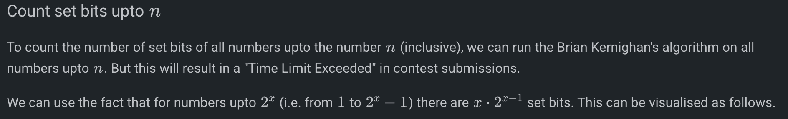

# COUNT SET BITS

__builtin_popcountll(n)

int countSetBits(int n)
{
    int count = 0;
    while (n)
    {
        n = n & (n - 1);
        count++;
    }
    return count;
}

int countSetBitsUptoN(int n) {
        int count = 0;
        while (n > 0) {
            int x = log2(n);
            count += x << (x - 1);
            n -= 1 << x;
            count += n + 1;
        }
        return count;
}