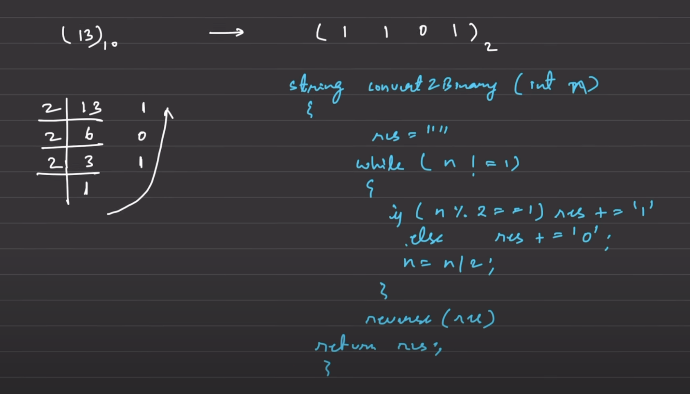

# decimal to binary

# Can also be done using bitsets

string decToBinary(int n) {
    
    string bin = "";
    while (n > 0) {
        // checking the mod 
		int bit = n%2;
      	bin.push_back('0' + bit);
        n /= 2;
    }
    
    // reverse the string 
	reverse(bin.begin(), bin.end());
    return bin;
}