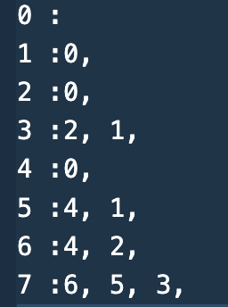
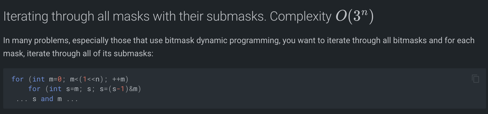
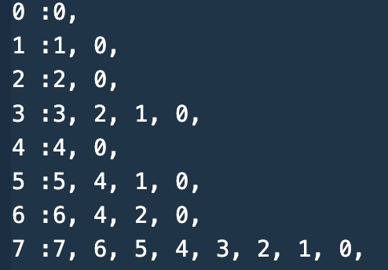

# MASK-SUBMASKING ITERATING IN DP-BITMASKING

## For each mask, we need submasks that are 1 bit off.
**(2^n * 30)**
```cpp
for(int m = 0; m<(1<<n); m++){
    for(int psn = 0; psn < n; psn++){
        if(((m>>psn)&1)){
            int s = (m ^ (1<<psn));
            // work back transition [ m -> s]
        }
    }
}
```



## For each mask, we need all submasks that could be built from set bits of mask.
**(3^n)**



```cpp
for(int m = 0; m<(1<<n); m++){
    for(int s = m; ;s = ((s-1)&m)){
        // work back transition [ m -> s]
        if(s == 0)
            break;
    }
}
```


## This same (3^n) idea, but now doing front transitions/ push dp:
```cpp
for(int mask=0; mask<N; ++mask){
    int rem = ((N-1) ^ mask);
    // iterate through non-empty submasks of rem
    for(int sub = rem; sub; sub = (sub-1) & rem){
        // front transition from dp[mask] to dp[nmask], where sub is the extra part that adds to mask, to make nmask
        int nmask = mask | sub;
    }
}
```
