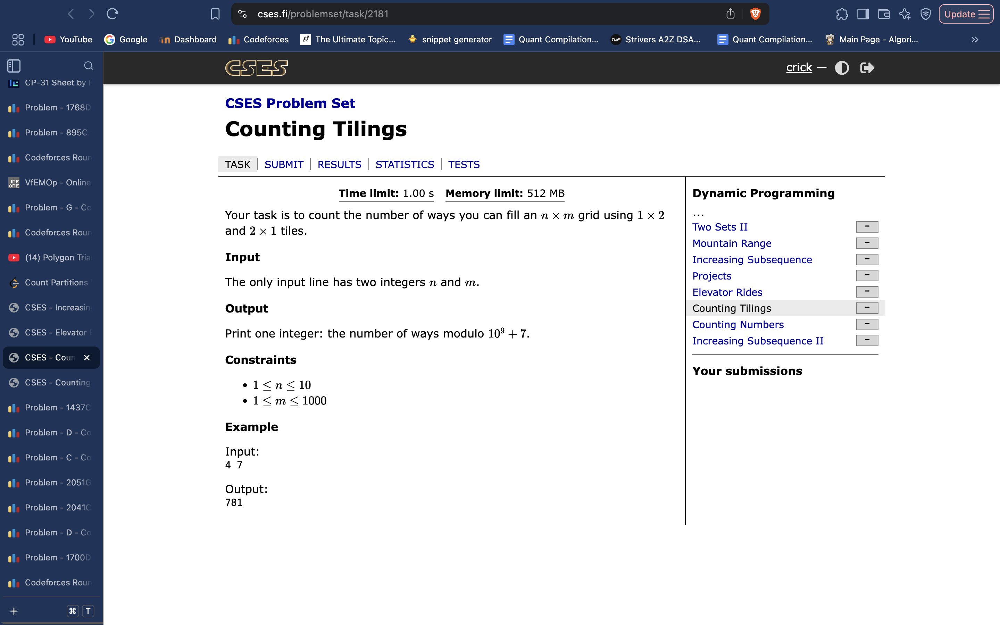

# Broken Profile DP:

 
     **Broken Profile DP: 
having dp[row no.][mask of current row]
And recursive transitions to next row.
Similar to a CSES Problem I have done.
It had dp(col id, mask of col) and was using recursive transitions to fill up this col, and find new col masks it leads to.**

  
     [https://gemini.google.com/app/46fc6a6dbe7a2944](https://gemini.google.com/app/46fc6a6dbe7a2944)
 
 
     [https://cp-algorithms.com/dynamic_programming/profile-dynamics.html#problem-parquet](https://cp-algorithms.com/dynamic_programming/profile-dynamics.html#problem-parquet)
 

[https://www.youtube.com/watch?v=byM079e5gmU](https://www.youtube.com/watch?v=byM079e5gmU)
 
     **Video solution
Backtracking recursion for Transitions.**
 