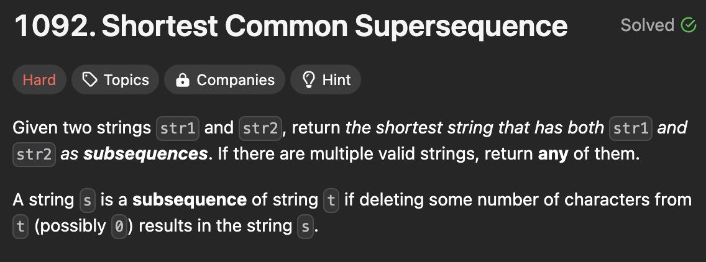
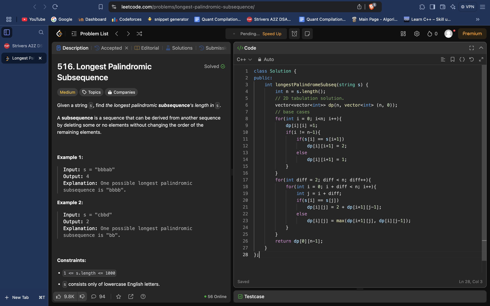
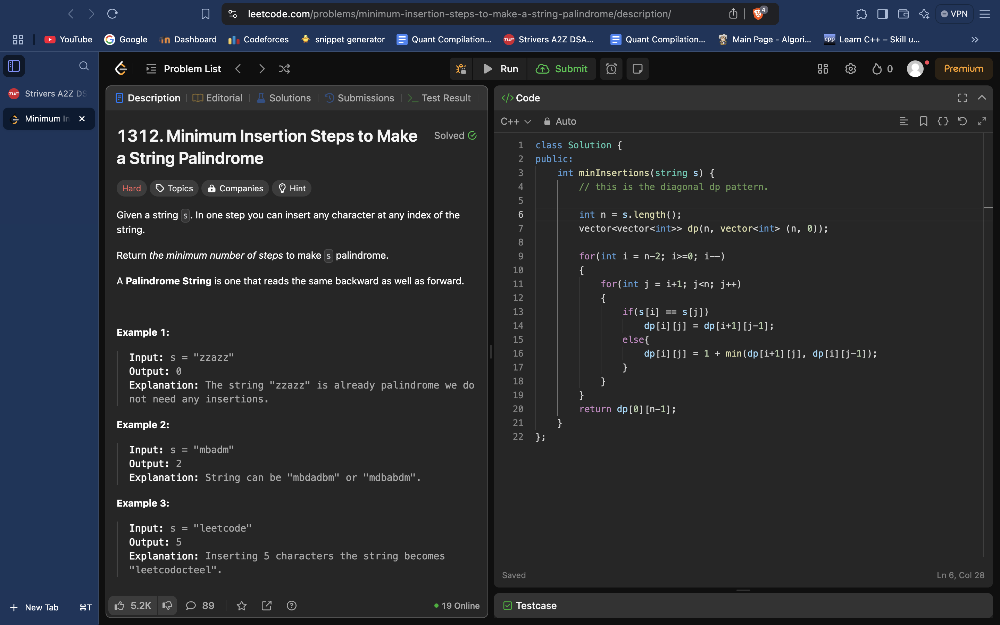

# DP ON STRINGS

# 
# LCS : LONGEST COMMON SUBSEQUENCE

# SPACE OPTIMISED TABULATION:
*// Function to find the length of the Longest Common Subsequence (LCS)*
int lcs(string s1, string s2) {
    int n = s1.size();
    int m = s2.size();

    *// Initialize two vectors to store the current and previous rows of the DP table*
    vector<int> prev(m + 1, 0), cur(m + 1, 0);

    *// Base case is covered as we have initialized the prev and cur vectors to 0.*

    for (int ind1 = 1; ind1 <= n; ind1++) {
        for (int ind2 = 1; ind2 <= m; ind2++) {
            if (s1[ind1 - 1] == s2[ind2 - 1])
                cur[ind2] = 1 + prev[ind2 - 1]; *// Characters match, increment LCS length*
            else
                cur[ind2] = max(prev[ind2], cur[ind2 - 1]); *// Characters don't match, consider the maximum from above or left*
        }
        prev = cur; *// Update the previous row with the current row*
    }

    return prev[m]; *// Return the length of the Longest Common Subsequence*
}

# TABULATION:
*// Function to find the length of the Longest Common Subsequence (LCS)*
int lcs(string s1, string s2) {
    int n = s1.size();
    int m = s2.size();

    vector<vector<int>> dp(n + 1, vector<int>(m + 1, -1)); *// Create a DP table*

    *// Initialize the base cases*
    for (int i = 0; i <= n; i++) {
        dp[i][0] = 0;
    }
    for (int i = 0; i <= m; i++) {
        dp[0][i] = 0;
    }

    *// Fill in the DP table to calculate the length of LCS*
    for (int ind1 = 1; ind1 <= n; ind1++) {
        for (int ind2 = 1; ind2 <= m; ind2++) {
            if (s1[ind1 - 1] == s2[ind2 - 1])
                dp[ind1][ind2] = 1 + dp[ind1 - 1][ind2 - 1]; *// Characters match, increment LCS length*
            else
                dp[ind1][ind2] = max(dp[ind1 - 1][ind2], dp[ind1][ind2 - 1]); *// Characters don't match, consider the maximum from left or above*
        }
    }

    return dp[n][m]; *// Return the length of the Longest Common Subsequence*
}

# MEMOIZATION:
*// Function to find the length of the Longest Common Subsequence (LCS)*
int lcsUtil(string& s1, string& s2, int ind1, int ind2, vector<vector<int>>& dp) {
    *// Base case: If either string reaches the end, return 0*
    if (ind1 < 0 || ind2 < 0)
        return 0;

    *// If the result for this pair of indices is already calculated, return it*
    if (dp[ind1][ind2] != -1)
        return dp[ind1][ind2];

    ***// If the characters at the current indices match, increment the LCS length***
    **if (s1[ind1] == s2[ind2])
        return dp[ind1][ind2] = 1 + lcsUtil(s1, s2, ind1 - 1, ind2 - 1, dp);
    else**
        ***// If the characters don't match, consider two options: moving either left or up in the strings***
        **return dp[ind1][ind2] = max(lcsUtil(s1, s2, ind1, ind2 - 1, dp), lcsUtil(s1, s2, ind1 - 1, ind2, dp));**
}

*// Function to calculate the length of the Longest Common Subsequence*
int lcs(string s1, string s2) {
    int n = s1.size();
    int m = s2.size();

    vector<vector<int>> dp(n, vector<int>(m, -1)); *// Create a DP table*
    return lcsUtil(s1, s2, n - 1, m - 1, dp);
}

# PRODUCING THE LCS STRING (OR SOMETHING SIMILAR) TOO:
# 
class Solution {
public:
    string shortestCommonSupersequence(string s, string t) {
        int n = s.size();
        int m = t.size();
        vector<vector<int>> dp(n+1, vector<int>(m+1, 0));

        // lcs dp
        for(int i = 1; i<=n; i++)
        {
            for(int j = 1; j<=m; j++)
            {
                if(s[i-1] == t[j-1])
                {
                    dp[i][j] = dp[i-1][j-1] + 1;
                }
                else
                {
                    dp[i][j] = 0 + max(dp[i-1][j], dp[i][j-1]);                      
                }
            }
        }
        int len = dp[n][m];

        // the backtracking part.
        int i = n;
        int j = m;
        string rev = "";
        while(i > 0 && j > 0)
        {
            if(s[i-1] == t[j-1])
            {
                rev += s[i-1];
                i--;
                j--;
            }
            else
            {
                if( dp[i][j-1] > dp[i-1][j] )
                {
                    rev += t[j-1];
                    j--;
                }
                else
                {
                    rev += s[i-1];
                    i--;
                }
            }
        }

        while(i>0)
        {       
            rev += s[i-1];
            i--;
        }
        while(j>0)
        {       
            rev += t[j-1];
            j--;
        }

        // remember to reverse.
        reverse(rev.begin(), rev.end());
        return rev;
    }
};
# AND IF WE NEED TO PRODUCE ANY LCS STRING:
class Solution {
public:
    string shortestCommonSupersequence(string s, string t) {
        int n = s.size();
        int m = t.size();
        vector<vector<int>> dp(n+1, vector<int>(m+1, 0));

        // lcs dp
        for(int i = 1; i<=n; i++)
        {
            for(int j = 1; j<=m; j++)
            {
                if(s[i-1] == t[j-1])
                {
                    dp[i][j] = dp[i-1][j-1] + 1;
                }
                else
                {
                    dp[i][j] = 0 + max(dp[i-1][j], dp[i][j-1]);                      
                }
            }
        }
        int len = dp[n][m];

        // the backtracking part.
        int i = n;
        int j = m;
        string rev = "";
        while(i > 0 && j > 0)
        {
            if(s[i-1] == t[j-1])
            {
                rev += s[i-1];
                i--;
                j--;
            }
            else
            {
                if( dp[i][j-1] > dp[i-1][j] )
                {
                    // rev += t[j-1];
                    j--;
                }
                else
                {
                    // rev += s[i-1];
                    i--;
                }
            }
        }

        // while(i>0)
        // {       
        //     rev += s[i-1];
        //     i--;
        // }
        // while(j>0)
        // {       
        //     rev += t[j-1];
        //     j--;
        // }

        // remember to reverse.
        reverse(rev.begin(), rev.end());
        return rev;
    }
};

# Palindrome problem (just to store the diagonal traversal approach) : (BOTH CAN BE SPACE OPTIMISED, BUT NOT DONE HERE FOR BETTER UNDERSTANDING)

# another example:

