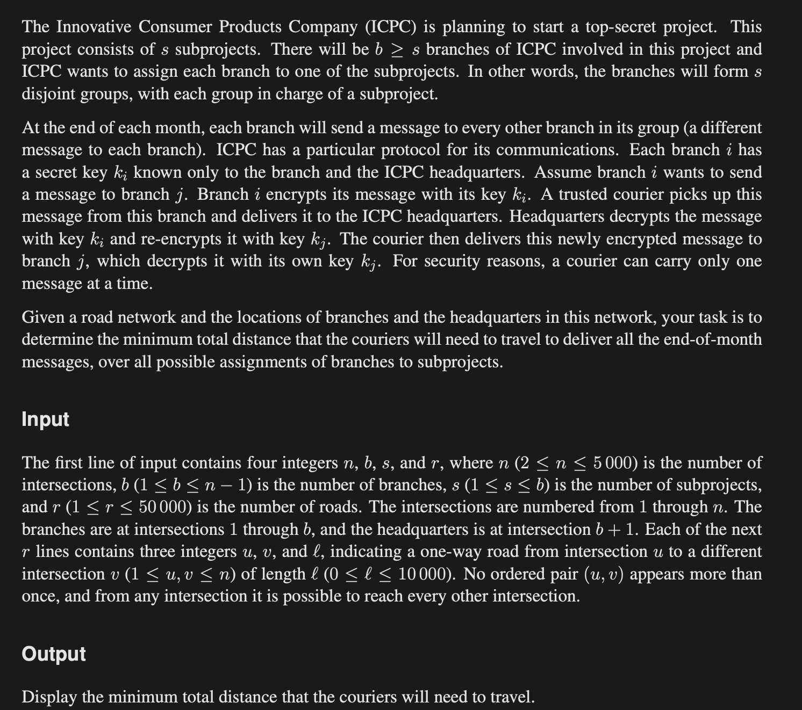
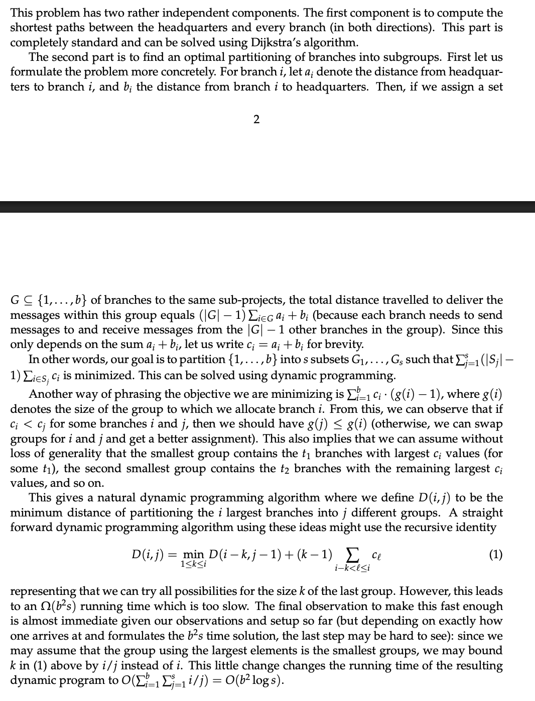
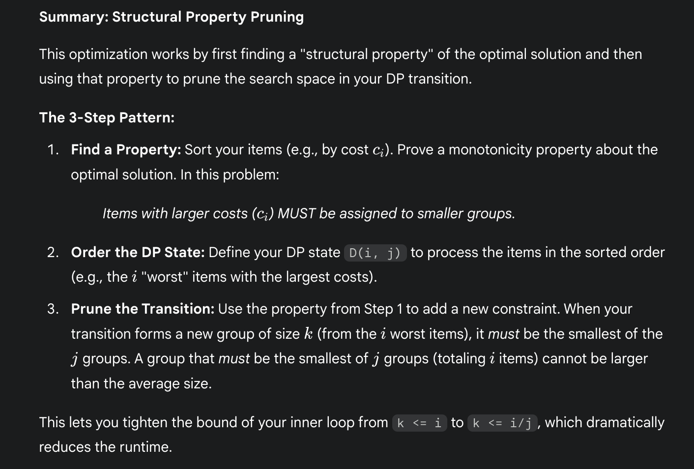

# DP optimisations

 
     **DP optimisations
transition optimisation through : Data Structures (Monotonicity, prefix sums)
Prefix / Suffix Sums is used soooo often to improve transitions time**

 
 
     **DP Optimisations on the transitions using Math:**

  
     [https://codeforces.com/group/wlb0UYQSQF/contest/481471/problem/B](https://codeforces.com/group/wlb0UYQSQF/contest/481471/problem/B)
 

 
     # DP optimisation of pruning transitions
 
# 
# 
