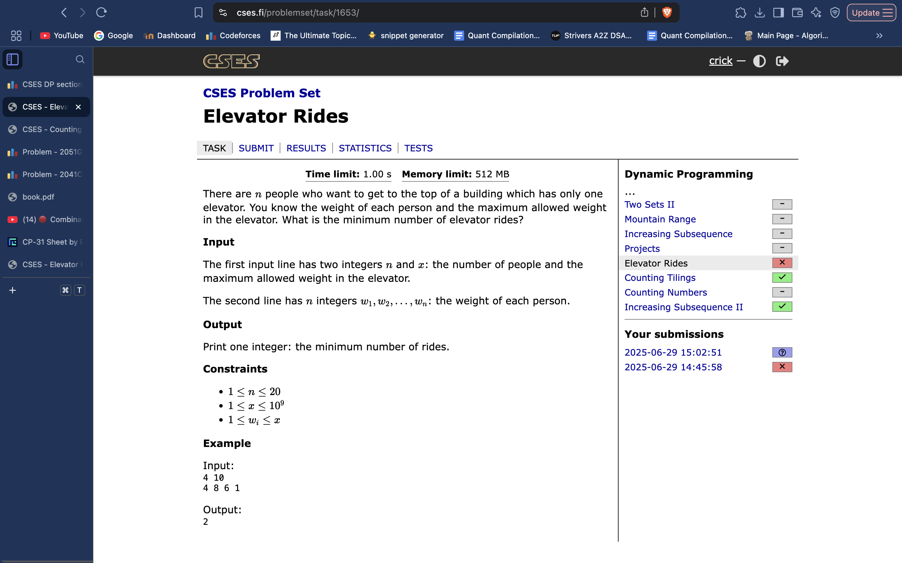

# Elevator DP

New type of problem: pair DP. You have to use a pair of values to calculate the DP of what we actually want, where one of the pair values is the actual answer.
So basically, `dp[] = {what we actually want, another value which is important for the first}`.
 