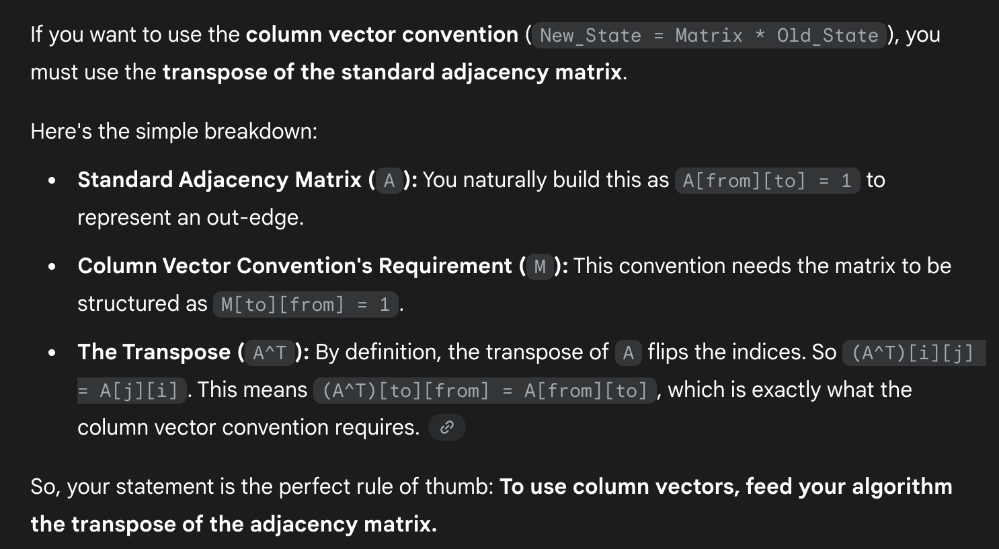
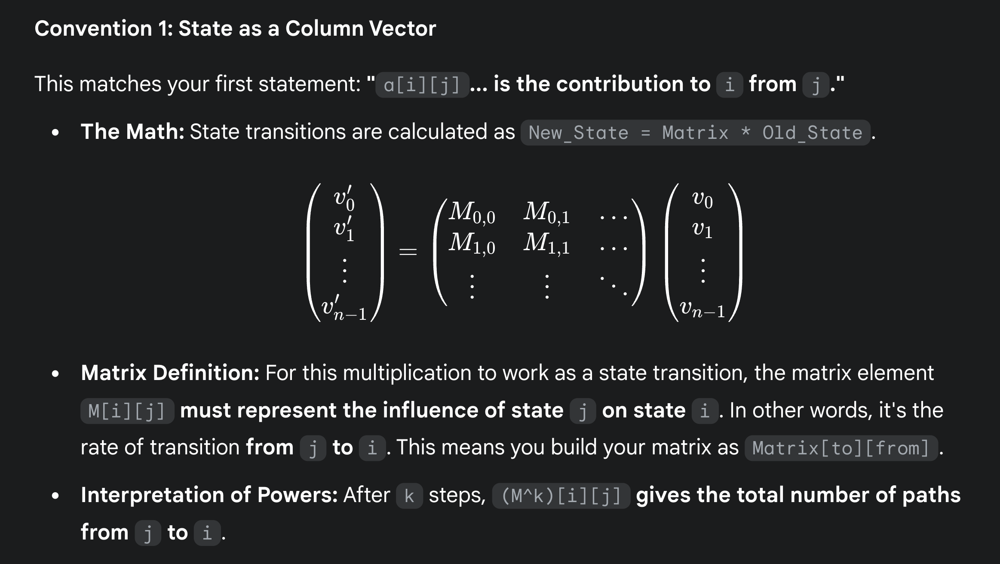
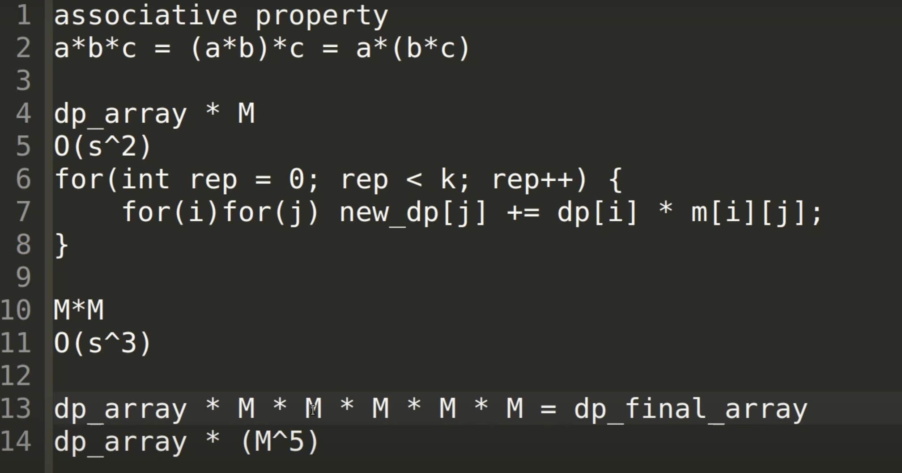
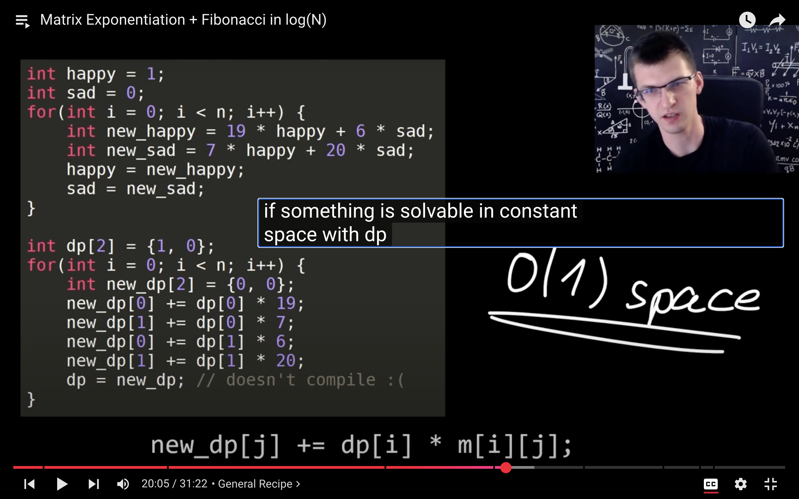
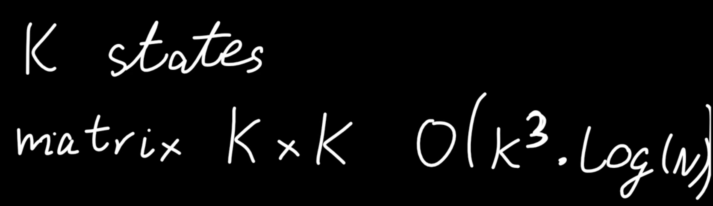
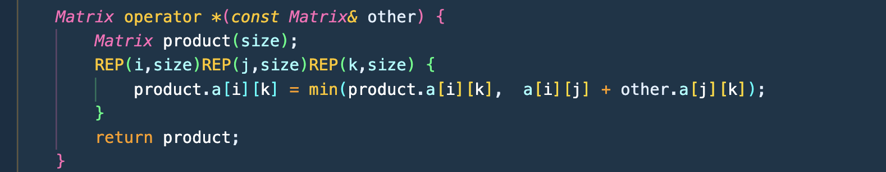
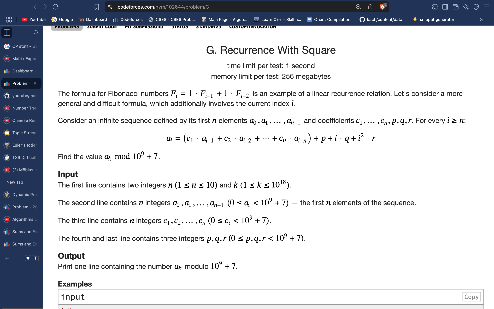
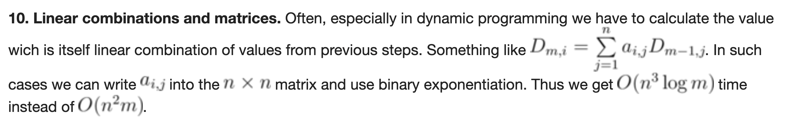
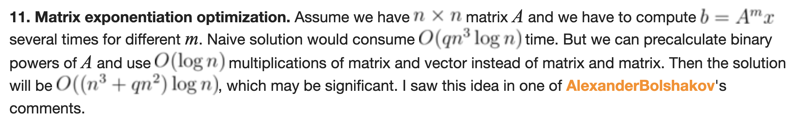
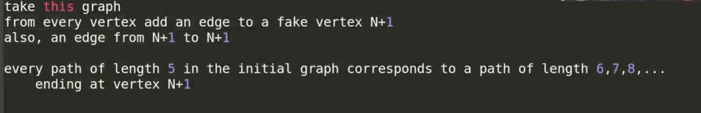

# Matrix Exponentiation:

 
     # **[https://www.youtube.com/watch?v=kQuCOFzWoa0](https://www.youtube.com/watch?v=kQuCOFzWoa0)**
 
 
     # **[https://www.youtube.com/watch?v=RA_SpxP2t54](https://www.youtube.com/watch?v=RA_SpxP2t54)**
  
     
**CODE: (Make sure to use Column vector standard)**
 
 
     # **Faster when number of variables is small**
 
# #include <bits/stdc++.h>
# using namespace std;
# #define REP(i,n) for(int i = 0; i < (n); i++)
# *const* int mod = 1e9 + 7;
# struct *Matrix* {
#     long long a[2][2] = {{0, 0},{0,0}};
#     *Matrix* operator *(*const* *Matrix&* other) {
#         *Matrix* product;
#         REP(i,2)REP(j,2)REP(k,2) {
#             product.a[i][k] = (product.a[i][k] +  (long long)a[i][j] * other.a[j][k])%mod;
#         }
#         return product;
#     }
# };
# *Matrix* expo_power(*Matrix* a, long long k) {
#     *Matrix* product;
#     REP(i,2) product.a[i][i] = 1;
#     while(k > 0) {
#         if(k % 2) {
#             product = product * a;
#         }
#         a = a * a;
#         k /= 2;
#     }
#     return product;
# }
# int main() {
#     long long n;
#     cin >> n;
#     *Matrix* single;
#     single.a[0][0] = 1;
#     single.a[0][1] = 1;
#     single.a[1][0] = 1;
#     single.a[1][1] = 0;
#     *Matrix* total = expo_power(single, n);
#     cout << total.a[1][0] << endl;
# }

 
     # **When number of variables is large (generalised)**
 
#include <bits/stdc++.h>
# using namespace std;
# #define REP(i,n) for(int i = 0; i < (n); i++)
# *const* int mod = 1e9 + 7;
# struct *Matrix* {
#     int size;
#     vector<vector<int>> a;
#     Matrix(int _size){
#         size = _size;
#         a.assign(size, vector<int>(size, 0));
#     }
#     *Matrix* operator *(*const* *Matrix&* other) {
#         *Matrix* product(size);
#         REP(i,size)REP(j,size)REP(k,size) {
#             product.a[i][k] = (product.a[i][k] +  (long long)a[i][j] * other.a[j][k])%mod; // or whatever the dp transition logic is (can also be combination of minmax and +*)
#         }
#         return product;
#     }
# };
# *Matrix* expo_power(*Matrix* a, long long k) {
#     *Matrix* product(a.size);
#     REP(i,a.size) product.a[i][i] = 1;
#     while(k > 0) {
#         if(k % 2) {
#             product = product * a;
#         }
#         a = a * a;
#         k /= 2;
#     }
#     return product;
# }
# int main() {
#     long long n, m, k;
#     cin >> n >> m >> k;
#     *Matrix* single(n);
#     for(int i = 0; i<m; i++){
#         int u, v; cin >> u >> v;
#         u--;
#         v--;
#         single.a[u][v] = 1;
#     }
#     *Matrix* total = expo_power(single, k);
#     long long sum = 0;
#     for(int i = 0; i<n; i++){
#         for(int j = 0; j<n; j++){
#             sum += total.a[i][j];
#             sum %= mod;
#         }
#     }
#     cout << sum << "\n";
# }
# 
 
     # 

  
     # **THEORY:
a[i][j] of matrix to power k => contribution to state variable i from state variable j over K length path.** 

  
     # **(If single matrix is populated in similar way)
{If you use the directed adjacency matrix (storing nodes you have an out-edge to), then the logic is reverse, and in that case, a[i][j] is contribution from i to j }**
 
# 
# 
# 
 
     # tool to speed up the dp with constant space

  
     # 
The variables that we need to store are all the variables that we would’ve needed to use to calculate dp in O(N) time and O(1) space.

  
     The single column vector becomes all these variables.

 

 
     # **[https://codeforces.com/blog/entry/80195](https://codeforces.com/blog/entry/80195)**
 

 
     **Can be done on any Small space DP, where the function is associative:**

  
     [https://codeforces.com/gym/102644/problem/F](https://codeforces.com/gym/102644/problem/F)
 

 
     **This, above, is an example of function being min, which is associative (min over sum of different paths)**

 
 
     **Good problem to understand how to fit some dps into the matrix multiplication format:**

 

 
     # **Really Good for Learning about a trick ( converting exactly K to atmost K) and about Matrix Multiplication. ( can watch errichto video on matrix Exponentiation )**

  
     **The trick is to have an extra node, and have all nodes have an edge to this special node ( even special node has an edge to special node ). And now find for paths of len K+1, to this special node.**
 

