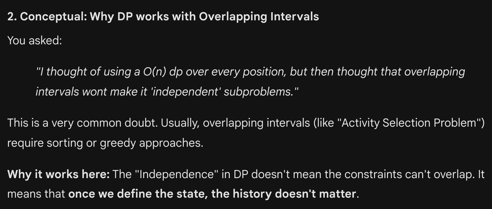
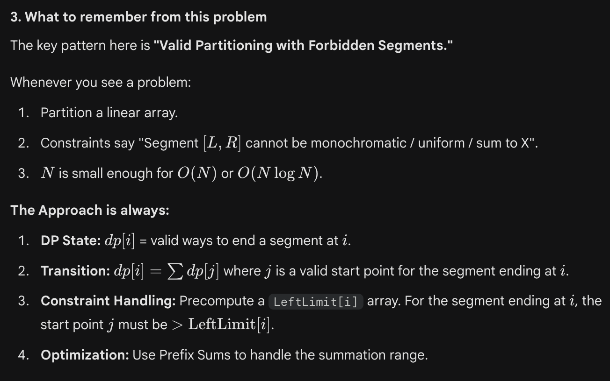
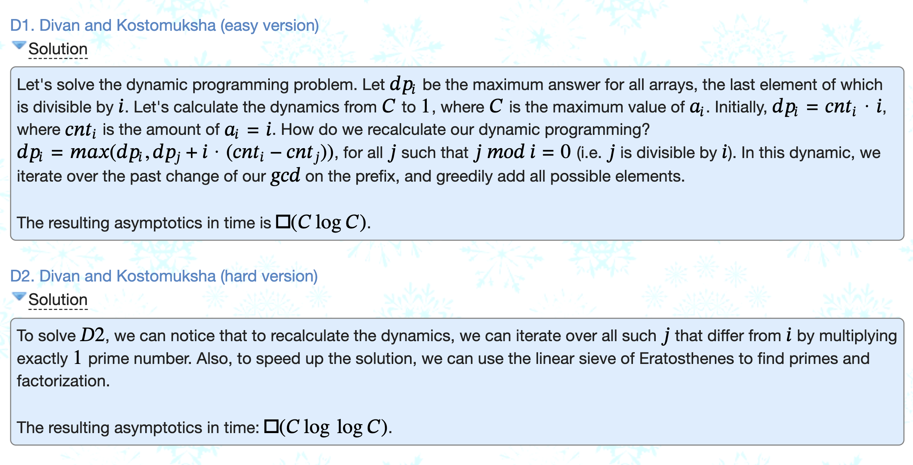

# Random points:

 
     # **In DP, the state represents all that really matters ( but also just enough that matters ) (Thus, compressed representation of all that matters, and only of what that actually matters)**

  
     
**Problem can be modeled into something related to subsets : 
TAKE / NOT_TAKE DP!!!!!!!!!!!!!!!!!!!!!!!!!**

  
     
VERY OFTEN WE PUT THE “K OPERATIONS” AS A PARAMETER IN THE DP STATE.

  
     I thought dp is not possible in such scenarios where there are overlapping intervals. But it is. I think it's because every position is from 0 to n, and not till 1e9 or something.

 

 
     **Math / Divisors based:
Sometimes when iterating over all numbers, and for each number: every multiple
you don’t need to do actually every multiple, just do (1 prime) step up.
Good example:** 

  
     **[https://codeforces.com/contest/1614/problem/D2](https://codeforces.com/contest/1614/problem/D2)**
  
     
**D1 used going over all multiples, but no need.**
 

