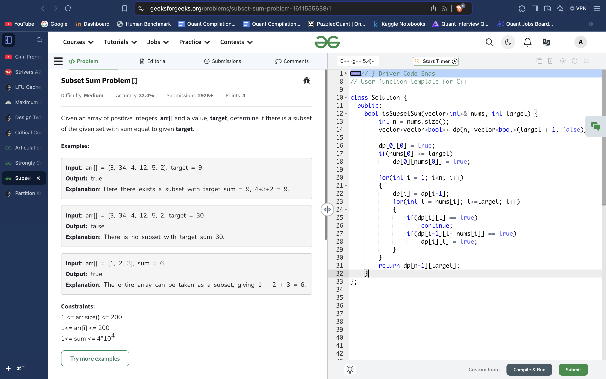
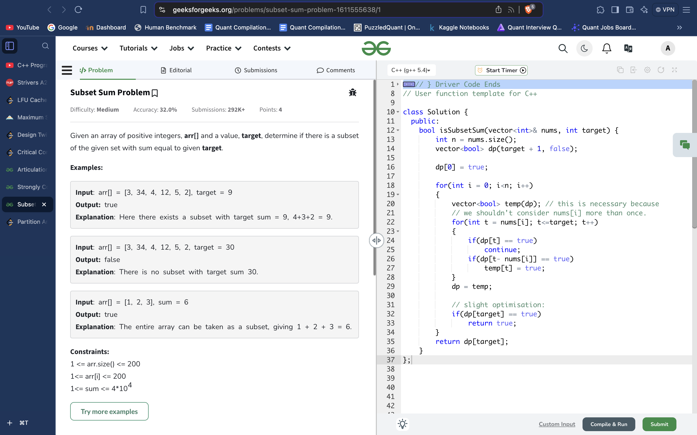
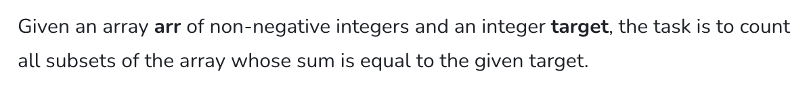
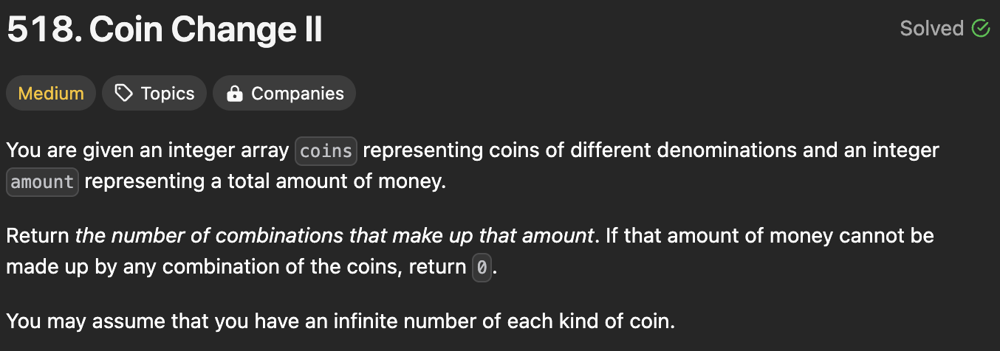
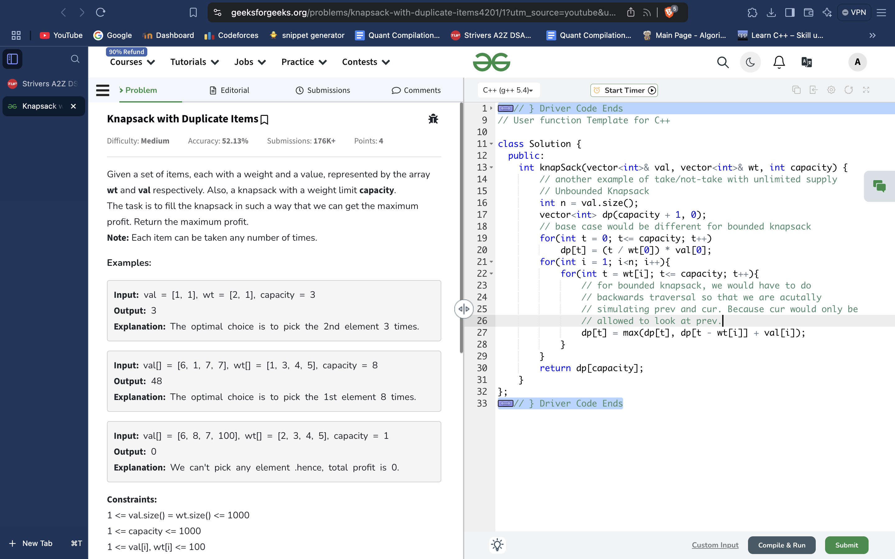
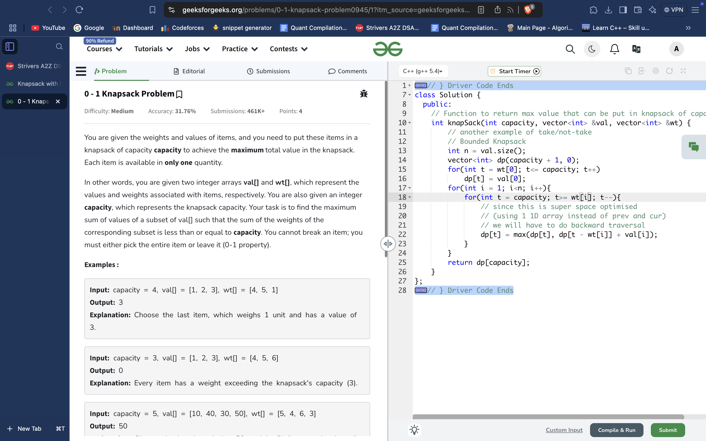

# SUBSETS (TAKE/NOT-TAKE)

 
     # **SUBSETS SUM = TARGET**

  
     **(take / not-take recursion problems ka DP template) 
(BASICALLY, ANY PROBLEM ON SUBSETS / SUBSEQUENCES)
Also has the Knapsack problems since those are also Take/Not-take.**

 

 
     **PROPER TABULATION:**
 

 
     
**TABULATION SPACE OPTIMISED:**
 

 
     **COUNTING VARIATION:**
 

class Solution {
  public:
    int perfectSum(vector<int>& nums, int target) {
        // code here
        int n = nums.size();
        vector<int> dp(target + 1, 0);
        dp[0] = 1;
        
        for(int i = 0; i < n; i++)
        {
            vector<int> temp(dp); // not take case handled
            for(int t = nums[i]; t<=target; t++)
            {
                temp[t] += dp[t-nums[i]];
            }
            dp = temp;
        }
        return dp[target];
    }
};

 
     # **UNDERLYING RECURSION**

 *// Function to check if there is a subset of 'arr' with a sum equal to 'target'*
bool subsetSumUtil(int ind, int target, vector<int>& arr, vector<vector<int>>& dp) {
    *// If the target sum is 0, we have found a subset*
    **if (target == 0)
        return true;**

    *// If we have reached the first element in 'arr'*
    if (ind == 0)
        return arr[0] == target;

    *// If the result for this subproblem has already been computed, return it*
    if (dp[ind][target] != -1)
        return dp[ind][target];

    *// Try not taking the current element into the subset*
    **bool notTaken = subsetSumUtil(ind - 1, target, arr, dp);**

    *// Try taking the current element into the subset if it doesn't exceed the target*
    **bool taken = false;
    if (arr[ind] <= target)
        taken = subsetSumUtil(ind - 1, target - arr[ind], arr, dp);**

    *// Store the result in the dp array to avoid recomputation*
    **return dp[ind][target] = notTaken || taken;**
}

*// Function to check if there is a subset of 'arr' with a sum equal to 'k'*
bool subsetSumToK(int n, int k, vector<int>& arr) {
    *// Initialize a 2D DP array for memoization*
    vector<vector<int>> dp(n, vector<int>(k + 1, -1));

    *// Call the recursive subsetSumUtil function*
    return subsetSumUtil(n - 1, k, arr, dp);
}

 
     # **EXAMPLE OF INF SUPPLY:**
 

class Solution {
public:
    // int util(int amount, int index, vector<int>& coins,vector<vector<int>>& dp )
    // {
    //     if(index == coins.size() -1 )
    //         return (dp[index][amount] = int(amount % coins[index] == 0) );
    //     if(amount < 0 )
    //         return 0;
    //     if(amount == 0)
    //         return 1;
    //     if(dp[index][amount] != -1)
    //         return dp[index][amount];
    //     return dp[index][amount] = util(amount - coins[index], index, coins, dp) + util(amount, index + 1, coins, dp);
    // }
    int change(int amount, vector<int>& coins) {
        // standard solution. same as find number of subsequences with sum = k.
        // but the difference is that this problem is based on take/not-take with infinite supply. 
        //slight change in recursion :take case mei we dont increment the index
        // change in bottom-up : when we come to a new index(hence a new value) , we take it as many times as possible(for each multiple we make the dp true / add to dp counter). So, we just need to let dp[i][t] look at dp[i][t - nums[i]] instead of making sure it looks at dp[i-1][t - nums[i]]. and if space optimised : no need for a temp vector. Let dp[t] look at dp[t-nums[i]]

        **int n = coins.size();
        vector<double> dp(amount + 1, 0);
        for(int t = 0; t<= amount; t++)
            dp[t] = (t % coins[0] == 0);
        for(int i = 1; i<n; i++){
            for(int t = coins[i]; t<= amount; t++){
                dp[t] = dp[t] + dp[t - coins[i]];
            }
        }
        return dp[amount];**

        // vector<long> prev(amount +1, 0), cur(amount +1, 0);
        // for(int i = 0; i<amount +1; i++){
        //     prev[i] = (i % coins[0] == 0);
        // }

        // for( int i = 1; i<n; i++)
        // {
        //     for(int a = 0; a <= amount ; a++)
        //     {
        //         long long nottake = prev[a];
        //         long long take = 0;
        //         if(a >= coins[i])
        //             take = cur[a - coins[i]];
        //         cur[a] = take + nottake;
        //     }
        //     prev = cur;
        // }
        // return prev[amount];
    }
};

 
     # **UNBOUNDED KNAPSACK(ANOTHER EXAMPLE OF INF SUPPLY)**
 

 
     # 

  
     # **BOUNDED KNAPSACK:**

 int knapSack(int capacity, vector<int> *&*val, vector<int> *&*wt) {
    vector<int> dp(capacity + 1, 0);
    int n = wt.size();
    for(int t = wt[0]; t<= capacity; t++)
        dp[t] = val[0];
    for(int i = 1; i<n; i++){
        for(int t = capacity; t>= wt[i]; t--){
            dp[t] = max(dp[t], dp[t - wt[i]] + val[i]);
        }
    }
    return dp[capacity];
}

 
     # **Subset Sum, retrieving a valid subset:**
 
    *vi* first(70000+1, -1);
    bitset<70000+1> dp;
    dp[0] = 1;
    f(i,n){
        int val = temp[i].ff;
        bitset<70000+1> ndp;
        ndp = dp | (dp<<val);
        bitset<70000+1> mask = ndp ^ dp;
        for(int j = mask._Find_first(); j<mask.size(); j= mask._Find_next(j)){
            first[j] = i;
        }
        dp = ndp;
    }

