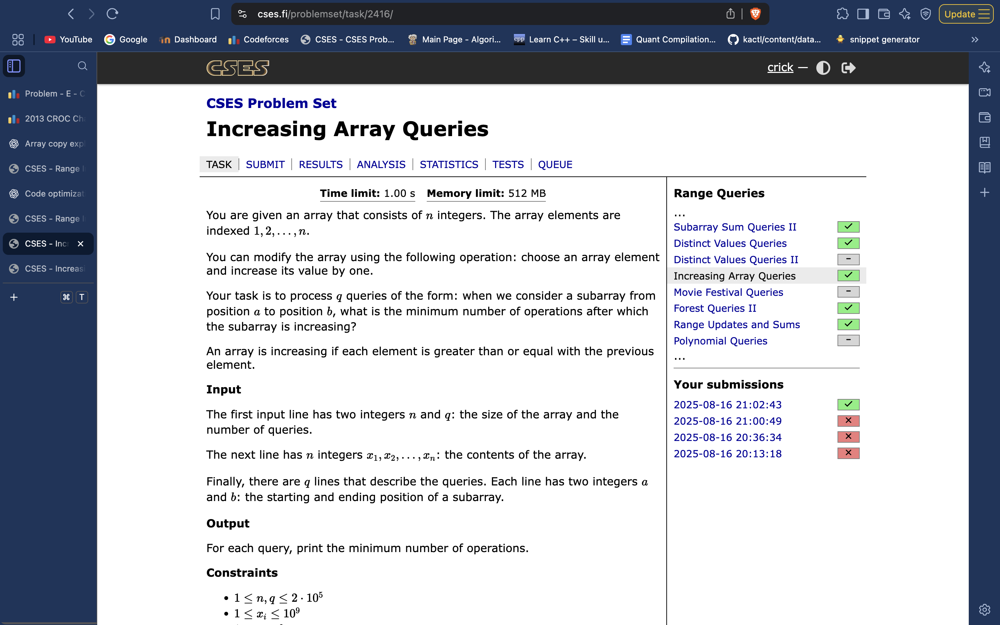
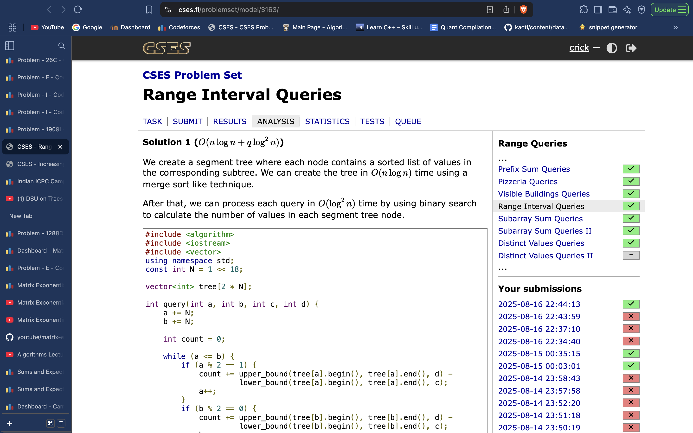
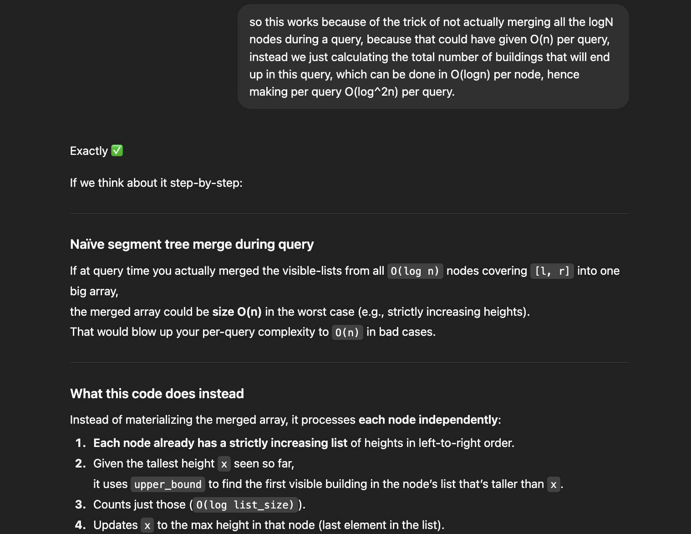

# Compressed array Seg Tree:
Custom Query function, No update function…

 
     # **Compressed array Seg Tree:**

  
     # **Custom Query function, No update function.**
  
     
**Each node stores compressed subarray of range it corresponds to**

 
 
     different kind of seg tree problem. Custom Query function, No update function.
Build the seg tree where each node stores a vector representation of the range it covers. This can work if no update functions and if we build the query function such that it doesn’t need to do the actual merging, and calulculates the answer just by looking at the O(logn) nodes for its range, and doing some fast caluclation per node(O(logN) or O(1) )
 
# 
struct *node*{
    *// acc to qn*
};
struct *SegTree*{
    int SZ;
    vector<*node*> t;
    SegTree(int size) : SZ(size), t(4*size){}
    *node* merge(*node* l, *node* r){
        *// acc to qn*
    }
    void build(int id, int l, int r, vector<int>*&* a){   
        if(l == r){
            *// leaf node, acc to qn*
            return;
        }
        int mid = (l + r)/2;
        build(2*id, l ,mid, a);
        build(2*id+1, mid + 1 ,r, a);
        t[id] = merge(t[2*id], t[(2*id) + 1]);
    }

    void query(int id, int l, int r, int lq, int rq, int *&*res, int *&*x){
        if((rq < l) || (lq > r)){
            return ; *// acc. to qn*
        }
        if((lq <= l) && (r <= rq)){ *// acc. to qn*
            *// this will be different than usual seg tree, has to be O(log(N) or better)*
            return;
        }
        int mid = (l + r)/2;
        query(2*id, l, mid, lq, rq, res, x);
        query((2*id) + 1, mid + 1, r, lq, rq, res, x);
        return;
    }
};

void solve(){

    ll n; 
    cin >> n;
    ll q; cin >> q;
    vi a(n); cin >> a;
    *SegTree* st(n);
    st.build(1, 0, n-1, a);
    while(q--){
        int l, r; cin >> l >> r;
        l--; r--;
        int res = 0;
        int x = 0;
        st.query(1, 0, n-1, l, r, res, x);
        cout << res << endl;
    }
}

# 
// solving:
struct node{
    vector<int> fixed;
    vector<int> pref;
    int val = 0;
};
 
struct SegTree{
    int SZ;
    vector<node> t;
    SegTree(int size) : SZ(size), t(4*size){}
    node merge(node l, node r){
        // acc to qn
        int maxi = l.fixed.back();
        for(auto x : r.fixed){
            l.val += max(0ll ,maxi - x);
            maxi = max(maxi, x);
            l.fixed.push_back(maxi);
            l.pref.push_back(l.pref.back() + maxi);
        }
        l.val += r.val;
        return l;
    }
    void build(int id, int l, int r, vector<int>& a){   
        if(l == r){
            // leaf node
            t[id] = {{a[l]}, {a[l]}, 0}; // acc. to qn
            return;
        }
        int mid = (l + r)/2;
        build(2*id, l ,mid, a);
        build(2*id+1, mid + 1 ,r, a);
        t[id] = merge(t[2*id], t[(2*id) + 1]);
    }
 
    void query(int id, int l, int r, int lq, int rq, int &res, int &x){
        if((rq < l) || (lq > r)){
            return ; // acc. to qn
        }
        if((lq <= l) && (r <= rq)){ // acc. to qn
            res += t[id].val;
            int p = lower_bound(all(t[id].fixed), x) - t[id].fixed.begin();
            p--;
            if(p>= 0){
                res += (x*(p+1) - t[id].pref[p]);
            }
            x = max(x, t[id].fixed.back());
            return;
        }
        int mid = (l + r)/2;
        query(2*id, l, mid, lq, rq, res, x);
        query((2*id) + 1, mid + 1, r, lq, rq, res, x);
        return;
    }
};
 
void solve(){
 
    ll n; 
    cin >> n;
    ll q; cin >> q;
    vi a(n); cin >> a;
    SegTree st(n);
    st.build(1, 0, n-1, a);
    while(q--){
        int l, r; cin >> l >> r;
        l--; r--;
        int res = 0;
        int x = 0;
        st.query(1, 0, n-1, l, r, res, x);
        cout << res << endl;
    }
 
}

#include <bits/stdc++.h>
#include <bits/extc++.h>
using namespace std;
using namespace __gnu_pbds; 
template<typename T> inline void input(T& x) {cin >> x;}
template<typename T, typename... S> inline void input(T& x, S&... args) {cin >> x; input(args ...);}
template<typename T> inline void print(T x) {cout << x << '\n';}
template<typename T, typename... S> inline void print(T x, S... args) {cout << x << ' '; print(args ...);}
template<typename T> inline void dbg(T x) {cerr << x << '\n';}
template<typename T, typename... S> inline void dbg(T x, S... args) {cerr << x << ", "; dbg(args ...);}
#define debug(...) cerr << #__VA_ARGS__ << ": "; dbg(__VA_ARGS__);
#define rep(i, a, b) for (auto i = (a); i < (b); i++)
#define arrput(l) for (auto &i : l) {cin >> i;}
#define arrprint(l) for (auto i : l) {cout << i << ' ';} cout << '\n'
#define setup() ios::sync_with_stdio(false); cin.tie(NULL); cout.tie(NULL)
#define int long long
#define ordered_set tree<int, null_type, less<int>, rb_tree_tag, tree_order_statistics_node_update> 
const int MOD = (int) 1e9 + 7; //998244353;

template<typename T, int SZ> struct SegTree {
	vector<T> seg; T id;
	T (*cmb) (T, T);
	SegTree(T _id, T _cmb(T, T)):id(_id),seg(2*SZ,id),cmb(_cmb){}
	void build() {for (int i=SZ-1; i >= 0; i--) seg[i]=cmb(seg[2*i],seg[2*i+1]);}
	void query(int l, int r, int &res, int &x, int s=0, int e=SZ-1, int c=1) {
		if (l > e || r < s) return;
		if (l <= s && r >= e) {
			if (!seg[c].empty()) {
				res += seg[c].end() - upper_bound(seg[c].begin(), seg[c].end(), x);
				x = max(x, seg[c].back());
			}
			return;
		}
		int mid = (s + e) / 2;
		query(l, r, res, x, s, mid, 2*c);
		query(l, r, res, x, mid + 1, e, 2*c+1);
	}
	void update(int i, T x, int s=0, int e=SZ-1, int c=1) {
		if (s > i || e < i) return;
		if (s == e) {seg[c] = x; return;}
		int mid = (s + e) / 2;
		update(i, x, s, mid, 2*c);
		update(i, x, mid + 1, e, 2*c+1);
		seg[c] = cmb(seg[2*c], seg[2*c+1]);
	}
};

SegTree<vector<int>, 1 << 17> s({},  {
	if (a.empty()) {
		return b;
	}
	int l = 0;
	while (l < b.size() and b[l] <= a.back()) {
		l++;
	}
	a.insert(a.end(), b.begin() + l, b.end());
	return a;
});

int32_t main() {
	setup();

	int n, q;
	input(n, q);

	vector<int> a(n);
	arrput(a);

	rep(i, 0, n) {
		s.seg[i + (1 << 17)] = {a[i]};
	}
	s.build();

	while (q--) {
		int l, r;
		input(l, r);

		int res = 0, x = 0;
		s.query(l - 1, r - 1, res, x);
		print(res);
	}
}

