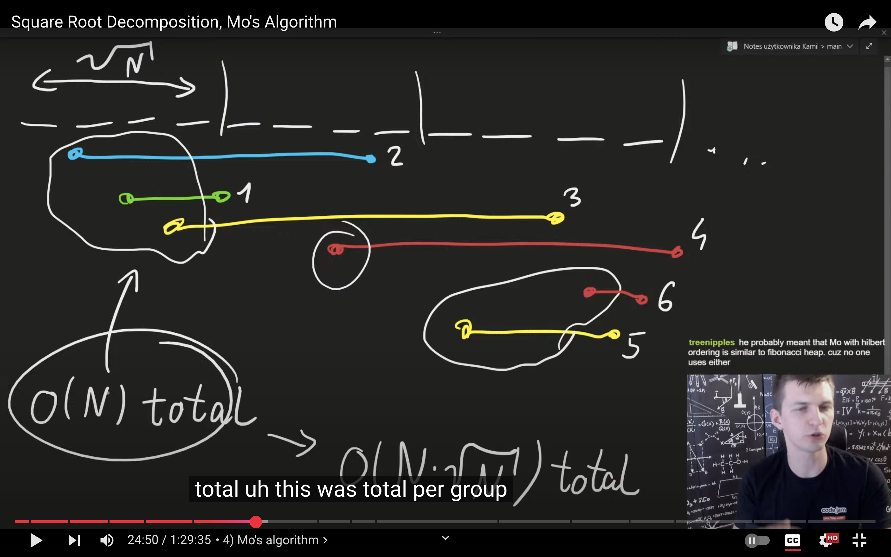
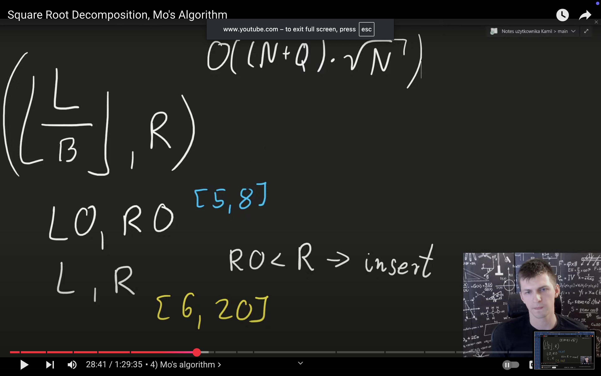
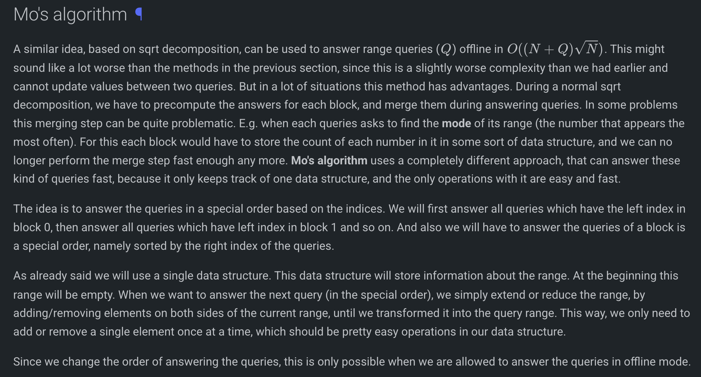
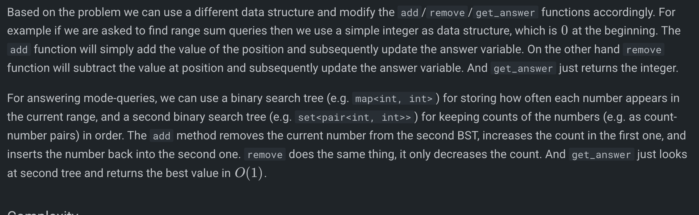
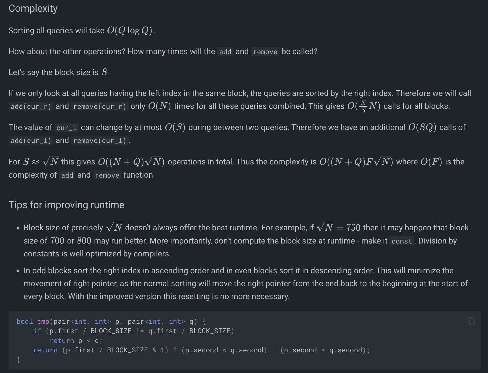

# Mo’s Algo: OFFLINE QUERIES.

 
     **For B = sqrt(N) , if N is 2e5, then use B = 500**

  
     # Idea is to have O(diff) per query where diff is the no. of  different indexes in a new query

  
     And then, to ensure the diff per query is small, we use 
  
     <u>Offline Queries</u>
  
      approach.
Also uses rootn grouping. And then sorting.

 

inline void remove(int idx);  // TODO: remove value at idx from data structure
inline void add(int idx);     // TODO: add value at idx from data structure
inline int get_answer();  // TODO: extract the current answer of the data structure

const int block_size = (int)sqrt(N); // TODO
 
struct Query {
    int l, r, idx;
    bool operator<(Query other) const
    {
        return make_pair(l / block_size, r) <
               make_pair(other.l / block_size, other.r);
        *// int block_a = l / block_size;*
        *// int block_b = other.l / block_size;*
        *// if (block_a != block_b) return block_a < block_b;*
        *// return (block_a & 1) ? (r > other.r) : (r < other.r); // Hilbert-like ordering*
    }
};

vector<int> mo_s_algorithm(vector<Query> queries) {
    vector<int> answers(queries.size());
    sort(queries.begin(), queries.end());

    // TODO: initialize data structure

    int cur_l = 0;
    int cur_r = -1;
    // invariant: data structure will always reflect the range [cur_l, cur_r]
    for (Query q : queries) {
        while (cur_l > q.l) {
            cur_l--;
            add(cur_l);
        }
        while (cur_r < q.r) {
            cur_r++;
            add(cur_r);
        }
        while (cur_l < q.l) {
            remove(cur_l);
            cur_l++;
        }
        while (cur_r > q.r) {
            remove(cur_r);
            cur_r--;
        }
        answers[q.idx] = get_answer();
    }
    return answers;
    *// int cur_l = 0, cur_r = -1;*
    *// for (auto &q : queries) {*
    *//     while (cur_l > q.l) add(--cur_l);*
    *//     while (cur_r < q.r) add(++cur_r);*
    *//     while (cur_l < q.l) remove_(cur_l++);*
    *//     while (cur_r > q.r) remove_(cur_r--);*
    *//     answers[q.idx] = get_answer();*
    *// }*
    *// return answers;*
}

void solve(){

    cin >> n >> m >> k;
    f(i,n) 
        cin >> a[i];
    vector<*Query*> queries(m);
    for(int i = 0; i<m; i++){
        ll l, r; cin >> l >> r;
        l--; r--;
        queries[i].l = l;
        queries[i].r = r;
        queries[i].idx = i;
    }
    *vi* v = mo_s_algorithm(queries);
    for(auto it : v){
        cout << it << endl;
    }
    *// cin >> n >> q;*
    *// f(i,n) cin >> a[i];*

    *// // coordinate compression*
    *// vector<int> vals(a, a+n);*
    *// sort(vals.begin(), vals.end());*
    *// vals.erase(unique(vals.begin(), vals.end()), vals.end());*
    *// f(i,n) a[i] = lower_bound(vals.begin(), vals.end(), a[i]) - vals.begin() + 1;*

    *// // block_size = max(1, (int)(n / sqrt(q)));*
    *// vector<Query> queries; queries.reserve(q);*
    *// f(i,q) {*
    *//     int l, r; cin >> l >> r;*
    *//     l--; r--;*
    *//     queries.push_back({l, r, i});*
    *// }*
    *// auto ans = mo_s_algorithm(queries);*
    *// for (int x : ans) cout << x << '\n';*
}

