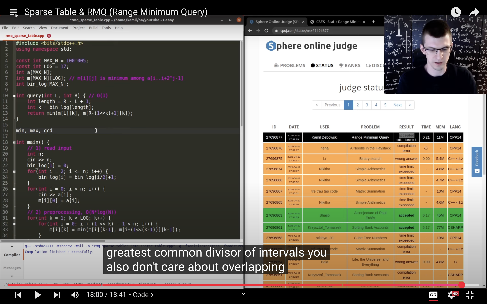
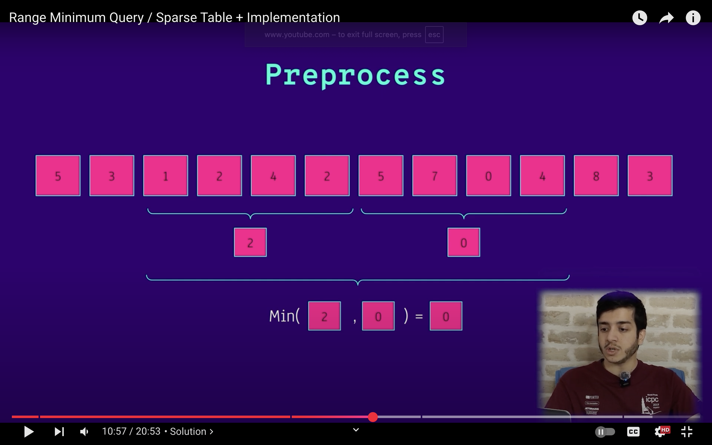
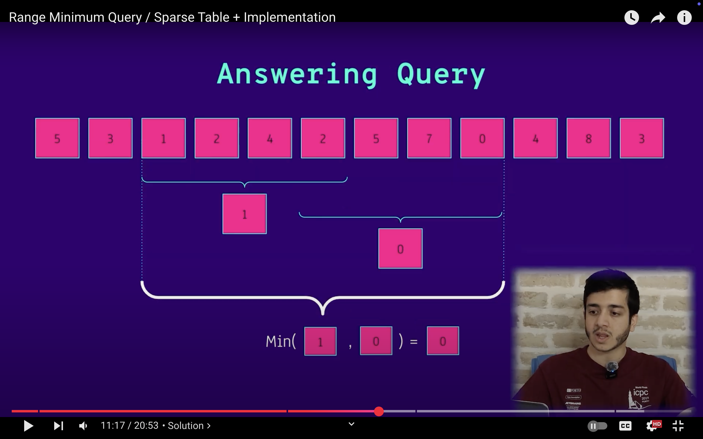
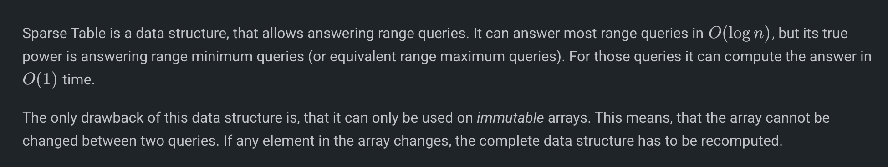
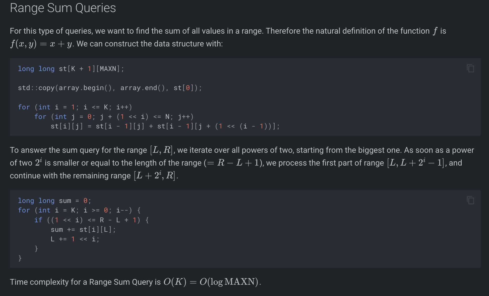
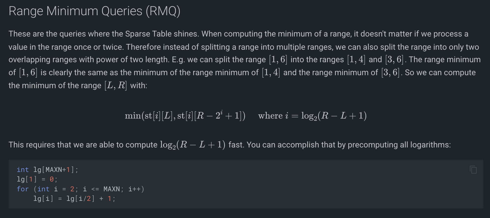
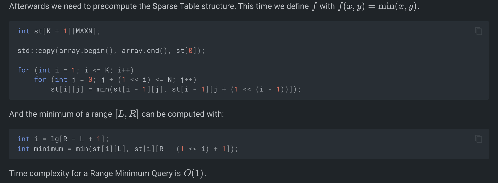

# SPARSE TABLE: (sid calls this RMQ)

int lg[MAXN+1];
lg[1] = 0;
for (int i = 2; i <= MAXN; i++)
    lg[i] = lg[i/2] + 1;

int K = lg[MAXN];
int st[K + 1][MAXN];
std::copy(a.begin(), a.end(), st[0]);
for (int i = 1; i <= K; i++)
    for (int j = 0; j + (1 << i) <= MAXN; j++)
        st[i][j] = min(st[i - 1][j], st[i - 1][j + (1 << (i - 1))]);

int i = lg[r - l + 1]; 
int minimum = min(st[i][l], st[i][r - (1 << i) + 1]);

# 

# 
# 
# Range Sum:

long long st[K + 1][MAXN];
std::copy(array.begin(), array.end(), st[0]);
for (int i = 1; i <= K; i++)
    for (int j = 0; j + (1 << i) <= N; j++)
        st[i][j] = st[i - 1][j] + st[i - 1][j + (1 << (i - 1))];

long long sum = 0;
for (int i = K; i >= 0; i--) {
    if ((1 << i) <= R - L + 1) {
        sum += st[i][L];
        L += 1 << i;
    }
}

# Range Minimum:

int lg[MAXN+1];
lg[1] = 0;
for (int i = 2; i <= MAXN; i++)
    lg[i] = lg[i/2] + 1;

int K = lg[MAXN];
int st[K + 1][MAXN];
std::copy(a.begin(), a.end(), st[0]);
for (int i = 1; i <= K; i++)
    for (int j = 0; j + (1 << i) <= MAXN; j++)
        st[i][j] = min(st[i - 1][j], st[i - 1][j + (1 << (i - 1))]);

int i = lg[r - l + 1];
int minimum = min(st[i][l], st[i][r - (1 << i) + 1]);

 
     A sparse table is calculated using a D&C DP in bottom-up tabulation style.
 
