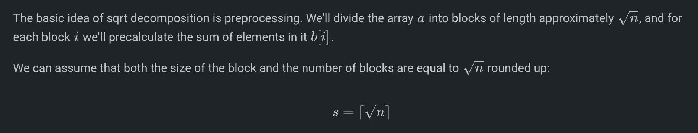
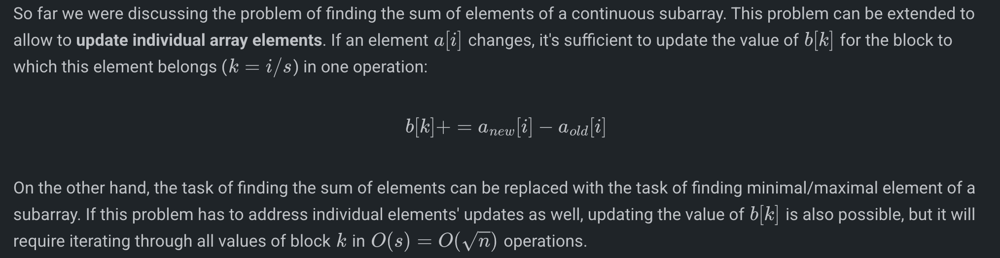

# SQRT DECOMPOSITION

 
     **For B = sqrt(N) , if N is 2e5, then use B = 500**
 
# 

// input data
int n;
vector<int> a (n);

// preprocessing
int len = (int) sqrt (n + .0) + 1; // size of the block and the number of blocks
vector<int> b (len);
for (int i=0; i<n; ++i)
    b[i / len] += a[i];

// answering the queries
for (;;) {
    int l, r;
  // read input data for the next query
    int sum = 0;
    for (int i=l; i<=r; )
        if (i % len == 0 && i + len - 1 <= r) {
            // if the whole block starting at i belongs to [l, r]
            sum += b[i / len];
            i += len;
        }
        else {
            sum += a[i];
            ++i;
        }
}

int sum = 0;
int c_l = l / len,   c_r = r / len;
if (c_l == c_r)
    for (int i=l; i<=r; ++i)
        sum += a[i];
else {
    for (int i=l, end=(c_l+1)*len-1; i<=end; ++i)
        sum += a[i];
    for (int i=c_l+1; i<=c_r-1; ++i)
        sum += b[i];
    for (int i=c_r*len; i<=r; ++i)
        sum += a[i];
}