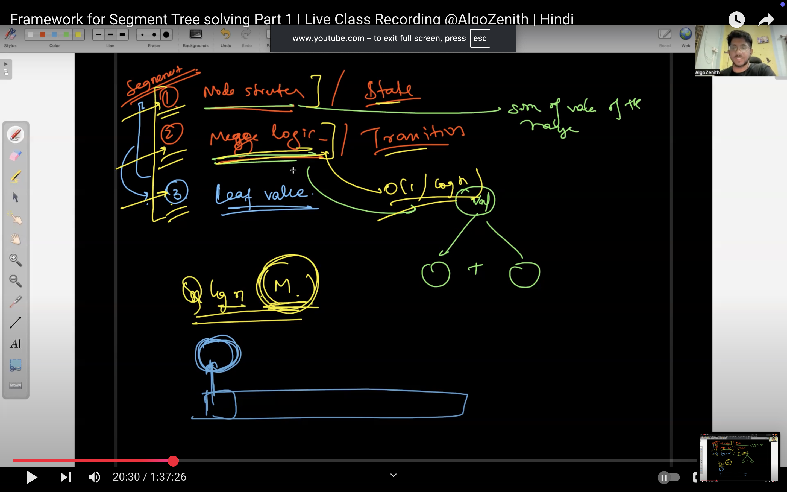
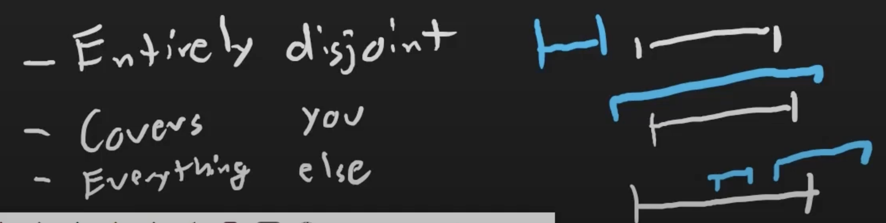

# Theory SegTree

 
     <u>When it has to be O(Q logN) and handles between query updates</u>

  
     vese O(Q logn) is a sparse table but no updates possible.
and a O(Q rootn) with updates is a sqrt decomposition (useful when complex structure)

 
 
     # **1.Node structure** 

  
     # **2.Merge Logic ( O(1) or O(logn) )**

  
     # **3.Leaf Value**
 

