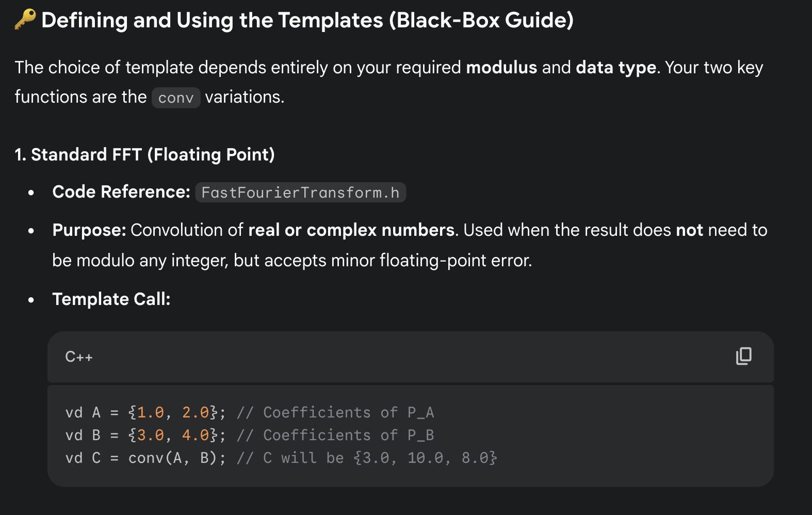
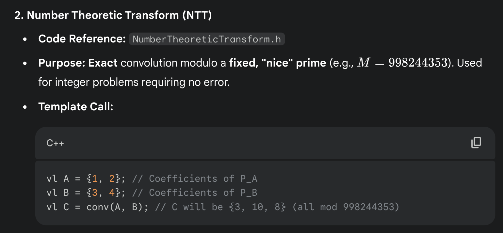
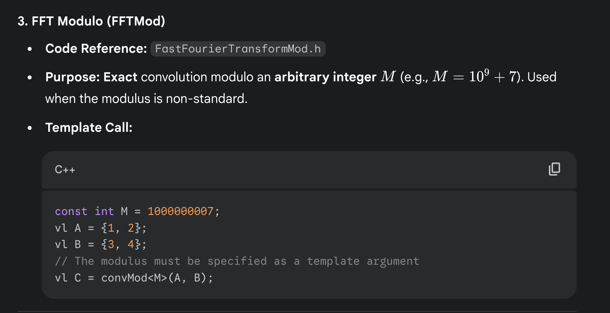

# Code:

#

# 

# 



#

```cpp
FastFourierTransform.h
ˆ
Description: fft(a) computes
f(k) = xa[x] exp(2πi·kx/N) for all k.
N must be a power of 2. Useful for convolution: conv(a, b) = c, where
c[x] = a[i]b[x−i]. For convolution of complex numbers or more than two
vectors: FFT, multiply pointwise, divide by n, reverse(start+1, end), FFT
back. Rounding is safe if ( a2
i + b2
i) log2 N <9·1014 (in practice 1016 ;
higher for random inputs). Otherwise, use NTT/FFTMod.
Time: O(Nlog N) with N= |A|+ |B|(∼1s for N = 222 ) 
typedef complex<double> C;
typedef vector<double> vd;
void fft(vector<C>& a) {
int n = sz(a), L = 31 - __builtin_clz(n);
static vector<complex<long double>> R(2, 1);
static vector<C> rt(2, 1); // (^ 10% f a s t e r i f double )
for (static int k = 2; k < n; k *= 2) {
R.resize(n); rt.resize(n);
auto x = polar(1.0L, acos(-1.0L) / k);
rep(i,k,2*k) rt[i] = R[i] = i&1 ? R[i/2] * x : R[i/2];
}
vi rev(n);
rep(i,0,n) rev[i] = (rev[i / 2] | (i & 1) << L) / 2;
rep(i,0,n) if (i < rev[i]) swap(a[i], a[rev[i]]);
for (int k = 1; k < n; k *= 2)
for (int i = 0; i < n; i += 2 * k) rep(j,0,k) {
C z = rt[j+k] * a[i+j+k]; // (25% f a s t e r i f hand =r o l l e d )
a[i + j + k] = a[i + j] - z;
a[i + j] += z;
}
}
vd conv(const vd& a, const vd& b) {
if (a.empty() || b.empty()) return { } ;
vd res(sz(a) + sz(b) - 1);
int L = 32 - __builtin_clz(sz(res)), n = 1 << L;
vector<C> in(n), out(n);
copy(all(a), begin(in));
rep(i,0,sz(b)) in[i].imag(b[i]);
fft(in);
for (C& x : in) x *= x;
rep(i,0,n) out[i] = in[-i & (n - 1)] - conj(in[i]);
fft(out);
rep(i,0,sz(res)) res[i] = imag(out[i]) / (4 * n);
return res;
}


FastFourierTransformMod.h
Description: Higher precision FFT, can be used for convolutions modulo
arbitrary integers as long as Nlog2 N·mod <8.6·1014 (in practice 1016 or
higher). Inputs must be in [0,mod).
Time: O(Nlog N), where N= |A|+ |B|(twice as slow as NTT or FFT)
typedef vector<ll> vl;
template<int M> vl convMod(const vl &a, const vl &b) {
if (a.empty() || b.empty()) return { } ;
vl res(sz(a) + sz(b) - 1);
int B=32-__builtin_clz(sz(res)), n=1<<B, cut=int(sqrt(M));
vector<C> L(n), R(n), outs(n), outl(n);
rep(i,0,sz(a)) L[i] = C((int)a[i] / cut, (int)a[i] % cut);
rep(i,0,sz(b)) R[i] = C((int)b[i] / cut, (int)b[i] % cut);
fft(L), fft(R);
rep(i,0,n) {
int j = -i & (n - 1);
outl[j] = (L[i] + conj(L[j])) * R[i] / (2.0 * n);
outs[j] = (L[i] - conj(L[j])) * R[i] / (2.0 * n) / 1i;
}
fft(outl), fft(outs);
rep(i,0,sz(res)) {
ll av = ll(real(outl[i])+.5), cv = ll(imag(outs[i])+.5);
ll bv = ll(imag(outl[i])+.5) + ll(real(outs[i])+.5);
res[i] = ((av % M * cut + bv) % M * cut + cv) % M;
}
return res;
}


NumberTheoreticTransform.h
ˆ
Description: ntt(a) computes
f(k) = xa[x]gxk for all k, where g =
root(mod−1)/N. N must be a power of 2. Useful for convolution modulo spe-
cific nice primes of the form 2ab+ 1, where the convolution result has size
at most 2a. For arbitrary modulo, see FFTMod. conv(a, b) = c, where
c[x] = a[i]b[x−i]. For manual convolution: NTT the inputs, multiply
pointwise, divide by n, reverse(start+1, end), NTT back. Inputs must be in
[0, mod).
Time: O(Nlog N)

const ll mod = (119 << 23) + 1, root = 62; // = 998244353
// For p < 2^30 there i s also e . g . 5 << 25, 7 << 26, 479 << 21
// and 483 << 21 (same root ) . The l a s t two are > 10^9.
typedef vector<ll> vl;
ll modpow(ll b, ll e) {
ll ans = 1;
for (; e; b = b * b % mod, e /= 2)
if (e & 1) ans = ans * b % mod;
return ans;
}
void ntt(vl &a) {
int n = sz(a), L = 31 - __builtin_clz(n);
static vl rt(2, 1);
for (static int k = 2, s = 2; k < n; k *= 2, s++) {
rt.resize(n);
ll z[] = { 1, modpow(root, mod >> s) } ;
rep(i,k,2*k) rt[i] = rt[i / 2] * z[i & 1] % mod;
}
vi rev(n);
rep(i,0,n) rev[i] = (rev[i / 2] | (i & 1) << L) / 2;
rep(i,0,n) if (i < rev[i]) swap(a[i], a[rev[i]]);
for (int k = 1; k < n; k *= 2)
for (int i = 0; i < n; i += 2 * k) rep(j,0,k) {
ll z = rt[j + k] * a[i + j + k] % mod, &ai = a[i + j];
a[i + j + k] = ai - z + (z > ai ? mod : 0);
ai += (ai + z >= mod ? z - mod : z);
}
}
vl conv(const vl &a, const vl &b) {
if (a.empty() || b.empty()) return { } ;
int s = sz(a) + sz(b) - 1, B = 32 - __builtin_clz(s),
n = 1 << B;
int inv = modpow(n, mod - 2);
vl L(a), R(b), out(n);
L.resize(n), R.resize(n);
ntt(L), ntt(R);
rep(i,0,n)
out[-i & (n - 1)] = (ll)L[i] * R[i] % mod * inv % mod;
ntt(out);
return { out.begin(), out.begin() + s } ;
}
```

```
