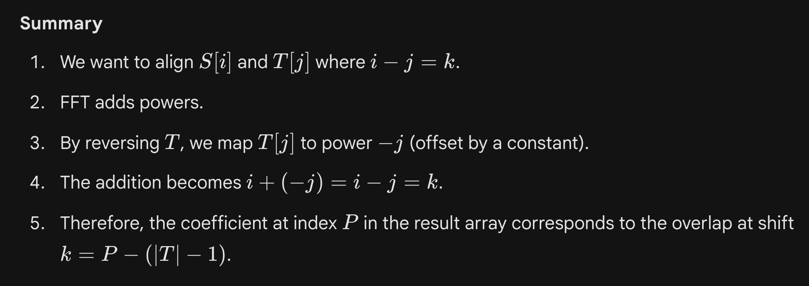

# i - j = k

**Standard FFT problem where we are interested in pairs of indexes, which have common difference, and hence, we need to reverse one polynomial/vector, and then do FFT.**

[https://codeforces.com/problemset/problem/954/I](https://codeforces.com/problemset/problem/954/I)

