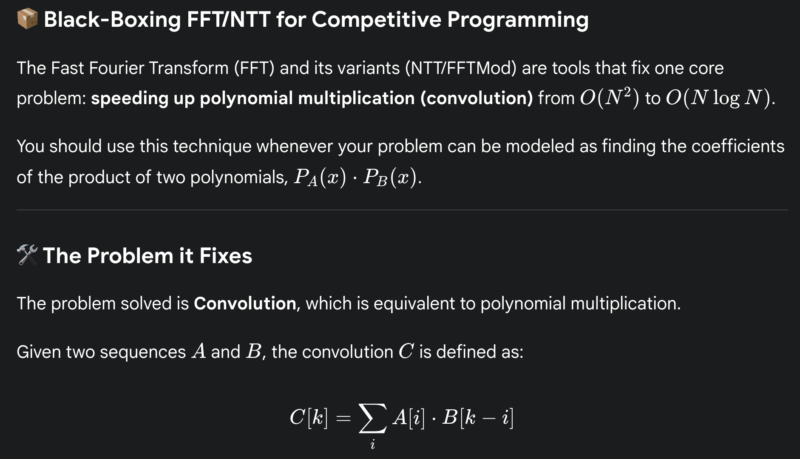
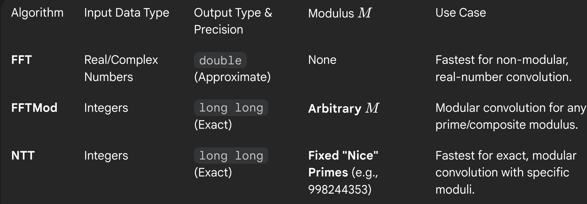

# if you can model the problem down to : Polynomial Multiplication

 
     # if you can model the problem down to : 
  
     **Polynomial Multiplication**

 

 
     

so whenever I have 2 polynomials, of arbitrary size, and want to find the polynomial after multiplying both of them, I use this right? If the mod is "nice" I use NTT. If not, I use FFTMod, and if I am not dealing with mod, and if I am dealing with doubles, just use FFT.
 

[http://cp-algorithms.com/algebra/fft.html](http://cp-algorithms.com/algebra/fft.html)

