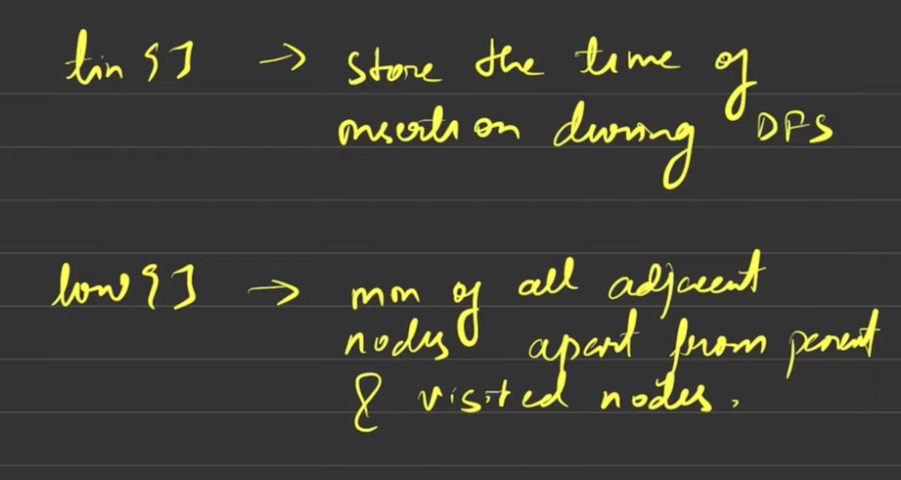

# ARTICULATION POINTS (undirected connected)

# 
# **find all the vertices removing which (and edges through it) disconnect the graph into 2 or more components.**

 
     **CP ALGO WEBSITE**

 int n; // number of nodes
vector<vector<int>> adj; // adjacency list of graph

vector<bool> visited;
vector<int> tin, low;
int timer;

void dfs(int v, int p = -1) {
    visited[v] = true;
    tin[v] = low[v] = timer++;
    int children=0; // actually this is only_visited_through_root_children
    for (int to : adj[v]) {
        if (to == p) continue;
        if (visited[to]) {
            low[v] = min(low[v], tin[to]); // we dont incr children here
        } else {
            dfs(to, v);
            low[v] = min(low[v], low[to]);
            if (low[to] >= tin[v] && p!=-1)
                IS_CUTPOINT(v);
            ++children;
        }
    }
    if(p == -1 && children > 1)
        IS_CUTPOINT(v);
}

void find_cutpoints() {
    timer = 0;
    visited.assign(n, false);
    tin.assign(n, -1);
    low.assign(n, -1);
    for (int i = 0; i < n; ++i) {
        if (!visited[i])
            dfs (i);
    }
}

 
     **STRIVER**
 
class Solution {
private:
    int timer = 1;
    void dfs(int node, int parent, vector<int> &vis, int tin[], int low[],
             vector<int> &mark, vector<int>adj[]) {
        vis[node] = 1;
        tin[node] = low[node] = timer;
        timer++;
        int child = 0; // more appropiately, it should be individual_dfs_calls
        for (auto it : adj[node]) {
            if (it == parent) continue;
            if (!vis[it]) {
                dfs(it, node, vis, tin, low, mark, adj);
                low[node] = min(low[node], low[it]);
                if (low[it] >= tin[node] && parent != -1) { // first change
			// we take >= because here were are removing entire node, so low[it] must be strictly less than tin[node], and hence must be connected to an ancestor of node. if they are ==, then still this point is an articulation point, because that means that it is connected to node, but through another edge, and this still won’t work as we are removing node here, and not just the edge.
                    mark[node] = 1;
                }
                child++;
            }
            else {
                low[node] = min(low[node], tin[it]); // second change
		// here, low represents min of all adj nodes except (parent OR VISITED NODES).
            }
        }
        if (child > 1 && parent == -1) { // third change
            mark[node] = 1;
        }
    }
public:
    vector<int> articulationPoints(int n, vector<int>adj[]) {
        vector<int> vis(n, 0);
        int tin[n];
        int low[n];
        vector<int> mark(n, 0);
        for (int i = 0; i < n; i++) {
            if (!vis[i]) {
                dfs(i, -1, vis, tin, low, mark, adj);
            }
        }
        vector<int> ans;
        for (int i = 0; i < n; i++) {
            if (mark[i] == 1) {
                ans.push_back(i);
            }
        }
        if (ans.size() == 0) return { -1};
        return ans;
    }
};

