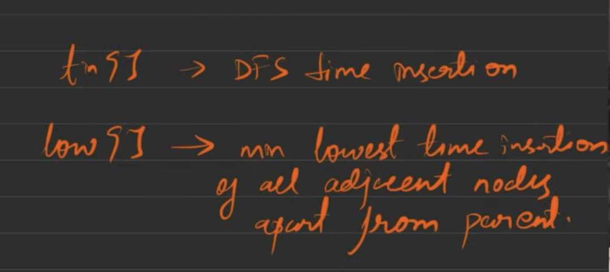

# BRIDGES / CRITICAL EDGE

CONNECTED , UNDIRECTED

 
     A critical connection is a connection that, if removed, will make some nodes unable to reach some other nodes.

 int tin[N];
int low[N];
vector<int> vis;
int timer;
*vpi* bridges;
void dfs(int node, int parent){
    vis[node] = 1;
    tin[node] = low[node] = timer;
    timer++;
    for (auto it : adjL[node]) {
        if (it == parent) continue;
        if (vis[it] == 0) {
            dfs(it, node);
            low[node] = min(low[it], low[node]);
            if (low[it] > tin[node]) {
                bridges.push_back({it, node});
            }
        }
        else {
            low[node] = min(low[node], low[it]);
        }
    }
}

    timer = 1;
    vis.assign(n+1, 0);
    bridges.clear();
    dfs(root, -1);

**Using Tarjan's Algorithm of time in and low time:**
class Solution {
private:
    int timer = 1;
    void dfs(int node, int parent, vector<int> &vis,
             vector<int> adj[], int tin[], int low[], vector<vector<int>> &bridges) {
        vis[node] = 1;
        tin[node] = low[node] = timer;
        timer++;
        for (auto it : adj[node]) {
            if (it == parent) continue;
            if (vis[it] == 0) {
                dfs(it, node, vis, adj, tin, low, bridges);
                low[node] = min(low[it], low[node]);
                *// node --- it*
                if (low[it] > tin[node]) {
                    bridges.push_back({it, node});
                }
            }
            else {
                low[node] = min(low[node], low[it]);
            }
        }
    }
public:
    vector<vector<int>> criticalConnections(int n,
    vector<vector<int>>& connections) {
        vector<int> adj[n];
        for (auto it : connections) {
            int u = it[0], v = it[1];
            adj[u].push_back(v);
            adj[v].push_back(u);
        }
        vector<int> vis(n, 0);
        int tin[n];
        int low[n];
        vector<vector<int>> bridges;
        dfs(0, -1, vis, adj, tin, low, bridges);
        return bridges;
    }
};

# INTUITION:

 
     **Whenever you want to do something with each cycle : Break the graph about bridges.**

 

