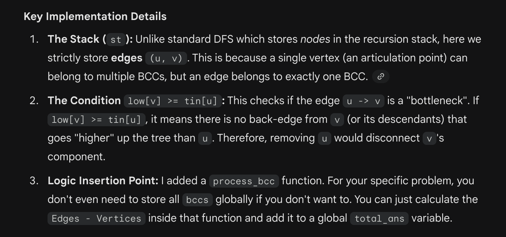

# BiConnected Components

#include <iostream>
#include <vector>
#include <stack>
#include <set>
#include <algorithm>

using namespace std;

*// Global variables for the graph*
*const* int MAXN = 100005; *// Adjust based on constraints*
vector<int> adjL[MAXN];
int tin[MAXN], low[MAXN];
int timer;
stack<pair<int, int>> st; *// Stack to store edges*
vector<vector<pair<int, int>>> bccs; *// To store the result blocks*

*// Function to process a found BCC*
void process_bcc(vector<pair<int, int>>*&* edges) {
    *// ---------------------------------------------------------*
    *// YOUR SPECIFIC PROBLEM LOGIC GOES HERE*
    *// Example: Count edges and unique vertices in this block*
    *// ---------------------------------------------------------*
    
    set<int> unique_nodes;
    for (auto& edge : edges) {
        unique_nodes.insert(edge.first);
        unique_nodes.insert(edge.second);
    }
    
    long long E_block = edges.size();
    long long V_block = unique_nodes.size();
    
    *// For your specific problem:*
    *// If Edges > Vertices, the extra edges are internal chords*
    if (E_block > V_block) {
        *// ans += (E_block - V_block);*
    }
    
    *// Debug output*
    *// cout << "Block found: " << E_block << " edges, " << V_block << " vertices." << endl;*
}

void dfs(int u, int p = -1) {
    tin[u] = low[u] = ++timer;
    
    for (int v : adjL[u]) {
        if (v == p) continue;
        
        if (tin[v]) { 
            *// Back-edge found*
            low[u] = min(low[u], tin[v]);
            *// Only push back-edge if we are visiting it for the first time* 
            *// (tin[v] < tin[u] prevents duplicates in undirected graphs)*
            if (tin[v] < tin[u]) {
                st.push({u, v});
            }
        } else {
            *// Tree-edge found*
            st.push({u, v});
            dfs(v, u);
            low[u] = min(low[u], low[v]);
            
            *// Check if u is an articulation point for the subtree at v*
            if (low[v] >= tin[u]) {
                vector<pair<int, int>> current_bcc;
                while (true) {
                    pair<int, int> edge = st.top();
                    st.pop();
                    current_bcc.push_back(edge);
                    if (edge == make_pair(u, v)) break;
                }
                
                *// Store or process the BCC immediately*
                bccs.push_back(current_bcc);
                process_bcc(current_bcc);
            }
        }
    }
}

void find_bccs(int n) {
    timer = 0;
    for (int i = 1; i <= n; i++) {
        tin[i] = 0; 
        low[i] = 0;
    }
    
    for (int i = 1; i <= n; i++) {
        if (!tin[i]) {
            *// Clear stack for new component (safety)*
            while (!st.empty()) st.pop(); 
            dfs(i);
        }
    }
}

int main() {
    int n, m; *// Vertices, Edges*
    cin >> n >> m;
    
    for (int i = 0; i < m; i++) {
        int u, v;
        cin >> u >> v;
        adj[u].push_back(v);
        adj[v].push_back(u);
    }
    
    find_bccs(n);
    
    *// Output results or final answer here*
    return 0;
}
