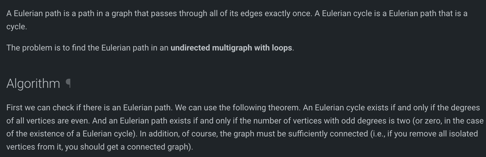
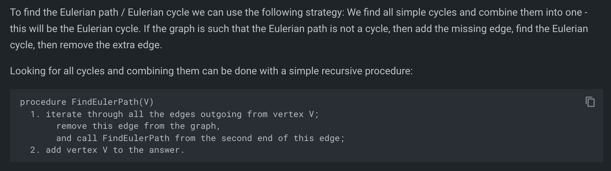
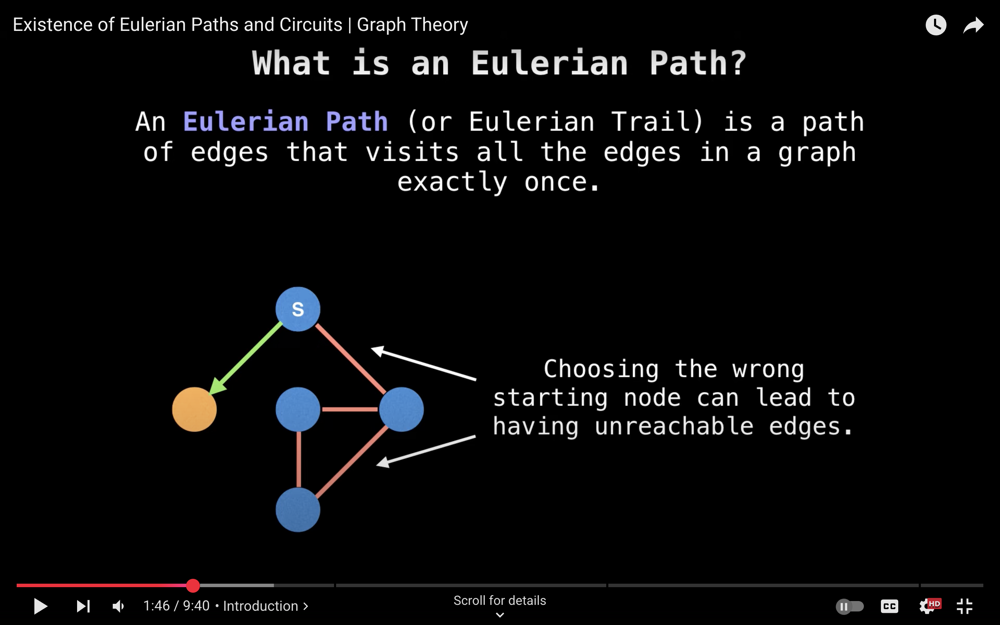
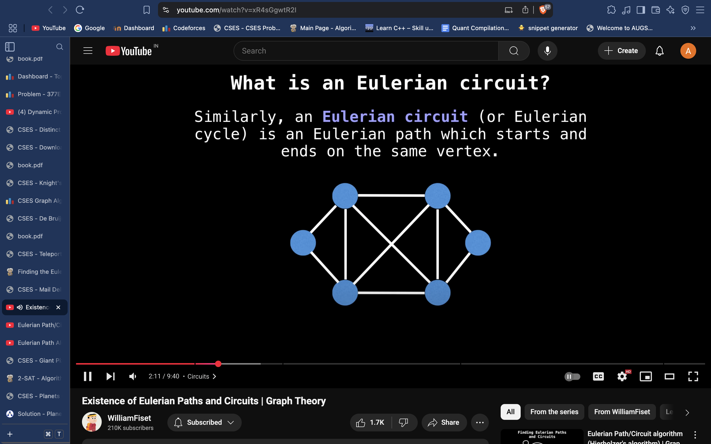
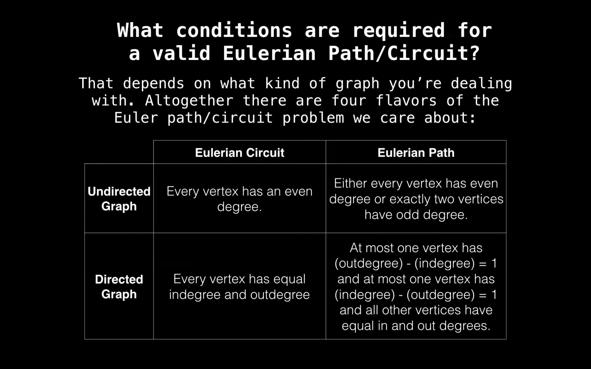
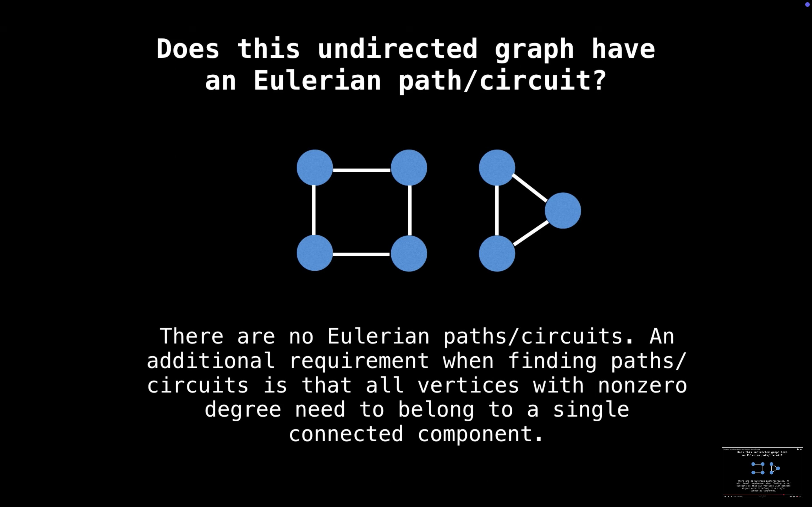
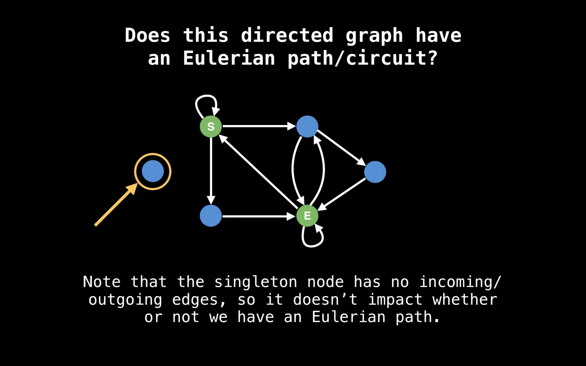

# Eurler Path / Euler Cycle

 
     **[https://cp-algorithms.com/graph/euler_path.htm](https://cp-algorithms.com/graph/euler_path.htm)**
 
# 
 
     # Non-recursive approach : 

 *const* int N = 2e5 + 5;
set<int> adjL[N];
*vi* ans;
ll n, m;
void solve()
{
    cin >> n >> m;
    ans.clear();
    f(i, n + 1){
        adjL[i].clear();
    }
    f(i, m){
        ll u, v;
        cin >> u >> v;
        adjL[u].insert(v);
        adjL[v].insert(u);
    }
    for (int i = 1; i <= n; i++){
        if (adjL[i].size() % 2 == 1){
            cout << "IMPOSSIBLE" << endl;
            return;
        }
    }
 
         ***// stack St;***
 
 
         ***// put start vertex in St;***
 
 
         ***// until St is empty***
 
 
         ***// let V be the value at the top of St;***
 
 
         ***// if degree(V) = 0, then***
 
 
         ***//     add V to the answer;***
 
 
         ***//     remove V from the top of St;***
 
 
         ***// otherwise***
 
 
         ***//     find any edge coming out of V;***
 
 
         ***//     remove it from the graph;***
 
 
         ***//     put the second end of this edge in St;***
  
     
    **stack<int> st;
    st.push(1);
    while(!st.empty()){
        int u = st.top();
        if(adjL[u].size() == 0){
            st.pop();
            ans.pb(u);
        } else{
            int v = *adjL[u].begin();
            st.push(v);
            adjL[v].erase(u);
            adjL[u].erase(v);
        }
    }**
 
#     if( (m+1) != ans.size()){
#         cout << "IMPOSSIBLE" << endl;
#         return;
#     }
#     cans;
# }
 
     # 

  
     # Recursive 

  
     # CSES code : 

  
     # [https://cses.fi/problemset/model/1691/](https://cses.fi/problemset/model/1691/)
 
#include <iostream>
#include <set>
#include <vector>
using namespace std;

vector<set<int>> graph;
vector<int> cycle;

void fail() {
    cout << "IMPOSSIBLE\n";
    exit(0);
}

void find_cycle(int node) {
    while (!graph[node].empty()) {
        int next_node = *graph[node].begin();
        graph[node].erase(next_node);
        graph[next_node].erase(node);
        find_cycle(next_node);
    }
    cycle.push_back(node);
}

int main() {
    int n, m;
    cin >> n >> m;

    graph.resize(n + 1);
    for (int i = 1; i <= m; i++) {
        int a, b;
        cin >> a >> b;
        graph[a].insert(b);
        graph[b].insert(a);
    }

    for (int i = 1; i <= n; i++) {
        if (graph[i].size() % 2 != 0) fail();
    }

    find_cycle(1);
    if (cycle.size() != m + 1) fail();

    for (auto node : cycle) {
        cout << node << " ";
    }
    cout << "\n";
}
 
     My code :

 
*const* int N = 2e5 + 5;
set<int> adjL[N];
set<int> removed[N];
*vi* vis(N, 0);
*vi* ans;
ll n, m;
void dfs(int node)
{
    *// cout << node << endl;*
    for (auto v : adjL[node])
    {
        if (removed[node].find(v) == removed[node].end())
        {
            adjL[v].erase(node);
            removed[node].insert(v);
            dfs(v);
        }
    }
    ans.pb(node);
}
void solve()
{
    cin >> n >> m;
    vis.assign(n + 1, 0);
    ans.clear();
    f(i, n + 1)
    {
        adjL[i].clear();
        removed[i].clear();
    }
    f(i, m)
    {
        ll u, v;
        cin >> u >> v;
        adjL[u].insert(v);
        adjL[v].insert(u);
    }
    for (int i = 1; i <= n; i++)
    {
        if (adjL[i].size() % 2 == 1)
        {
            cout << "IMPOSSIBLE" << endl;
            return;
        }
    }
    dfs(1);
    if( (m+1) != ans.size()){
        cout << "IMPOSSIBLE" << endl;
        return;
    }
    cans;
}

 
     # Hacky solution to Euler Path in directed graph: 
  
# CSES solution: **[https://cses.fi/problemset/model/1693/](https://cses.fi/problemset/model/1693/)** 
# **(Much better code)**
#include <algorithm>
#include <iostream>
#include <vector>
using namespace std;

vector<vector<int>> graph;
vector<int> cycle;

void fail() {
    cout << "IMPOSSIBLE\n";
    exit(0);
}

void find_cycle(int node) {
    while (!graph[node].empty()) {
        int next_node = graph[node].back();
        graph[node].pop_back();
        find_cycle(next_node);
    }
    cycle.push_back(node);
}

int main() {
    int n, m;
    cin >> n >> m;

    graph.resize(n + 1);
    vector<int> in_degree(n + 1);
    vector<int> out_degree(n + 1);
    for (int i = 1; i <= m; i++) {
        int a, b;
        cin >> a >> b;
        graph[a].push_back(b);
        out_degree[a]++;
        in_degree[b]++;
    }

    in_degree[1]++;
    out_degree[n]++;
    for (int i = 1; i <= n; i++) {
        if (in_degree[i] != out_degree[i]) fail();
    }

    find_cycle(1);
    if (cycle.size() != m + 1) fail();

    reverse(cycle.begin(), cycle.end());
    for (auto node : cycle) {
        cout << node << " ";
    }
    cout << "\n";
}

 
     # My own solution:
 
*const* int N = 2e5 + 5;
multiset<int> outadj[N];
multiset<int> inadj[N];
*vi* ans;
ll n, m;
void solve()
{
    cin >> n >> m;
    ans.clear();
    f(i, n + 1){
        inadj[i].clear();
        outadj[i].clear();
    }
    f(i, m){
        ll u, v;
        cin >> u >> v;
        outadj[u].insert(v);
        inadj[v].insert(u);
    }
    if(outadj[1].size() != inadj[1].size() + 1 || (inadj[n].size() != outadj[n].size() + 1) ){
        cout << "IMPOSSIBLE" << endl;
        return;
    }
    for (int i = 2; i < n; i++){
        if (outadj[i].size() != inadj[i].size()){
            cout << "IMPOSSIBLE" << endl;
            return;
        }
    }
    *// stack St;*
    *// put start vertex in St;*
    *// until St is empty*
    *// let V be the value at the top of St;*
    *// if degree(V) = 0, then*
    *//     add V to the answer;*
    *//     remove V from the top of St;*
    *// otherwise*
    *//     find any edge coming out of V;*
    *//     remove it from the graph;*
    *//     put the second end of this edge in St;*
    inadj[1].insert(n);
    outadj[n].insert(1);
    stack<int> st;
    st.push(1);
    while(!st.empty()){
        int u = st.top();
        if(outadj[u].size() == 0){
            st.pop();
            ans.pb(u);
        } else{
            int v = *outadj[u].begin();
            st.push(v);
            *// adjL[v].erase(u);*
            outadj[u].erase(outadj[u].find(v));
        }
    }
    if( (m+2) != ans.size()){
        cout << "IMPOSSIBLE" << endl;
        return;
    }
    reverse(all(ans));
    *// cans;*
    *vvi* loops;
    int lastind = 0;
    *vi* curloop;
    for(int i = 1; i<(ans.size()); i++){
        if(ans[i] == 1){
            if(!curloop.empty() && curloop.back() == n){
                lastind = loops.size();
            }
            loops.pb(curloop);
            curloop.clear();
        } else{
            curloop.pb(ans[i]);
        }
    }
    for(int i = 0; i<loops.size(); i++){
        if(i == lastind)
            continue;
        cout << 1 << " ";
        cout << loops[i];
    }
    cout << 1 << " " << loops[lastind]<< endl;
    *// cans;*
}

# 

