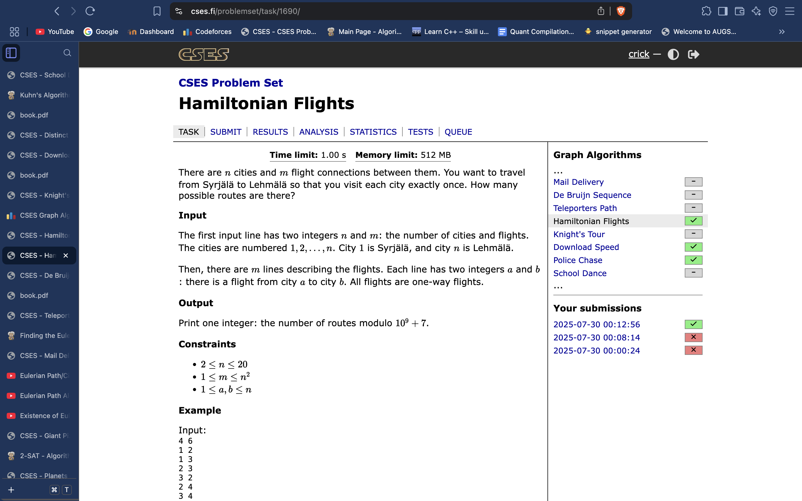

# Hamiltonian Paths:

 
     # **Bitmask DP (optimising from n!n^2 brute force to 2^n * n^2) .** 

  
     # **We use** 

  
     # **dp[mask of visited nodes] [ last visited node ]**
 
*const* int N =20; 
*vi* adjL[N];
*vvi* dp(N, *vi*((1ll<<N), 0));
ll n, m;
void solve(){
    cin >> n >> m;
    f(i,n+1){
        adjL[i].clear();
    }
    f(i,m){
        ll u, v; cin >> u >> v;
        u--; v--;
        adjL[u].pb(v);
    }
    dp[n-1][(1ll<<n)-1] = 1;
    for(int mask = (1ll<<n)-2; mask >= 0; mask--){
        for(int u = 0; u<n; u++){
            if((mask>>u)&1){
                for(auto v : adjL[u]){
                    int nm = (mask | (1<<v));
                    if(mask != nm){
                        dp[u][mask] += dp[v][ nm ];
                        dp[u][mask] %= mod;
                    }
                }
            }
        }
    }
    cout << dp[0][1] << endl;
}

 
     # **optimised: ( slightly, same TC )**
 
*const* int N =20; 
*vvi* dp(N, *vi*((1ll<<N), 0));
ll n, m;
void solve(){
    cin >> n >> m;
    *vvi* adjL(n, *vi*(n, 0));
    f(i,m){
        ll u, v; cin >> u >> v;
        u--; v--;
        adjL[u][v]++;
    }
    dp[n-1][(1ll<<n)-1] = 1;
    for(int mask = (1ll<<n)-2; mask >= 1; mask--){
        if(mask&1){
            for(int u = 0; u<n; u++){
                if((mask>>u)&1){
                    for(int v = 1; v<n; v++){
                        int nm = (mask | (1<<v));
                        if(mask != nm){
                            dp[u][mask] += (dp[v][ nm ] * adjL[u][v])%mod;
                            dp[u][mask] %= mod;
                        }
                    }
                }
            }
        }
    }
    cout << dp[0][1] << "\n";
}

