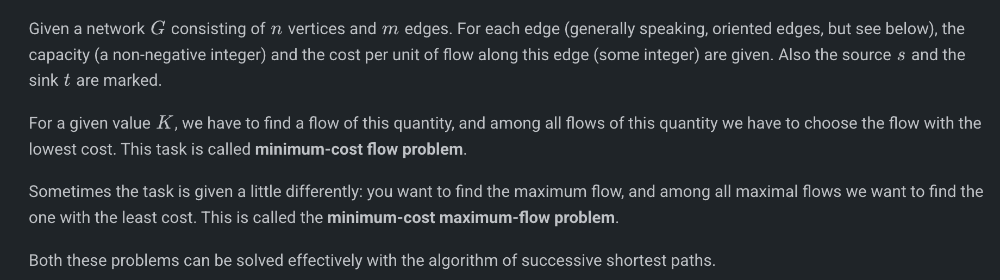
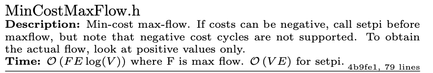
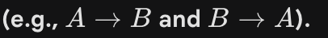
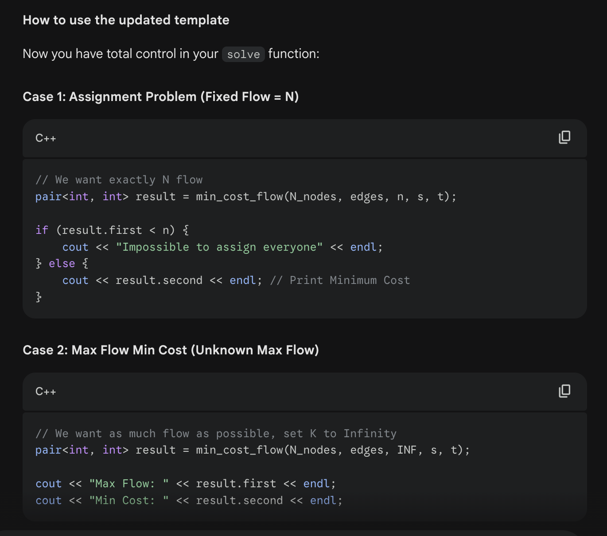

# MCMF: Min Cost Max Flow:
Shows up in a lot of grid problems, where…

# MCMF: Min Cost Max Flow:
Shows up in a lot of grid problems, where you connect row nodes to col nodes.

It is cost per unit flow
# 

# The kactl one: ( With Gemini Cleaning ) 
Handles reverse edges and multiple edges
# 
#include <bits/stdc++.h>
using namespace std;

#define ll long long
const ll INF = 1e18;

struct Edge {
    int to;
    int rev; // index of reverse edge in adj[to]
    ll flow;
    ll cap;
    ll cost;
};

struct MCMF {
    int N;
    vector<vector<Edge>> adj;
    vector<ll> dist, pi;
    vector<int> par_node, par_edge;

    MCMF(int n) : N(n), adj(n), dist(n), pi(n), par_node(n), par_edge(n) {}

    void addEdge(int from, int to, ll cap, ll cost) {
        adj[from].push_back({to, (int)adj[to].size(), 0, cap, cost});
        adj[to].push_back({from, (int)adj[from].size() - 1, 0, 0, -cost});
    }

    // Dijkstra with Potentials (pi) to handle negative costs in residual graph
    bool path(int s, int t) {
        dist.assign(N, INF);
        par_node.assign(N, -1);
        par_edge.assign(N, -1);
        
        dist[s] = 0;
        
        // Priority Queue stores { -distance, node } for min-heap behavior
        priority_queue<pair<ll, int>> q;
        q.push({0, s});

        while (!q.empty()) {
            ll d = -q.top().first;
            int u = q.top().second;
            q.pop();

            if (d > dist[u]) continue;

            for (int i = 0; i < adj[u].size(); ++i) {
                Edge &e = adj[u][i];
                // Reduced cost: weight + potential[u] - potential[v]
                // This ensures all edge weights in Dijkstra are non-negative
                if (e.cap - e.flow > 0 && dist[e.to] > dist[u] + e.cost + pi[u] - pi[e.to]) {
                    dist[e.to] = dist[u] + e.cost + pi[u] - pi[e.to];
                    par_node[e.to] = u;
                    par_edge[e.to] = i;
                    q.push({-dist[e.to], e.to});
                }
            }
        }
        
        // Update potentials for next iteration
        for (int i = 0; i < N; ++i) {
            if (dist[i] != INF) pi[i] += dist[i];
        }

        return dist[t] != INF;
    }

    pair<ll, ll> solve(int s, int t, int k) {
        ll totflow = 0;
        ll totcost = 0;
        
        // Initialize potentials (pi). If graph has no negative edges initially, 0 is fine.
        // If graph had initial negative edges, we would need one run of SPFA here.
        fill(pi.begin(), pi.end(), 0);

        while (totflow < k && path(s, t)) {
            ll flow_push = k - totflow;
            
            // Find bottleneck
            int cur = t;
            while (cur != s) {
                int p = par_node[cur];
                int idx = par_edge[cur];
                flow_push = min(flow_push, adj[p][idx].cap - adj[p][idx].flow);
                cur = p;
            }

            totflow += flow_push;
            
            // Push flow
            cur = t;
            while (cur != s) {
                int p = par_node[cur];
                int idx = par_edge[cur];
                
                adj[p][idx].flow += flow_push;
                int r_idx = adj[p][idx].rev;
                adj[cur][r_idx].flow -= flow_push;
                
                // Add Cost: flow * cost
                totcost += (ll)flow_push * adj[p][idx].cost;
                
                cur = p;
            }
        }

        if (totflow < k) return {-1, -1};
        return {totflow, totcost};
    }
};

int main() {
    ios::sync_with_stdio(0); cin.tie(0);
    int n, m, k;
    if (cin >> n >> m >> k) {
        // Nodes 1..n, so size n+1
        MCMF mcmf(n + 1);
        for (int i = 0; i < m; ++i) {
            int u, v, r, c;
            cin >> u >> v >> r >> c;
            mcmf.addEdge(u, v, r, c);
        }

        pair<ll, ll> res = mcmf.solve(1, n, k);
        cout << res.second << endl;
    }
    return 0;
}

# The CP ALGOS ones won’t work for multiple edges and reverse edges!
# **it cannot handle multiple routes between the same cities or routes in opposite directions**
# 
[https://cp-algorithms.com/graph/min_cost_flow.html](https://cp-algorithms.com/graph/min_cost_flow.html)

# **IF you know the max flow / target Flow:**
struct Edge
{
    int from, to, capacity, cost;
};

vector<vector<int>> adj, cost, capacity;

const int INF = 1e18;

void shortest_paths(int n, int v0, vector<int>& d, vector<int>& p) {
    d.assign(n, INF);
    d[v0] = 0;
    vector<bool> inq(n, false);
    queue<int> q;
    q.push(v0);
    p.assign(n, -1);

    while (!q.empty()) {
        int u = q.front();
        q.pop();
        inq[u] = false;
        for (int v : adj[u]) {
            if (capacity[u][v] > 0 && d[v] > d[u] + cost[u][v]) {
                d[v] = d[u] + cost[u][v];
                p[v] = u;
                if (!inq[v]) {
                    inq[v] = true;
                    q.push(v);
                }
            }
        }
    }
}

int min_cost_flow(int N, vector<Edge> edges, int K, int s, int t) {
    adj.assign(N, vector<int>());
    cost.assign(N, vector<int>(N, 0));
    capacity.assign(N, vector<int>(N, 0));
    for (Edge e : edges) {
        adj[e.from].push_back(e.to);
        adj[e.to].push_back(e.from);
        cost[e.from][e.to] = e.cost;
        cost[e.to][e.from] = -e.cost;
        capacity[e.from][e.to] = e.capacity;
    }

    int flow = 0;
    int cost = 0;
    vector<int> d, p;
    while (flow < K) {
        shortest_paths(N, s, d, p);
        if (d[t] == INF)
            break;

        // find max flow on that path
        int f = K - flow;
        int cur = t;
        while (cur != s) {
            f = min(f, capacity[p[cur]][cur]);
            cur = p[cur];
        }

        // apply flow
        flow += f;
        cost += f * d[t];
        cur = t;
        while (cur != s) {
            capacity[p[cur]][cur] -= f;
            capacity[cur][p[cur]] += f;
            cur = p[cur];
        }
    }

    if (flow < K)
        return -1;
    else
        return cost;
}

void solve() {
    // --- 1. SETUP ---
    int n, m; 
    cin >> n >> m; // Example inputs

    int S = 0;              // Source Node Index
    int T = n + 1;          // Sink Node Index
    int N_nodes = T + 1;    // Total number of nodes (must cover largest index)
    
    // IMPORTANT: Set your required flow amount
    // For Assignment Problem: K = n
    // For Max Flow Min Cost (unknown max flow): K = INF
    int target_flow = n; 

    // --- 2. BUILD GRAPH ---
    vector<Edge> edges;

    // Example: Reading m edges from input
    for(int i = 0; i < m; ++i) {
        int u, v, cap, c;
        cin >> u >> v >> cap >> c;
        // Construct: {from, to, capacity, cost}
        edges.push_back({u, v, cap, c});
    }

    // Don't forget to connect Source/Sink if they aren't in the input!
    // edges.push_back({S, 1, INF, 0});
    // edges.push_back({n, T, INF, 0});

    // --- 3. RUN ALGORITHM ---
    // Returns -1 if target_flow cannot be reached
    int ans = min_cost_flow(N_nodes, edges, target_flow, S, T);

    // --- 4. OUTPUT & RECONSTRUCTION ---
    if (ans == -1) {
        cout << "Impossible" << endl;
    } else {
        cout << ans << endl;

        // OPTIONAL: Check which edges were used (Residual Capacity check)
        // Since 'capacity' is global, we can check it directly.
        // If capacity[u][v] < original_cap, flow passed through.
        
        // Example: Finding used edges for an assignment
        // for(auto& e : edges) {
        //     // If it was a forward edge (capacity > 0 initially) and is now full (0)
        //     if (e.capacity > 0 && capacity[e.from][e.to] == 0) {
        //         cout << "Edge used: " << e.from << " -> " << e.to << endl;
        //     }
        // }
    }
}

# IF you don’t know the max flow / target Flow:
// Change return type to pair<int, int>
pair<int, int> min_cost_flow(int N, vector<Edge> edges, int K, int s, int t) {
    adj.assign(N, vector<int>());
    cost.assign(N, vector<int>(N, 0));
    capacity.assign(N, vector<int>(N, 0));
    for (Edge e : edges) {
        adj[e.from].push_back(e.to);
        adj[e.to].push_back(e.from);
        cost[e.from][e.to] = e.cost;
        cost[e.to][e.from] = -e.cost;
        capacity[e.from][e.to] = e.capacity;
    }

    int flow = 0;
    int total_cost = 0;
    vector<int> d, p;
    
    while (flow < K) {
        shortest_paths(N, s, d, p);
        if (d[t] == INF)
            break; // No more paths exist (Natural Max Flow reached)

        // find max flow on that path
        int f = K - flow;
        int cur = t;
        while (cur != s) {
            f = min(f, capacity[p[cur]][cur]);
            cur = p[cur];
        }

        // apply flow
        flow += f;
        total_cost += f * d[t];
        cur = t;
        while (cur != s) {
            capacity[p[cur]][cur] -= f;
            capacity[cur][p[cur]] += f;
            cur = p[cur];
        }
    }

    // REMOVED THE CHECK: if (flow < K) return -1;
    // Instead, return what we achieved:
    return {flow, total_cost};
}

