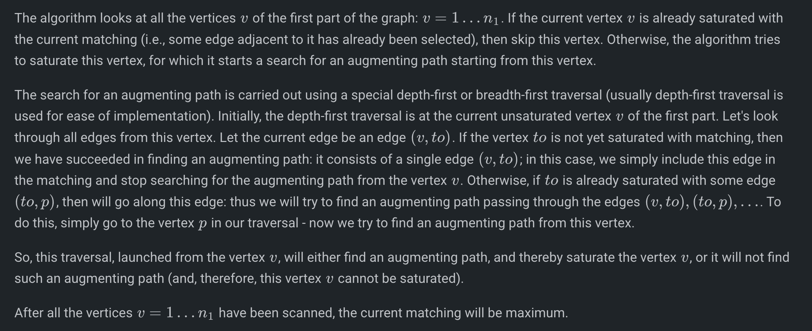
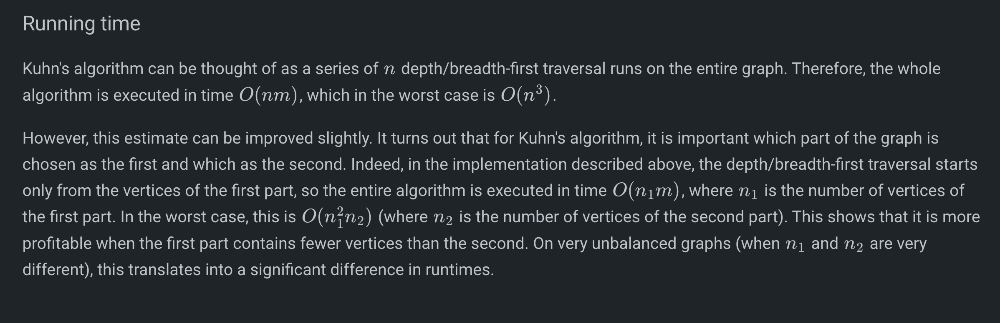
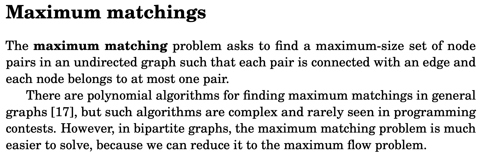
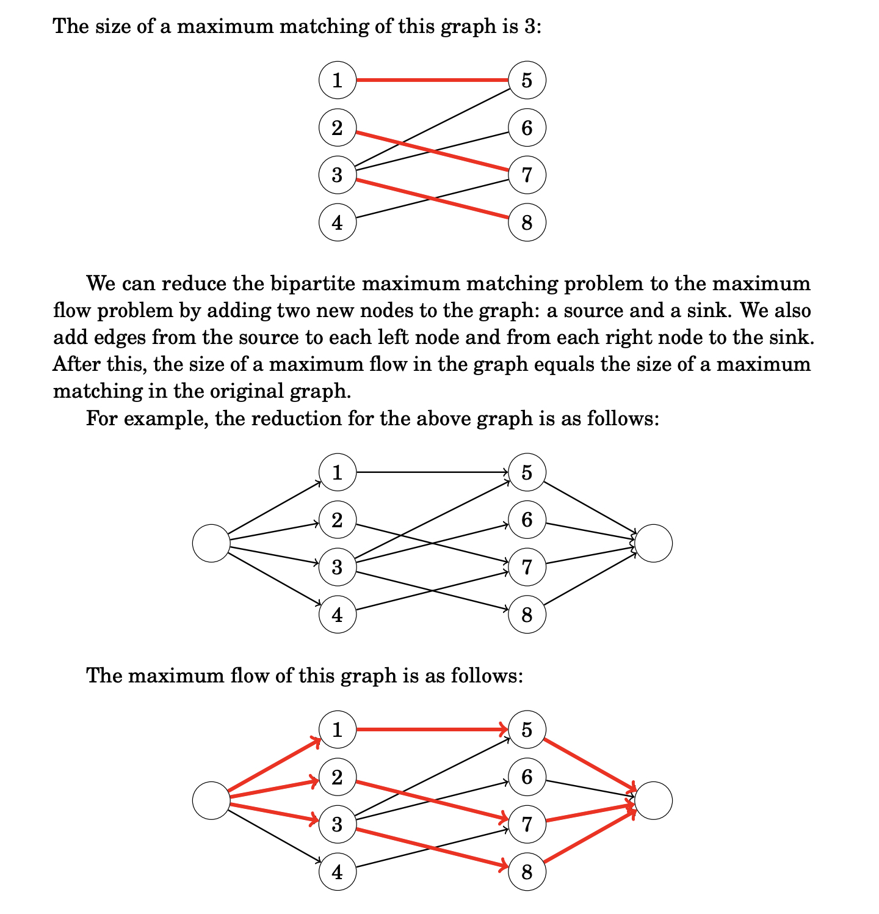
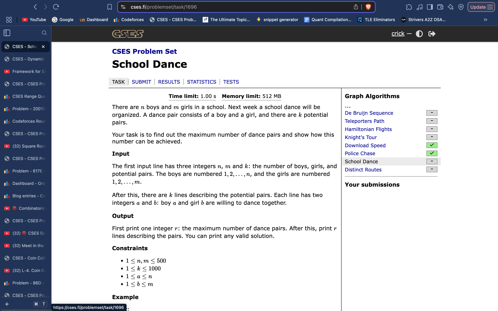

# Max Bipartite Matching

# 

*const* int N = 501;
int n, m, k; *// n is first group ka size, m is second group ka size (both of the groups of the bipartite graph)*
vi adjL[N]; *// just stores edges from first group nodes to second group nodes.*
vector<int> mt(N);  *// marking saturation of second group nodes by showing the group 1 node it is paired with. -1 means un-paired.*
vector<bool> used(N); *// represents group 1 nodes assigned to the augmenting path while search for an augmenting path.*

bool try_kuhn(int v) { *// function to try and find an augmenting path*
    if (used[v])
        return false;
    used[v] = true;
    for (int to : adjL[v]) {
        if (mt[to] == -1 || try_kuhn(mt[to])) {
            mt[to] = v;
            return true;
        }
    }
    return false;
}

void solve(){
    cin >> n >> m >> k;
    f(i,k){
        ll a, b; cin >> a >> b;
        a--; b--;
        adjL[a].pb(b);
    }

    mt.assign(m, -1); *// initally, all nodes are unsaturated*
    for (int v = 0; v < n; ++v) {
        used.assign(n, false);
        try_kuhn(v);
    }

    vpi ans;
    for (int i = 0; i < m; ++i){
        if (mt[i] != -1){
            ans.pb({mt[i] + 1, i + 1});
        }
    }
    cout << ans.size() << endl;
    for(auto it : ans)
        cout << it << endl;
}

int main() {
    // ... reading the graph ...

    mt.assign(k, -1);
    vector<bool> used1(n, false);
    for (int v = 0; v < n; ++v) {
        for (int to : g[v]) {
            if (mt[to] == -1) {
                mt[to] = v;
                used1[v] = true;
                break;
            }
        }
    }
    for (int v = 0; v < n; ++v) {
        if (used1[v])
            continue;
        used.assign(n, false);
        try_kuhn(v);
    }

    for (int i = 0; i < k; ++i)
        if (mt[i] != -1)
            printf("%d %d\n", mt[i] + 1, i + 1);
}

 
     **Algo to do Maximum Bipartite matching :** 

  
     [https://cp-algorithms.com/graph/kuhn_maximum_bipartite_matching.html](https://cp-algorithms.com/graph/kuhn_maximum_bipartite_matching.html)
 
 
     **Example Problem : (Max Matching)**
 

