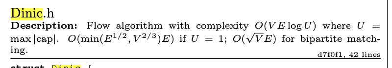
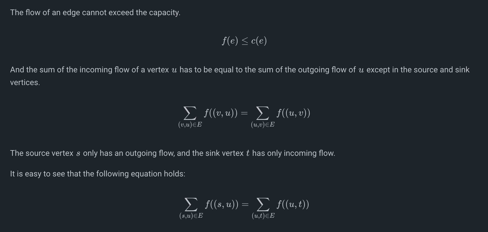
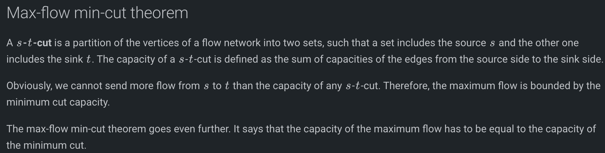
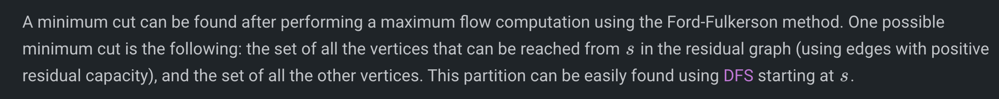
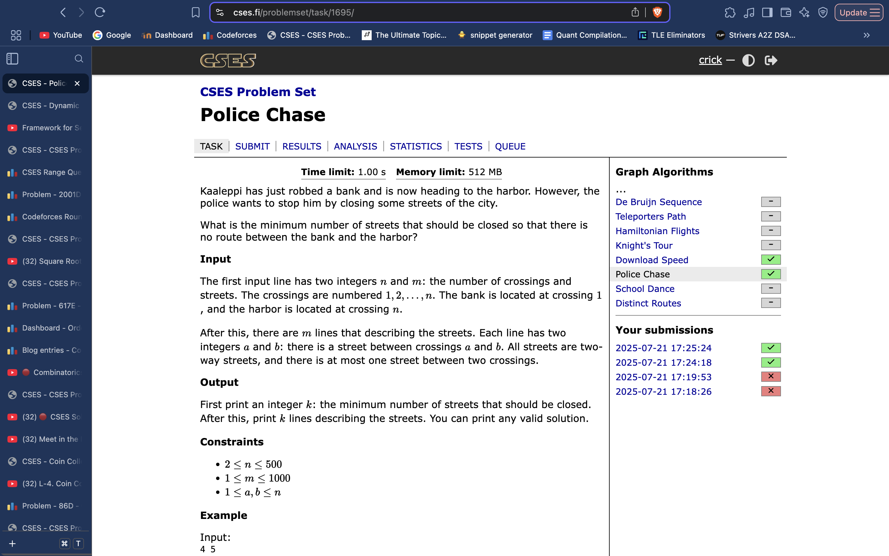
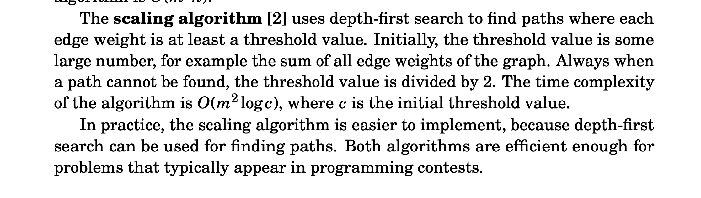
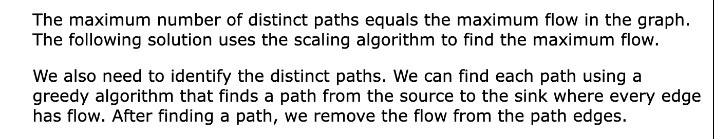

# Max Flow, Min Cut

## Dinic’s Max Flow 
**Kactl:**



```cpp
struct Dinic {
    struct Edge {
        int to, rev;
        ll c, oc;
        ll flow() { return max(oc - c, 0LL); } // if you need flows
    };

    vi lvl, ptr, q;
    vector<vector<Edge>> adj;

    Dinic(int n) : lvl(n), ptr(n), q(n), adj(n) {}

    void addEdge(int a, int b, ll c, ll rcap = 0) {
        adj[a].push_back({b, sz(adj[b]), c, c});
        adj[b].push_back({a, sz(adj[a]) - 1, rcap, rcap});
    }

    ll dfs(int v, int t, ll f) {
        if (v == t || !f) return f;
        for (int& i = ptr[v]; i < sz(adj[v]); i++) {
            Edge& e = adj[v][i];
            if (lvl[e.to] == lvl[v] + 1)
                if (ll p = dfs(e.to, t, min(f, e.c))) {
                    e.c -= p;
                    adj[e.to][e.rev].c += p;
                    return p;
                }
        }
        return 0;
    }

    ll calc(int s, int t) {
        ll flow = 0;
        q[0] = s;
        // Scaling: iterate from largest bit (30) down to 0
        rep(L, 0, 31) do { 
            lvl = ptr = vi(sz(q)); // Reset level and pointer arrays
            int qi = 0, qe = lvl[s] = 1;
            
            // BFS to build Level Graph
            while (qi < qe && !lvl[t]) {
                int v = q[qi++];
                for (Edge e : adj[v])
                    // Only use edges with capacity >= 2^(30-L)
                    if (!lvl[e.to] && (e.c >> (30 - L))) { 
                        q[qe++] = e.to;
                        lvl[e.to] = lvl[v] + 1;
                    }
            }
            // DFS to push blocking flow
            while (ll p = dfs(s, t, LLONG_MAX)) flow += p;
            
        } while (lvl[t]);
        
        return flow;
    }

    bool leftOfMinCut(int a) { return lvl[a] != 0; }
};

// --- Driver Function ---
int main() {
    // Optimize I/O operations
    cin.tie(0)->sync_with_stdio(0);

    int n, m;
    // Reading number of Nodes and Edges
    if (!(cin >> n >> m)) return 0;

    int s, t;
    // Reading Source and Sink nodes (0-indexed)
    cin >> s >> t;

    Dinic graph(n);

    cout << "Reading " << m << " edges..." << endl;
    for (int i = 0; i < m; ++i) {
        int u, v;
        ll cap;
        cin >> u >> v >> cap;
        // Add directed edge u -> v with capacity 'cap'
        graph.addEdge(u, v, cap);
    }

    // Calculate Max Flow
    ll max_flow = graph.calc(s, t);
    
    cout << "------------------------" << endl;
    cout << "Max Flow: " << max_flow << endl;
    cout << "------------------------" << endl;

    // OPTIONAL: Demonstrate Min-Cut Recovery
    // Edges that go from the reachable set (S) to the unreachable set (T) form the Min-Cut.
    cout << "Edges in the Min-Cut:" << endl;
    for (int u = 0; u < n; ++u) {
        if (graph.leftOfMinCut(u)) { // If u is reachable from Source
            for (auto& e : graph.adj[u]) {
                if (!graph.leftOfMinCut(e.to)) { // If v is NOT reachable
                    // Ensure it's a forward edge in the original graph (oc > 0)
                    // and it is fully saturated (flow == capacity)
                    if (e.oc > 0 && e.c == 0) {
                        cout << u << " -> " << e.to << " (Cap: " << e.oc << ")" << endl;
                    }
                }
            }
        }
    }

    return 0;
}
```

## CP Algos:
[https://cp-algorithms.com/graph/dinic.html](https://cp-algorithms.com/graph/dinic.html)

```cpp
struct FlowEdge {
    int v, u;
    long long cap, flow = 0;
    FlowEdge(int v, int u, long long cap) : v(v), u(u), cap(cap) {}
};

struct Dinic {
    const long long flow_inf = 1e18;
    vector<FlowEdge> edges;
    vector<vector<int>> adj;
    int n, m = 0;
    int s, t;
    vector<int> level, ptr;
    queue<int> q;

    Dinic(int n, int s, int t) : n(n), s(s), t(t) {
        adj.resize(n);
        level.resize(n);
        ptr.resize(n);
    }

    void add_edge(int v, int u, long long cap) {
        edges.emplace_back(v, u, cap);
        edges.emplace_back(u, v, 0);
        adj[v].push_back(m);
        adj[u].push_back(m + 1);
        m += 2;
    }

    bool bfs() {
        while (!q.empty()) {
            int v = q.front();
            q.pop();
            for (int id : adj[v]) {
                if (edges[id].cap == edges[id].flow)
                    continue;
                if (level[edges[id].u] != -1)
                    continue;
                level[edges[id].u] = level[v] + 1;
                q.push(edges[id].u);
            }
        }
        return level[t] != -1;
    }

    long long dfs(int v, long long pushed) {
        if (pushed == 0)
            return 0;
        if (v == t)
            return pushed;
        for (int& cid = ptr[v]; cid < (int)adj[v].size(); cid++) {
            int id = adj[v][cid];
            int u = edges[id].u;
            if (level[v] + 1 != level[u])
                continue;
            long long tr = dfs(u, min(pushed, edges[id].cap - edges[id].flow));
            if (tr == 0)
                continue;
            edges[id].flow += tr;
            edges[id ^ 1].flow -= tr;
            return tr;
        }
        return 0;
    }

    long long flow() {
        long long f = 0;
        while (true) {
            fill(level.begin(), level.end(), -1);
            level[s] = 0;
            q.push(s);
            if (!bfs())
                break;
            fill(ptr.begin(), ptr.end(), 0);
            while (long long pushed = dfs(s, flow_inf)) {
                f += pushed;
            }
        }
        return f;
    }
};
```

## Max Flow:
O(V * E^2)
INITIALISE RESIDUAL MATRIX ASSUMING FRONT AND BACKWARD EDGES. (BACKWARD EDGES HAVE 0 CAPACITY INITIALLY)

```cpp
const int N = 550; 
vi adjL[N];
vector<vector<int>> capacity(N, vi(N, 0));
ll n, m;

int bfs(int s, int t, vector<int>& parent) {
    parent.assign(n+1, -1);
    parent[s] = -2;
    queue<pair<int, int>> q;
    q.push({s, LONG_MAX});

    while (!q.empty()) {
        int cur = q.front().first;
        int flow = q.front().second;
        q.pop();

        for (int next : adjL[cur]) {
            if (parent[next] == -1 && capacity[cur][next]) {
                parent[next] = cur;
                int new_flow = min(flow, capacity[cur][next]);
                if (next == t)
                    return new_flow;
                q.push({next, new_flow});
            }
        }
    }

    return 0;
}

int maxflow(int s, int t) {
    int flow = 0;
    vector<int> parent(n+1);
    int new_flow;

    while (new_flow = bfs(s, t, parent)) {
        if(new_flow == 0)
            break;
        flow += new_flow;
        int cur = t;
        while (cur != s) {
            int prev = parent[cur];
            capacity[prev][cur] -= new_flow;
            capacity[cur][prev] += new_flow;
            cur = prev;
        }
    }

    return flow;
}

void solve(){
    cin >> n >> m;
    f(i,n+1){
        adjL[i].clear();
    }
    f(i,n+1){
        capacity[i].assign(n+1, 0);
    }
    f(i,m){
        ll u, v, w; cin >> u >> v >> w;
        adjL[u].pb(v);
        adjL[v].pb(u);
        capacity[u][v] += w;
    }
    cout << maxflow(1, n) << endl;
}
```







**Algo with finding the Cut edges:**

```cpp
const int N = 550; 
vi adjL[N];
vector<vector<int>> capacity(N, vi(N, 0));
ll n, m;

int bfs(int s, int t, vector<int>& parent) {
    parent.assign(n+1, -1);
    parent[s] = -2;
    queue<pair<int, int>> q;
    q.push({s, LONG_MAX});

    while (!q.empty()) {
        int cur = q.front().first;
        int flow = q.front().second;
        q.pop();

        for (int next : adjL[cur]) {
            if (parent[next] == -1 && capacity[cur][next]) {
                parent[next] = cur;
                int new_flow = min(flow, capacity[cur][next]);
                if (next == t)
                    return new_flow;
                q.push({next, new_flow});
            }
        }
    }

    return 0;
}

int maxflow(int s, int t) {
    int flow = 0;
    vector<int> parent(n+1);
    int new_flow;

    while (new_flow = bfs(s, t, parent)) {
        if(new_flow == 0)
            break;
        flow += new_flow;
        int cur = t;
        while (cur != s) {
            int prev = parent[cur];
            capacity[prev][cur] -= new_flow;
            capacity[cur][prev] += new_flow;
            cur = prev;
        }
    }

    return flow;
}

void dfs(int node, set<int>& vis){
    vis.insert(node);
    for(auto v : adjL[node]){
        if(vis.find(v) == vis.end() && capacity[node][v] > 0){
            dfs(v, vis);
        }
    }
}

void solve(){
    cin >> n >> m;
    f(i,n+1){
        adjL[i].clear();
    }
    f(i,n+1){
        capacity[i].assign(n+1, 0);
    }
    f(i,m){
        ll u, v; cin >> u >> v;
        adjL[u].pb(v);
        adjL[v].pb(u);
        capacity[u][v] += 1;
        capacity[v][u] += 1;
    }
    cout << maxflow(1, n) << endl;
    set<int> vis;
    dfs(1, vis);
    vpi streets;
    for(auto u : vis){
        for(auto v : adjL[u]){
            if(vis.find(v) == vis.end()){
                streets.pb({u, v});
            }
        }
    }
    for(auto it : streets){
        cout << it << endl;
    }
}

signed main()
{
    ios_base::sync_with_stdio(false); cin.tie(0); cout.tie(0);

    // pre-computation:

    int t = 1;
    // cin >> t;
    while (t--)
        solve();
    return 0;
}
```

## Min Cut Problem example



## Max Flow with paths & Scaling Algorithm
### CSES STRUCT, WITH SCALING ALGO




### CSES editorial approach : (also uses Scaling algorithm)

```cpp
#include <iostream>
#include <vector>

using namespace std;
using ll = long long;

struct MaxFlow {
    static const ll INF = 1e18;

    struct Edge {
        int from;
        int to;
        ll w;
        bool real;
    };

    int n, source, sink;
    vector<vector<int>> g;
    vector<Edge> edges;
    vector<bool> seen;
    ll flow = 0;

    MaxFlow(int n, int source, int sink)
        : n(n), source(source), sink(sink), g(n) {}

    int add_edge(int from, int to, ll forward, ll backward = 0) {
        const int id = (int)edges.size();
        g[from].emplace_back(id);
        edges.push_back({from, to, forward, true});
        g[to].emplace_back(id + 1);
        edges.push_back({to, from, backward, false});
        return id;
    }

    bool dfs(int node, ll lim) {
        if (node == sink) return true;
        if (seen[node]) return false;
        seen[node] = true;
        for (int i : g[node]) {
            auto &e = edges[i];
            auto &back = edges[i ^ 1];
            if (e.w >= lim) {
                if (dfs(e.to, lim)) {
                    e.w -= lim;
                    back.w += lim;
                    return true;
                }
            }
        }
        return false;
    }

    ll max_flow() {
        for (ll bit = 1ll << 62; bit > 0; bit /= 2) {
            bool found = false;
            do {
                seen.assign(n, false);
                found = dfs(source, bit);
                flow += bit * found;
            } while (found);
        }
        return flow;
    }
};

int main() {
    int n, m;
    cin >> n >> m;

    MaxFlow flow(n + 1, 1, n);
    for (int i = 1; i <= m; i++) {
        int a, b;
        cin >> a >> b;
        flow.add_edge(a, b, 1);
    }

    int k = flow.max_flow();
    cout << k << "\n";

    for (int i = 1; i <= k; i++) {
        int node = 1;
        vector<int> path;
        path.push_back(1);

        do {
            for (auto id : flow.g[node]) {
                auto edge = flow.edges[id];
                if (edge.w == 0 && edge.real) {
                    node = edge.to;
                    path.push_back(node);
                    flow.edges[id].w = 1;
                    break;
                }
            }
        } while (node != n);

        cout << path.size() << "\n";
        for (auto node : path) {
            cout << node << " ";
        }
        cout << "\n";
    }
}
```

### My hackish approach:

```cpp
const int N = 550; 
vi adjL[N];
vector<vector<int>> capacity(N, vi(N, 0));
ll n, m;
vvi ans;

int bfs(int s, int t, vector<int>& parent) {
    parent.assign(n+1, -1);
    parent[s] = -2;
    queue<pair<int, int>> q;
    q.push({s, LONG_MAX});

    while (!q.empty()) {
        int cur = q.front().first;
        int flow = q.front().second;
        q.pop();

        for (int next : adjL[cur]) {
            if (parent[next] == -1 && capacity[cur][next]) {
                parent[next] = cur;
                int new_flow = min(flow, capacity[cur][next]);
                if (next == t)
                    return new_flow;
                q.push({next, new_flow});
            }
        }
    }

    return 0;
}

int maxflow(int s, int t) {
    int flow = 0;
    vector<int> parent(n+1);
    int new_flow;

    while (new_flow = bfs(s, t, parent)) {
        if(new_flow == 0)
            break;
        flow += new_flow;
        int cur = t;
        while (cur != s) {
            int prev = parent[cur];
            capacity[prev][cur] -= new_flow;
            capacity[cur][prev] += new_flow;
            cur = prev;
        }
    }

    return flow;
}

void dfs(int node, vi& cur, vi fradjL[]){
    cur.pb(node);
    if(node == n){
        ans.pb(cur);
    }else{
        for(auto v : fradjL[node]){
            if(capacity[node][v] == 0){
                capacity[node][v] = -1;
                dfs(v, cur, fradjL);
                if(node != 1)
                    break;
            }
        }
    }
    cur.pop_back();
}

void solve(){
    cin >> n >> m;
    f(i,n+1){
        adjL[i].clear();
    }
    f(i,n+1){
        capacity[i].assign(n+1, 0);
    }
    vi fradjL[n+1];
    f(i,m){
        ll u, v; cin >> u >> v;
        adjL[u].pb(v);
        adjL[v].pb(u);
        capacity[u][v] += 1;
        fradjL[u].pb(v);
    }
    cout << maxflow(1, n) << endl;
    
    // now I implement a hackish way of finding these paths.
    vi cur = {};
    dfs(1, cur, fradjL);
    for(auto v : ans){
        cout << v.size() << endl;
        cout << v << endl;
    }
}
```