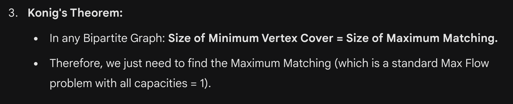
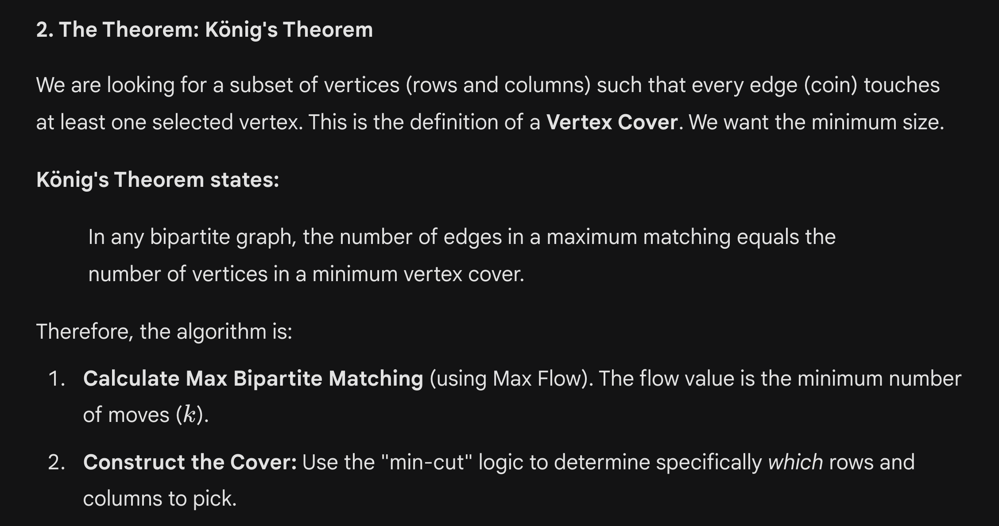
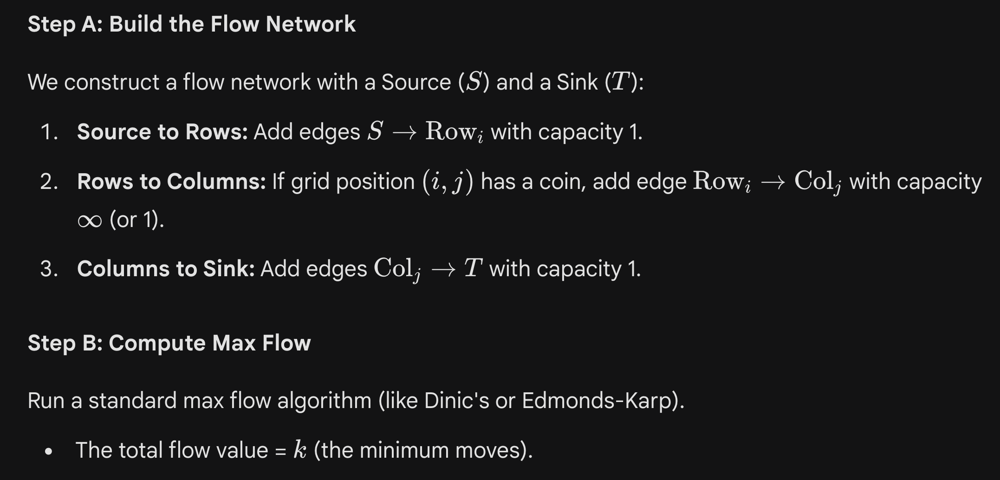
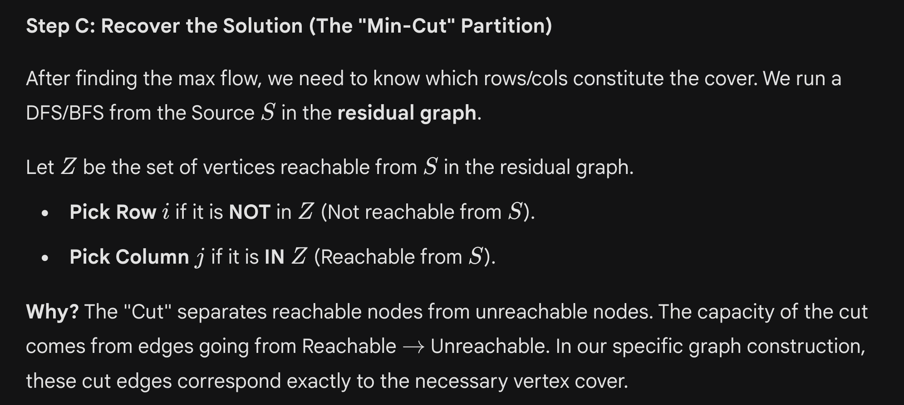

# Min Vertex Cover in Bipartite Graph
= Maximum Matching in Bipartite…

 
     # **Min Vertex Cover in Bipartite Graph
= Maximum Matching in Bipartite Graph
Which can be done using Max Flow**
 
[https://cses.fi/problemset/task/1709](https://cses.fi/problemset/task/1709)

