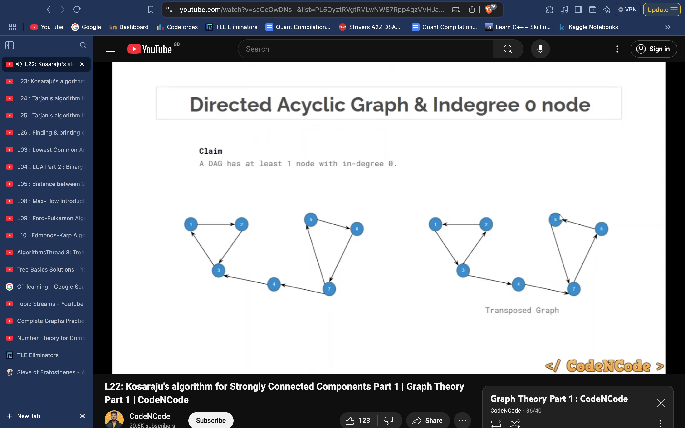

# Strongly Connected Components (SCC)

## Directed Graph

Find the number of strongly connected components in the graph.
A component is called a Strongly Connected Component (SCC) only if for every possible pair of vertices $(u, v)$ inside that component, $u$ is reachable from $v$ and $v$ is reachable from $u$.

```cpp
const int N = 2e5 + 5; 
vi adjL[N];
vi vis(N, 0);
vi belongs(N, -1);
ll n, m;

void dfs(int node, stack<int> &st) {
    vis[node] = 1;
    for (auto it : adjL[node]) {
        if (!vis[it]) {
            dfs(it, st);
        }
    }
    st.push(node);
}

void dfs3(int node, vector<int> adjT[], int ind) {
    // cout << node << endl;
    vis[node] = 1;
    belongs[node] = ind;
    for (auto it : adjT[node]) {
        if (!vis[it]) {
            dfs3(it, adjT, ind);
        }
    }
}

void solve(){
    cin >> n >> m;
    belongs.assign(n+1, -1);
    vis.assign(n+1, 0);
    f(i,m){
        ll u, v; cin >> u >> v;
        adjL[u].pb(v);
    }

    stack<int> st;
    for (int i = 1; i <= n; i++) {
        if (!vis[i]) {
            dfs(i, st);
        }
    }

    vector<int> adjT[n+1];
    for (int i = 1; i <= n; i++) {
        vis[i] = 0;
        for (auto it : adjL[i]) {
            adjT[it].push_back(i);
        }
    }

    int ind = 0;
    while (!st.empty()) {
        int node = st.top();
        st.pop();
        if (!vis[node]) {
            ind++;
            dfs3(node, adjT, ind);
        }
    }

    cout << ind << endl;
    for(int i = 1; i <= n; i++)
        cout << belongs[i] << " ";
    cout << "\n";
}
```



## SCC Compression (making a DAG)

```cpp
void dfs(int node, stack<int> &st) {
    vis[node] = 1;
    for (auto it : adjL[node]) {
        if (!vis[it]) {
            dfs(it, st);
        }
    }
    st.push(node);
}

void dfs3(int node, int nnode, vector<int> adjT[], vi &fn) {
    vis[node] = 1;
    if(node != nnode)
        val[nnode] += val[node];
    for (auto it : adjT[node]) {
        if (!vis[it]) {
            dfs3(it, nnode, adjT, fn);
        }
    }
    fn[node] = nnode;
}

void solve(){
    stack<int> st;
    for (int i = 1; i <= n; i++) {
        if (!vis[i]) {
            dfs(i, st);
        }
    }
    vector<int> adjT[n+1];
    for (int i = 1; i <= n; i++) {
        vis[i] = 0;
        for (auto it : adjL[i]) {
            adjT[it].push_back(i);
        }
    }
    set<int> finalnodes;
    vi fn(n+1, -1);
    while (!st.empty()) {
        int node = st.top();
        st.pop();
        if (!vis[node]) {
            finalnodes.insert(node);
            int nnode = node;
            dfs3(node, nnode, adjT, fn);
        }
    }
    for(int u = 1; u <= n; u++){
        int nn = fn[u];
        for(auto v : adjL[u]){
            if(fn[v] != nn){
                adjL[nn].insert(fn[v]);
            }
        }
    }
}
```

## Class Template to Convert Graph to DAG

```cpp
class SCCmaker
{
    vector<vector<ll>> DAG;
    vector<ll> info;
    ll number_of_nodes;

    void dfs(ll node, vector<vector<ll>> &adj, vector<ll> &vis, vector<ll> &order)
    {
        vis[node] = 1;
        for (auto &i : adj[node])
        {
            if (vis[i] != 1)
            {
                dfs(i, adj, vis, order);
            }
        }
        order.push_back(node);
    }
    void dfs2(ll node, vector<vector<ll>> &revadj, vector<ll> &temp, vector<ll> &vis)
    {
        vis[node] = 1;
        temp.push_back(node);
        for (auto &i : revadj[node])
        {
            if (vis[i] == 0)
            {
                dfs2(i, revadj, temp, vis);
            }
        }
    }

public:
    SCCmaker(vector<vector<ll>> &adj, vector<ll> &information, ll (*combine)(vector<ll> &temp, vector<ll> &information), vector<pair<ll, ll>> &edges, ll n)
    {
        vector<ll> order;
        vector<ll> vis(n + 1, 0);
        for (ll i = 1; i <= n; i++)
        {
            if (!vis[i])
                dfs(i, adj, vis, order);
        }
        reverse(order.begin(), order.end());
        vector<ll> vis2(n + 1, 0);
        vector<vector<ll>> revadj(n + 1);
        for (auto &i : edges)
        {
            revadj[i.second].push_back(i.first);
        }
        vector<ll> parentset(n + 1, 0);
        ll c = 0;
        for (auto &i : order)
        {
            if (!vis2[i])
            {
                vector<ll> temp;
                dfs2(i, revadj, temp, vis2);
                ll z = temp.size();
                for (ll j = 0; j < z; j++)
                {
                    parentset[temp[j]] = c;
                }
                ll sum = combine(temp, information);
                info.push_back(sum);
                c++;
            }
        }
        DAG.resize(c);
        number_of_nodes = c;
        for (auto &i : edges)
        {
            if (parentset[i.first] != parentset[i.second])
            {
                DAG[parentset[i.first]].push_back(parentset[i.second]);
            }
        }
    }
    vector<vector<ll>> getDAG()
    {
        return DAG;
    }
    vector<ll> getinfo()
    {
        return info;
    }
    ll get_numberofnodes()
    {
        return number_of_nodes;
    }
};
```

## Template Code for SCC Compression (Kosaraju’s Algorithm Modification)

```cpp
void dfs(int node, stack<int> &st) {
    vis[node] = 1;
    for (auto it : adjL[node]) {
        if (!vis[it]) {
            dfs(it, st);
        }
    }
    st.push(node);
}

void dfs3(int node, int nnode, vector<int> adjT[], vi &fn) {
    vis[node] = 1;
    if(node != nnode)
        val[nnode] += val[node];
    for (auto it : adjT[node]) {
        if (!vis[it]) {
            dfs3(it, nnode, adjT, fn);
        }
    }
    fn[node] = nnode;
}

void solve(){
    stack<int> st;
    for (int i = 1; i <= n; i++) {
        if (!vis[i]) {
            dfs(i, st);
        }
    }
    vector<int> adjT[n+1];
    for (int i = 1; i <= n; i++) {
        vis[i] = 0;
        for (auto it : adjL[i]) {
            adjT[it].push_back(i);
        }
    }
    set<int> finalnodes;
    vi fn(n+1, -1);
    while (!st.empty()) {
        int node = st.top();
        st.pop();
        if (!vis[node]) {
            finalnodes.insert(node);
            int nnode = node;
            dfs3(node, nnode, adjT, fn);
        }
    }
    for(int u = 1; u <= n; u++){
        int nn = fn[u];
        for(auto v : adjL[u]){
            if(fn[v] != nn){
                adjL[nn].insert(fn[v]);
            }
        }
    }
}
```