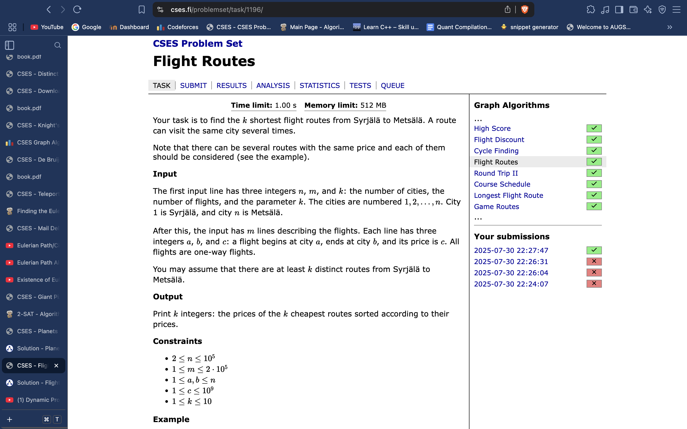

# Shortest Path through Dijkstra variations (just one example)

*const* int N = 2e5 + 5; 
*vpi* adjL[N];
ll n, m, k;
void solve(){
    cin >> n >> m >> k;
    f(i,n+1){
        adjL[i].clear();
    }
    f(i,m){
        ll u, v, w; cin >> u >> v >> w;
        adjL[u].pb({v, w});
    }
    multiset<pair<int,int>> st; 
    **vector<priority_queue<int>> dist(n+1);** *// 1e18 represents not possible to reach this node from source*
    
    *// assuming source node to be 1*
    int S = 1;
    st.insert({0, S}); 
    dist[S].push(0);

    *// Now, erase the minimum distance node first from the set*
    *// and traverse for all its adjacent nodes.*
    while(!st.empty()){
        auto it = *(st.begin()); 
        int node = it.second; 
        int dis = it.first; 
        st.erase(st.find(it));
        for(auto it : adjL[node]){
            int adjNode = it.first; 
            int edgW = it.second;
            **if((dist[adjNode].size() < k )|| (dist[adjNode].top() > (dis + edgW))){**
                **dist[adjNode].push(dis + edgW);
                st.insert({dis + edgW, adjNode});
                if(dist[adjNode].size() > k){
                    int removing = dist[adjNode].top();
                    dist[adjNode].pop();
                    st.erase(st.find({removing, adjNode}));
                }**
            }
        }
    }
    *vi* distances;
    int f = n;
    while(!dist[f].empty()){
        distances.pb(dist[f].top());
        dist[f].pop();
    }
    reverse(all(distances));
    cout << distances << endl;
}
