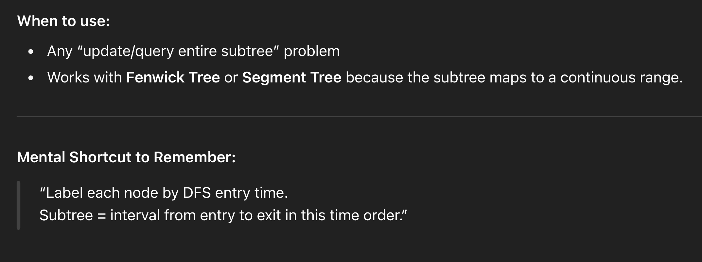
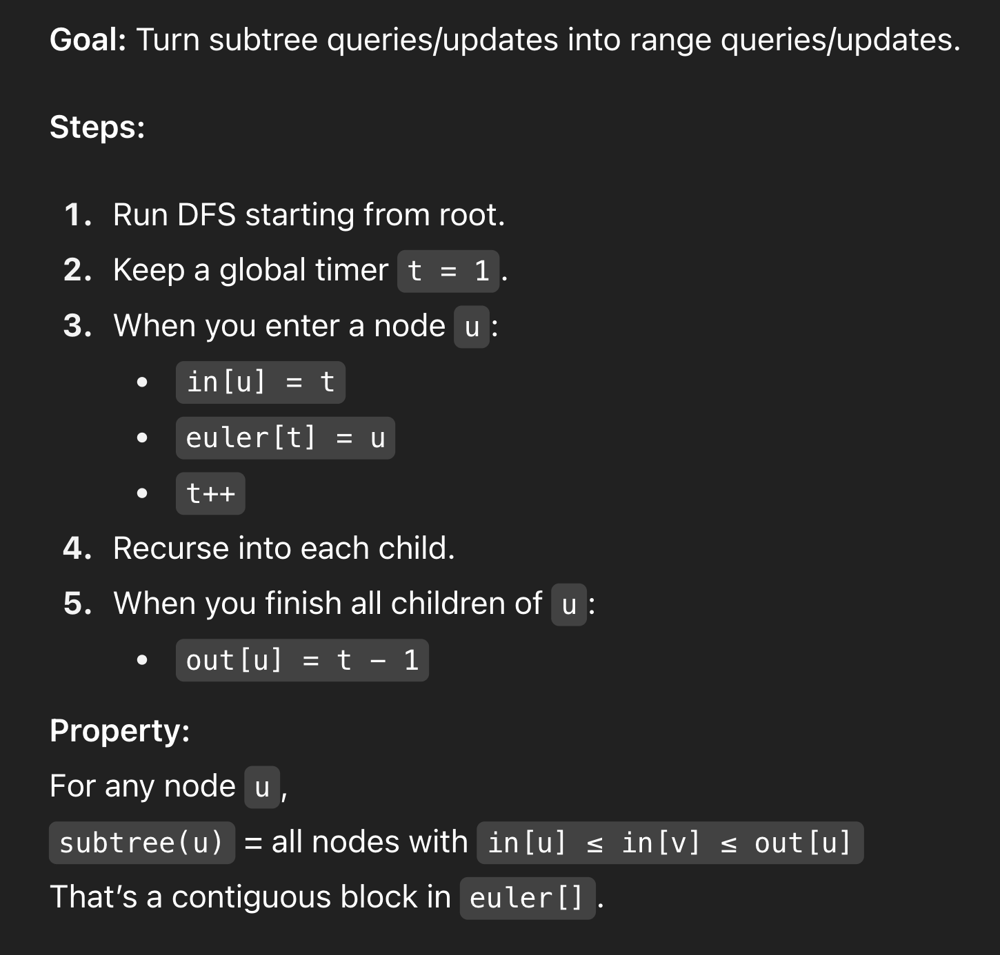
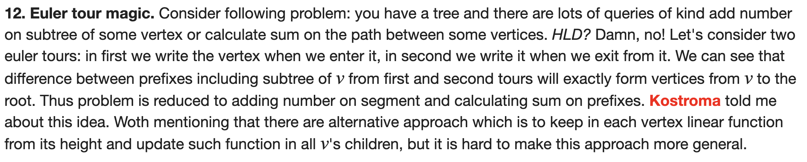

# Euler Tour Trick

 
     # **Each subtree = Contiguous range of array
Tree Flattening** 

 *vector<int> intime, outtime, euler;
int timer = 0;

void dfs(int u, int p, const vector<vector<int>>& adj) {
    intime[u] = timer;
    euler[timer] = u; // store node in euler array
    timer++;
    for (int v : adj[u]) {
        if (v != p) {
            dfs(v, u, adj);
        }
    }
    outtime[u] = timer - 1;
}

void build_euler(int n, int root, const vector<vector<int>>& adj) {
    intime.assign(n, -1);
    outtime.assign(n, -1);
    euler.assign(n, -1);
    timer = 0;
    dfs(root, -1, adj);
}*

# 

