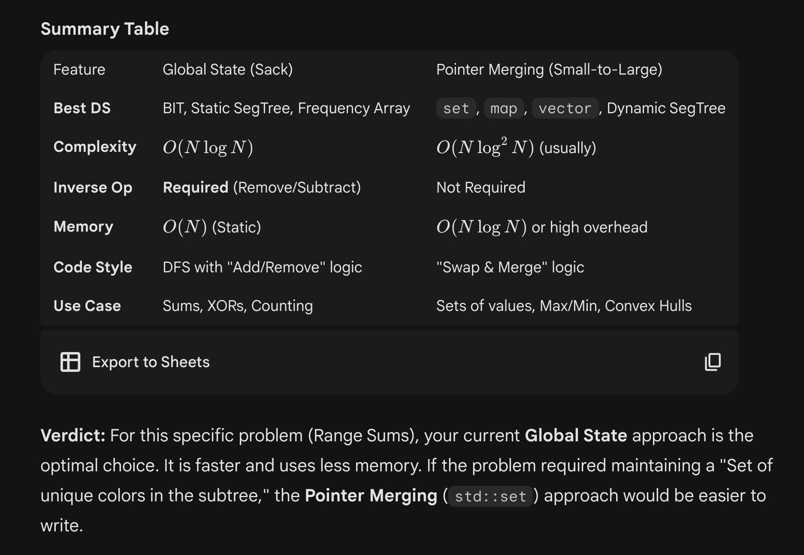
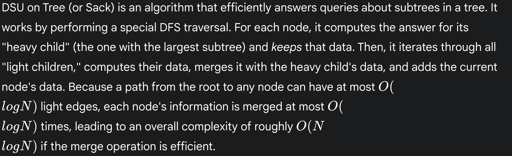

# SMALL TO LARGE & SACKS / DSU ON TREES

 
     
**Difference bw DSU & Pointers approach:**

 ## **1. Global State with Rollback (Your Code)**
**"The Sack"**
In this approach, you have **one** static data structure (your SegTree st) that sits outside the recursion. You "add" nodes as you enter and "remove" nodes (rollback) as you leave light edges.
* **How it works:**	1. DFS Light Child $\to$ Add data $\to$ Answer Queries $\to$ **Clear Data (Rollback)**.
	4. DFS Heavy Child $\to$ Add data $\to$ **Keep Data**.
	7. Iterate Light Children again $\to$ Add data.
	8. Answer Queries for current node.
**Pros:**
* **Static Memory:** This is the *only* efficient way to use Array-based structures like **Fenwick Trees (BIT)** or **Static Segment Trees**. You only allocate $O(N)$ memory once.
* **Cache Friendliness:** Since you are reusing the same array, it stays hot in the CPU cache.
* **Speed:** Constant factors are very low. Operations are simple array updates.
**Cons:**
* **Requires Inverse Operation:** Your data structure *must* support an "undo" or "remove" operation.
	* *Sum:* Easy (Subtract).
	* *XOR:* Easy (XOR again).
	* *Max/Min:* **Impossible** (or very hard) without a stack of history. You cannot "subtract" a max value to revert to the previous state easily.
* **Double Processing:** You process light nodes twice (once to recurse, once to add back to the heavy parent).
## **2. Object Merging (Your "Usual" Way)**
**"Small-to-Large Merging"**
In this approach, every node creates a *new* data structure (or inherits one). When moving up the tree, you take the pointer to the Heavy Child's structure and brute-force insert elements from the Light Children's structures into it.
* **How it works:**	1. structure* my_ds = heavy_child->ds; (Swap pointer, O(1))
	2. For each light child: merge(my_ds, light_child->ds);
	3. Answer queries.
**Pros:**
* **No Inverse Operation Needed:** You never remove items. You only add them. This works perfectly for std::set, std::map, std::vector, or std::priority_queue.
* **Supports Max/Min:** Since you never delete, maintaining a Max/Min is trivial.
* **Intuitive:** The logic is often simpler to reason about: "Take the big bag, dump the small bag into it."
**Cons:**
* **Memory Heavy:**If you use std::set or std::map, the overhead of dynamic allocation is massive.
	* If you use Segment Trees, you must use **Dynamic Segment Trees** (pointer-based nodes), which use $\approx 3-4\times$ more memory than static arrays and are slower due to pointer chasing.
* **Cannot use Static Arrays:** You cannot "swap" a static Fenwick Tree. If you tried to have vector<BIT*>, merging two BITs would take $O(N)$ time, destroying the complexity.

*const* int N = 100005; *// Max number of nodes*
vector<int> adj[N];
int sz[N];
long long ans[N];

*// --- PROBLEM SPECIFIC GLOBAL STATE ---*
*// This is the core data structure you'll use to solve the problem.*
*// It will hold the information for the current subtree being processed*

*// Function to add a node's data to the global state*
void add(int u) {

}

*// Function to remove a node's data from the global state*
void remove(int u) {

}

*// Function to clear the global state.*
void clear_state() {
    
}

*// Helper to traverse a subtree and call add() or remove() on each node*
void update_subtree(int u, int p, bool is_adding) {
    if (is_adding) {
        add(u);
    } else {
        remove(u);
    }
    for (int v : adjL[u]) {
        if (v != p) {
            update_subtree(v, u, is_adding);
        }
    }
}

*// Preprocessing DFS to calculate subtree sizes and find the heavy child*
void dfs_size(int u, int p) {
    sz[u] = 1;
    for (int &v : adjL[u]) {
        if (v == p) continue;
        dfs_size(v, u);
        sz[u] += sz[v];
        *// Swap to make the heavy child the first child*
        if (sz[v] > sz[adjL[u][0]]) {
            swap(v, adjL[u][0]);
        }
    }
}

*// Main DFS that implements the DSU on Tree logic*
void dfs_solve(int u, int p, bool keep) {
    *// 1. Recurse on light children and clear their data*
    for (*size_t* i = 1; i < adjL[u].size(); ++i) {
        int v = adjL[u][i];
        if (v != p) {
            dfs_solve(v, u, false); *// `keep = false`*
        }
    }

    *// 2. Recurse on the heavy child (if it exists) and keep its data*
    if (!adjL[u].empty() && adjL[u][0] != p) {
        dfs_solve(adjL[u][0], u, true); *// `keep = true`*
    }

    *// 3. Merge the current node and light children into the heavy child's data*
    add(u); *// Add current node*
    for (*size_t* i = 1; i < adjL[u].size(); ++i) {
        int v = adjL[u][i];
        if (v != p) {
            update_subtree(v, u, true); *// Add light subtree*
        }
    }

    *// 4. --- PROBLEM SPECIFIC: CALCULATE AND STORE ANSWER FOR `u` ---*
    *// At this point, the global state has the complete data for u's subtree.*

    *// 5. If this was a light child, clear its data*
    if (!keep) {
        update_subtree(u, p, false); *// Remove this entire subtree's data*
        clear_state();
    }
}

Example problem:
[https://codeforces.com/problemset/problem/570/D](https://codeforces.com/problemset/problem/570/D)
(latest solution Accepted: [https://codeforces.com/contest/570/submission/337060485](https://codeforces.com/contest/570/submission/337060485) )

 
     **POINTERS APPROACH:**
 
*// treeboilerplate*

#include <bits/stdc++.h>
#define ll long long
#define int long long
#define pb push_back
#define ppb pop_back
#define f(i, n) for (ll i = 0; i < n; i++)
#define rep(i,a,n) for(int i=(a); i<=(n); i++)
using namespace std;
using *vpi* = vector<pair<int, int>>;
using *pi* = pair<int, int>;
using *vi* = vector<int>;
using *vvi* = vector<vector<int>>;
#define ff first
#define ss second
#define all(x) x.begin(), x.end()
#define sz(x) (int)(x).size()
#define cyes cout << "YES" << endl
#define cno cout << "NO" << endl
#define cans cout << ans << endl
#define minpq priority_queue <int, vector<int>, greater<int>>
#define minpqpi priority_queue <*pi*, vector<*pi*>, greater<*pi*>>
#define ps(x,y) fixed << setprecision(y) << x
#define mxe(v)  *max_element(v.begin(),v.end())
#define mne(v)  *min_element(v.begin(),v.end())
#define sumof(v) accumulate(v.begin(), v.end(), 0)
*const* int inf = 1e18;
*const* int L = 20; *// ceil(logN / log2) + 1*

template <typename *T*, typename *Y*> *istream* *&*operator>>(*istream* *&*is, pair<*T*, *Y*> *&*p){is >> p.first >> p.second; return is;}
template <typename *T*, typename *Y*> *ostream* *&*operator<<(*ostream* *&*os, pair<*T*, *Y*> p)
{os << p.first << ' ' << p.second << ' ';return os;}
template <typename *T*> *istream* *&*operator>>(*istream* *&*is, vector<*T*> *&*v)
{for(auto &i : v){is >> i;} return is;}
template <typename *T*> *ostream* *&*operator<<(*ostream* *&*os, vector<*T*> v)
{for (auto &i : v){os << i << ' ';}return os;}

bool comp(int a, int b) {
    return a> b;
}

*const* int mod = 1e9+7;
*// solving:*
struct *group*{
    int size = 0;
    map<int,int> freq;
    int maxfreq = 0;
    int sum = 0;
};
*const* int N = 1e5 + 5; 
*vi* adjL[N];
*vi* col(N);
*vi* ans(N);
vector<*group**> sacks;
ll n;
void dfs(int node, int p){
    int lc = -1;
    int s = 0;
    for(auto v : adjL[node]){
        if(v != p){
            dfs(v, node);
            if(sacks[v]->size>s){
                lc = v;
                s = sacks[v]->size;
            }
        }
    }
    if(lc == -1){
        *group** ptr = new *group*();
        ptr->size = 1;
        ptr->freq[col[node]] = 1;
        ptr->maxfreq = 1;
        ptr->sum = col[node];
        sacks[node] = ptr;
    } else{
        sacks[node] = sacks[lc];
        for(auto v : adjL[node]){
            if(v != p && v != lc){
                if(sacks[v] == NULL){
                    cno;return;
                }
                sacks[node]->size += sacks[v]->size;
                for(auto it : sacks[v]->freq){
                    sacks[node]->freq[it.ff] += it.ss;
                    if(sacks[node]->freq[it.ff] == sacks[node]->maxfreq){
                        sacks[node]->sum += it.ff;
                    } else if(sacks[node]->freq[it.ff] > sacks[node]->maxfreq){
                        sacks[node]->sum = it.ff;
                        sacks[node]->maxfreq = sacks[node]->freq[it.ff];
                    }
                }
            }
        }
        *// also include yourself*
        sacks[node]->size++;
        sacks[node]->freq[col[node]]++;
        if(sacks[node]->freq[col[node]] == sacks[node]->maxfreq){
            sacks[node]->sum += col[node];
        } else if(sacks[node]->freq[col[node]] > sacks[node]->maxfreq){
            sacks[node]->sum = col[node];
            sacks[node]->maxfreq = sacks[node]->freq[col[node]];
        }
    }
    ans[node] = sacks[node]->sum;
}
void solve(){
    cin >> n;
    col.assign(n+1, 0);
    sacks.assign(n+1, NULL);
    ans.assign(n+1, 0);
    f(i,n+1){
        adjL[i].clear();
    }
    f(i,n){
        cin >> col[i+1];
    }
    f(i,n-1){
        ll u, v; cin >> u >> v;
        adjL[u].pb(v);
        adjL[v].pb(u);
    }
    dfs(1, -1);
    f(i,n){
        cout << ans[i+1] << " ";
    }
    cout << endl;
}

signed main()
{
    *ios_base*::sync_with_stdio(false); cin.tie(0); cout.tie(0);

    *// pre-computation:*

    int t = 1;
    *// cin >> t;*
    while (t--)
        solve();
    return 0;
}