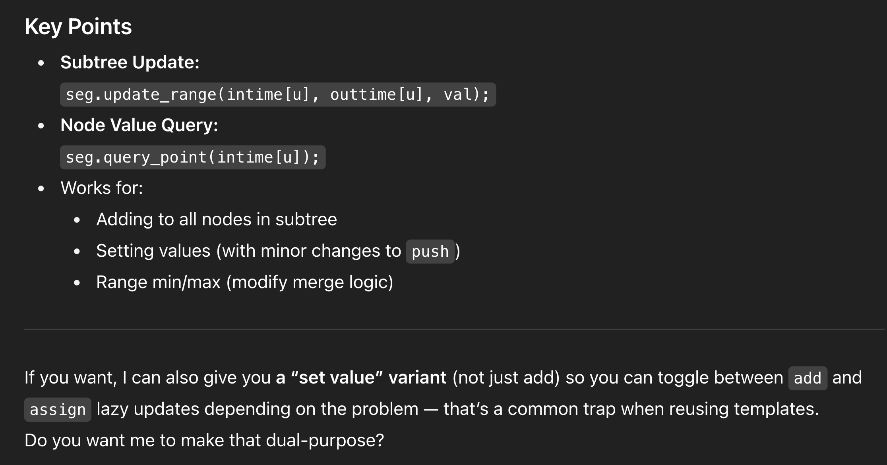

# SUBTREE UPDATES : EULER TOUR + LAZY SEG TREE

# 

#include <bits/stdc++.h>
using namespace std;

struct LazySegTree {
    int n;
    vector<long long> seg, lazy;

    LazySegTree(int n) : n(n) {
        seg.assign(4 * n, 0);
        lazy.assign(4 * n, 0);
    }

    void push(int idx, int l, int r) {
        if (lazy[idx] != 0) {
            seg[idx] += (r - l + 1) * lazy[idx]; // for sum segment tree
            if (l != r) {
                lazy[idx * 2] += lazy[idx];
                lazy[idx * 2 + 1] += lazy[idx];
            }
            lazy[idx] = 0;
        }
    }

    void update(int idx, int l, int r, int ql, int qr, long long val) {
        push(idx, l, r);
        if (r < ql || l > qr) return;
        if (ql <= l && r <= qr) {
            lazy[idx] += val;
            push(idx, l, r);
            return;
        }
        int mid = (l + r) / 2;
        update(idx * 2, l, mid, ql, qr, val);
        update(idx * 2 + 1, mid + 1, r, ql, qr, val);
        seg[idx] = seg[idx * 2] + seg[idx * 2 + 1];
    }

    long long query(int idx, int l, int r, int pos) {
        push(idx, l, r);
        if (l == r) return seg[idx];
        int mid = (l + r) / 2;
        if (pos <= mid) return query(idx * 2, l, mid, pos);
        else return query(idx * 2 + 1, mid + 1, r, pos);
    }

    // Public wrappers
    void update_range(int l, int r, long long val) { update(1, 0, n - 1, l, r, val); }
    long long query_point(int pos) { return query(1, 0, n - 1, pos); }
};

// --- Euler Tour Part ---
vector<int> intime, outtime, euler;
int timer = 0;

void dfs(int u, int p, const vector<vector<int>>& adj) {
    intime[u] = timer;
    euler[timer] = u;
    timer++;
    for (int v : adj[u]) {
        if (v != p) dfs(v, u, adj);
    }
    outtime[u] = timer - 1;
}

void build_euler(int n, int root, const vector<vector<int>>& adj) {
    intime.assign(n, -1);
    outtime.assign(n, -1);
    euler.assign(n, -1);
    timer = 0;
    dfs(root, -1, adj);
}

// --- Example usage ---
int main() {
    int n;
    cin >> n;
    vector<vector<int>> adj(n);
    for (int i = 0; i < n - 1; i++) {
        int u, v;
        cin >> u >> v;
        --u; --v; // zero-index
        adj[u].push_back(v);
        adj[v].push_back(u);
    }

    build_euler(n, 0, adj); // root at 0

    LazySegTree seg(n);

    // Example operations:
    // Add 5 to all nodes in subtree of u
    int u = 2; 
    seg.update_range(intime[u], outtime[u], 5);

    // Get value of node v
    int v = 3;
    cout << seg.query_point(intime[v]) << "\n";
}
