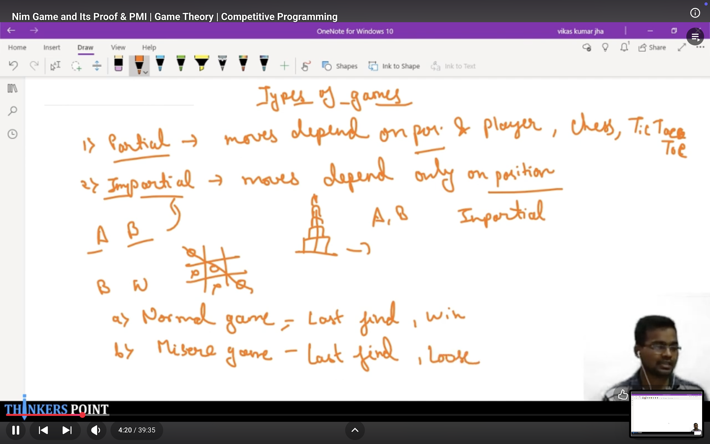
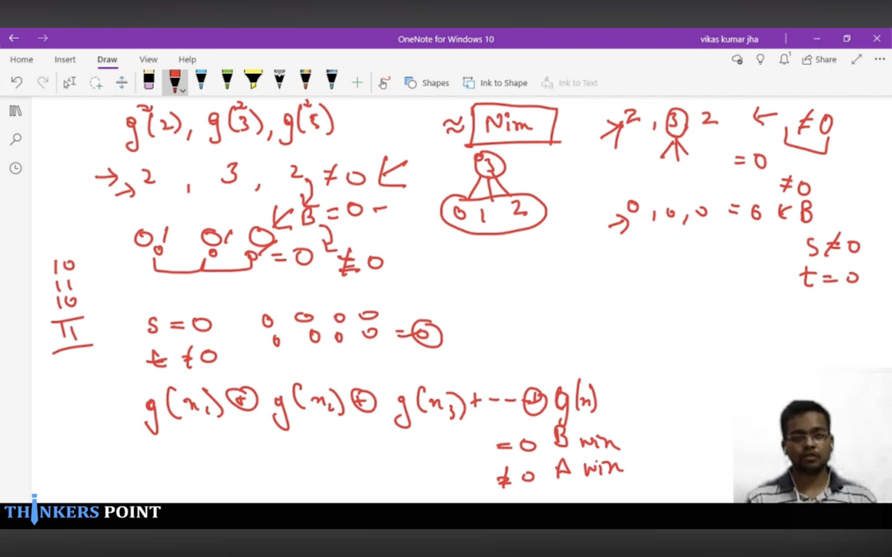

# Playlist:

define each state with a label of W or L
DP / Recursion / Induction type thinking. 
Think about base case, and then move up from there, then see pattern.

**Nim Game**

**Sprague Grundy Numbers & Mex**

Mex is just a mathematical workaround to do the : Need one Losing state to go to, to call this winning state.
(and if no losing state to go to, then this is losing state)

It could’ve been compressed to 0 and 1? No, because of Sprague - Grundy Theorem

So somehow, the Grundy numbers store some cyclicity information.

Proof behind Sprague - Grundy:
For Each subgame, the Grundy Number can always decreased to any value less than it ( Because it was the mex of previous states)
This matches perfectly with Nim Game.
2 other cases: What if we increase the Grundy Number of a sub-game? Then the other guy can always come back to the original Grundy Number in one move, hence resetting the game.
And if Grundy Number is 0, then also the same thing can happen. Hence, effectively no change, if other guy wants.
So, if XOR = 0, other guy can always mantain XOR = 0.

