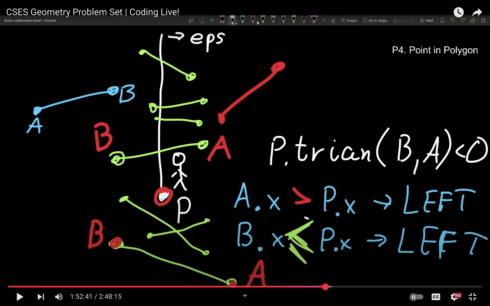

# Point wrt Polygon


```cpp
bool segment_contains(P p1, P p2, P p3){

    return((p1.triangle(p2, p3) == 0) && 
            (min(p1.x, p2.x) <= p3.x && max(p1.x, p2.x) >= p3.x) && 
            (min(p1.y, p2.y) <= p3.y && max(p1.y, p2.y) >= p3.y) 
            );
}

bool intersect(P p1, P p2, P p3, P p4){
    if((p2 - p1 )* (p4 - p3) == 0){ // line segments are parallel
        if(p1.triangle(p2, p3) != 0){
            return false;
        } else { // now need to check bounding boxes.
            for(int rep = 0; rep < 2; rep++){
                if(max(p1.x, p2.x) < min(p3.x, p4.x) || max(p1.y, p2.y) < min(p3.y, p4.y)){
                    return false;
                }
                swap(p1, p3);
                swap(p2, p4);
            }
            return true;
        }
    } else{ // line segs not parallel
        for(int rep = 0; rep < 2; rep++){
            if(p1.triangle(p2, p3)>0 && p1.triangle(p2, p4) > 0){
                return false;
            }
            if(p1.triangle(p2, p3)<0 && p1.triangle(p2, p4) < 0){
                return false;
            } 

            swap(p1, p3);
            swap(p2, p4);
        }
        return true;
    }
}

void test_case(){
    ll n, m; cin >> n >> m;
    vector<P> polygon(n);
    for(P& p : polygon){
        p.read();
    }
    for(int i = 0; i<m; i++){
        P p; p.read(); // check if this point p is inside polygon
        P out = P{p.x + 1, 3'000'000'001LL}; // need a ray that is not parallel with any line segment. alternative is in picture below
        bool on_boundary = false;
        int count = 0;
        for(int j = 0; j<n; j++){
            P p1 = polygon[j];
            P p2 = polygon[(j+1)%n];
            if(segment_contains(p1, p2, p)){
                on_boundary = true;
                break;
            }
            if(intersect(p, out, p1, p2)){
                count++;
            }
        }
        if(on_boundary){
            cout << "BOUNDARY" << "\n";
        }
        else if((count%2)== 1){
            cout << "INSIDE\n";
        } else{
            cout << "OUTSIDE\n";
        }
    }
}

 
```
# **Alternative method to taking a ray, just imagine the ray, and use these checks to check Line segment intersections.**

 
