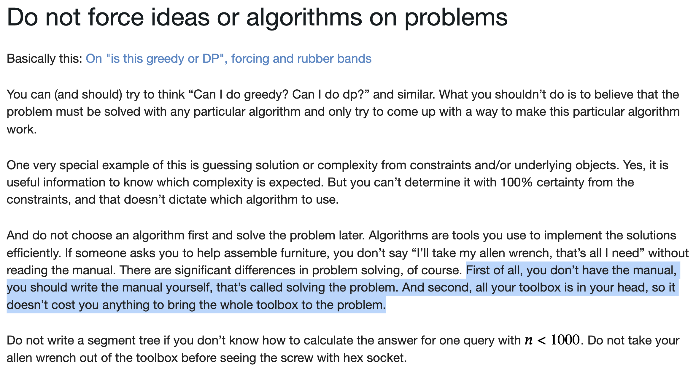

# Algorithm is last:
For almost every problem ever, you first have to…

 
     **Algorithm is last:
For almost every problem ever, you first have to do observations/ transformations/ simplifications… 
and then, use an algo to close off the execution.

(Even an extreme like DP is built after “it can be solved using recursion over smaller subproblems”)**

  
     [https://codeforces.com/blog/entry/106346](https://codeforces.com/blog/entry/106346)
  
     
Never Guess / Force an algorithm to use.
Always:

  
     * Gather observations, understand what's 
  
     *really*
  
      going on, convert the problem into something you can make an algorithm out of.

  
     * Solve the new and simpler problem directly, with DP, greedy or some classical algorithm.
 
 
     <u>**Doing greedy or DP happens at the end of your thought process, not at the beginning of it.**</u>

 

