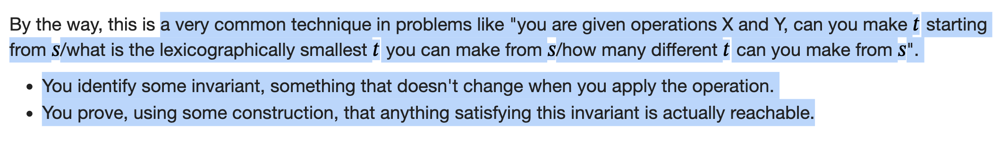

# Invariants and Monovariants

**[https://codeforces.com/blog/entry/57216](https://codeforces.com/blog/entry/57216)**

So, what are Invariants and Monovariants? An invariant is a quantity that doesn't change. A monovariant is a quantity that changes monotically (that is, non-decreasing or non-increasing).

Assign general variables, and use the properties given to form whatever basic equations are possible, you will see the invariant on its own.

Usually Chessboard problems work on invariants regarding the White & Black cells (If operation works on adjacent cells)

