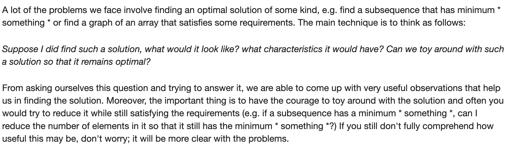

# Nature of Optimal Solution

[Characteristics of the optimal solution, a technique for finding observations in a problem

](https://codeforces.com/blog/entry/99291)

***Suppose I did find such a solution, what would it look like? what characteristics it would have? Can we toy around with such a solution so that it remains optimal?***

What would the optimal solution look like, and what are its invariants? What can we tweak and it’ll still be optimal?
