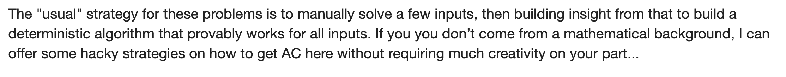
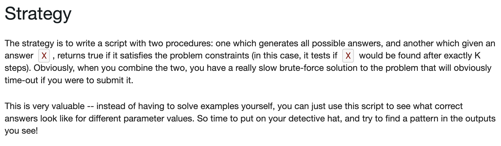

# Pattern Finding for Constructive Algorithms

# Constructive Algorithms:

The reason these problems get difficult is that working out small examples on pen and paper is trivial, yet it's hard to imagine a programmatic approach that will always construct a valid solution for arbitrary

𝑁

