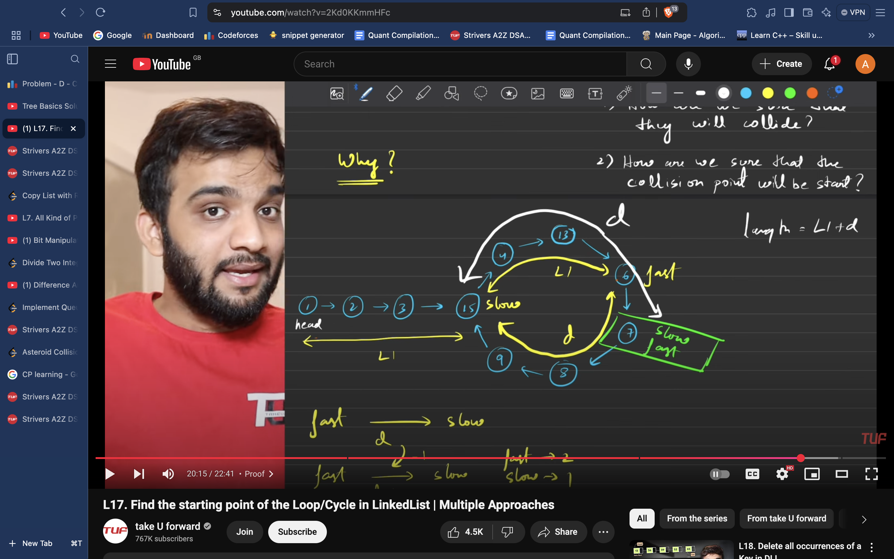

# CYCLE STARTING

# HARE TORTOISE 

Given the head of a linked list, return *the node where the cycle begins. If there is no cycle, return* null.
class Solution {
public:
    ListNode *detectCycle(ListNode *head) {
        ListNode * slow = head;
        ListNode * fast = head;
        while(fast && fast->next)
        {
            slow = slow->next;
            fast = fast->next->next;
            if(fast == slow)
            {
                slow = head;
                while(slow != fast)
                {
                    slow = slow->next;
                    fast = fast->next;
                }
                return slow;
            }
        }
        return NULL;
    }
};

