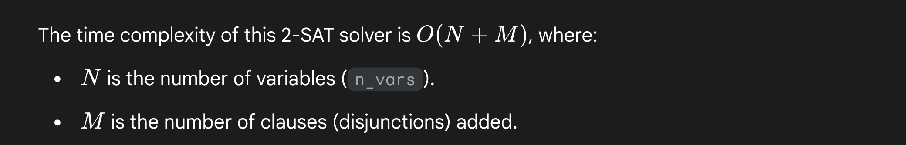
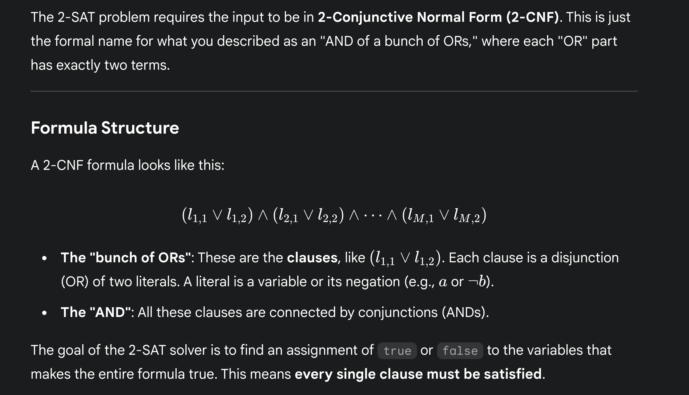
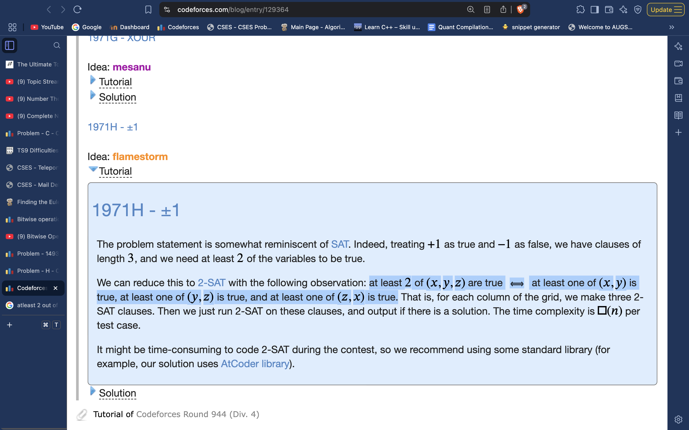

# 2-SAT:

# 
# 

 
     **Identify the problem can be modelled by conjective form.

Conjective form 
Implicative form
Directed Graph
SCC Compression
x & ~x check, and assignment**

  
     [https://cp-algorithms.com/graph/2SAT.html](https://cp-algorithms.com/graph/2SAT.html)
 

struct *TwoSatSolver* {
public:
    int n_vars;
    int n_vertices;
    vector<vector<int>> adj, adj_t;
    vector<bool> used;
    vector<int> order, comp;
    vector<bool> assignment;

    TwoSatSolver(int _n_vars) : n_vars(_n_vars), n_vertices(2 * n_vars), adj(n_vertices), adj_t(n_vertices), used(n_vertices), order(), comp(n_vertices, -1), assignment(n_vars) {
        order.reserve(n_vertices);
    }
    void dfs1(int v) {
        used[v] = true;
        for (int u : adj[v]) {
            if (!used[u])
                dfs1(u);
        }
        order.push_back(v);
    }

    void dfs2(int v, int cl) {
        comp[v] = cl;
        for (int u : adj_t[v]) {
            if (comp[u] == -1)
                dfs2(u, cl);
        }
    }

    bool solve_2SAT(){
        *// for debugging :* 
        *// for(int i = 1; i<= n_vertices; i++){*
        *//     cout << adj[i] << " : " << i << endl;*
        *// }*
        order.clear();
        used.assign(n_vertices, false);
        for (int i = 0; i < n_vertices; ++i) {
            if (!used[i])
                dfs1(i);
        }

        comp.assign(n_vertices, -1);
        for (int i = 0, j = 0; i < n_vertices; ++i) {
            int v = order[n_vertices - i - 1];
            if (comp[v] == -1)
                dfs2(v, j++);
        }

        assignment.assign(n_vars, false);
        for (int i = 0; i < n_vertices; i += 2) {
            if (comp[i] == comp[i + 1])
                return false;
            assignment[i / 2] = comp[i] > comp[i + 1];
        }
        return true;
    }

    void add_disjunction(int a, bool na, int b, bool nb) {
        *// converts conjuctions into implications, and hence, edges in the directed graph*

        *// na and nb signify whether a and b are to be negated* 
        a = 2 * a ^ na;
        b = 2 * b ^ nb;
        int neg_a = a ^ 1;
        int neg_b = b ^ 1;
        adj[neg_a].push_back(b);
        adj[neg_b].push_back(a);
        adj_t[b].push_back(neg_a);
        adj_t[a].push_back(neg_b);
    }

    *// static void example_usage() {*
    *//     TwoSatSolver solver(3); // a, b, c*
    *//     solver.add_disjunction(0, false, 1, true);  //     a  v  not b*
    *//     solver.add_disjunction(0, true, 1, true);   // not a  v  not b*
    *//     solver.add_disjunction(1, false, 2, false); //     b  v      c*
    *//     solver.add_disjunction(0, false, 0, false); //     a  v      a*
    *//     assert(solver.solve_2SAT() == true);*
    *//     auto expected = vector<bool>(True, False, True);*
    *//     assert(solver.assignment == expected);*
    *// }*
};

