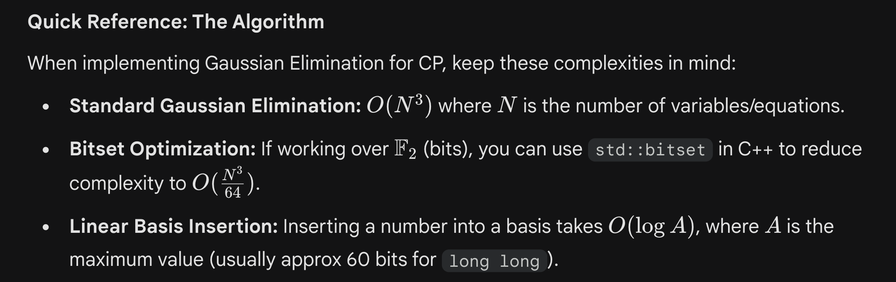
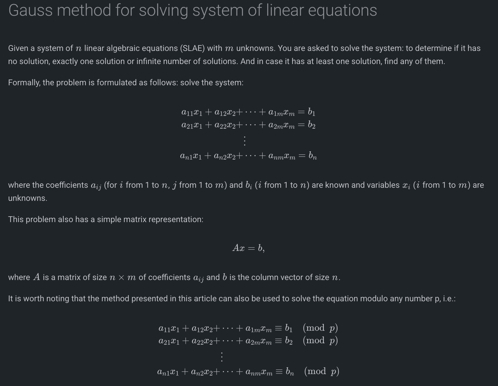
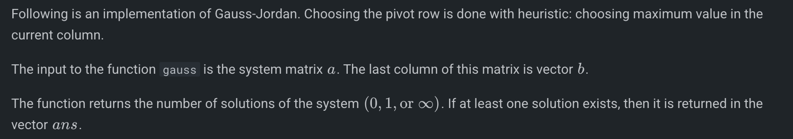
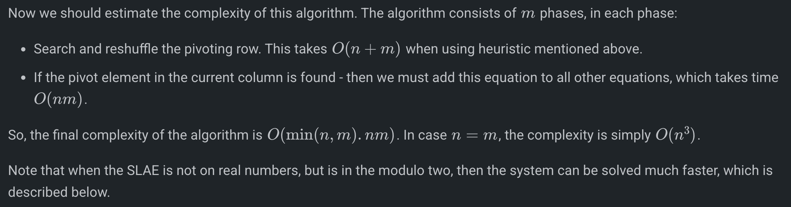
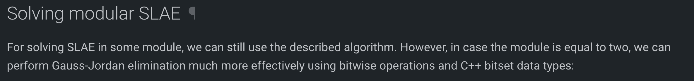
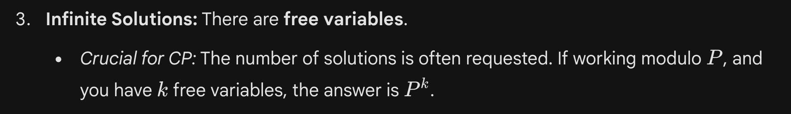

# Gaussian Elimination

     [https://cp-algorithms.com/linear_algebra/linear-system-gauss.html](https://cp-algorithms.com/linear_algebra/linear-system-gauss.html)

const double EPS = 1e-9;
const int INF = 2; // it doesn't actually have to be infinity or a big number

int gauss (vector < vector<double> > a, vector<double> & ans) {
    int n = (int) a.size();
    int m = (int) a[0].size() - 1;

    vector<int> where (m, -1);
    for (int col=0, row=0; col<m && row<n; ++col) {
        int sel = row;
        for (int i=row; i<n; ++i)
            if (abs (a[i][col]) > abs (a[sel][col]))
                sel = i;
        if (abs (a[sel][col]) < EPS)
            continue;
        for (int i=col; i<=m; ++i)
            swap (a[sel][i], a[row][i]);
        where[col] = row;

        for (int i=0; i<n; ++i)
            if (i != row) {
                double c = a[i][col] / a[row][col];
                for (int j=col; j<=m; ++j)
                    a[i][j] -= a[row][j] * c;
            }
        ++row;
    }

    ans.assign (m, 0);
    for (int i=0; i<m; ++i)
        if (where[i] != -1)
            ans[i] = a[where[i]][m] / a[where[i]][i];
    for (int i=0; i<n; ++i) {
        double sum = 0;
        for (int j=0; j<m; ++j)
            sum += ans[j] * a[i][j];
        if (abs (sum - a[i][m]) > EPS)
            return 0;
    }

    for (int i=0; i<m; ++i)
        if (where[i] == -1)
            return INF;
    return 1;
}

int gauss (vector < bitset<N> > a, int n, int m, bitset<N> & ans) {
    vector<int> where (m, -1);
    for (int col=0, row=0; col<m && row<n; ++col) {
        for (int i=row; i<n; ++i)
            if (a[i][col]) {
                swap (a[i], a[row]);
                break;
            }
        if (! a[row][col])
            continue;
        where[col] = row;

        for (int i=0; i<n; ++i)
            if (i != row && a[i][col])
                a[i] ^= a[row];
        ++row;
    }
        // The rest of implementation is the same as above
}

     Rank & Basis:

     [https://judge.yosupo.jp/problem/system_of_linear_equations](https://judge.yosupo.jp/problem/system_of_linear_equations)

     [https://chatgpt.com/c/69468f84-dd54-8323-82af-abd868314248](https://chatgpt.com/c/69468f84-dd54-8323-82af-abd868314248)

