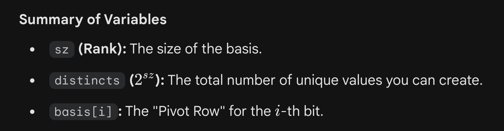
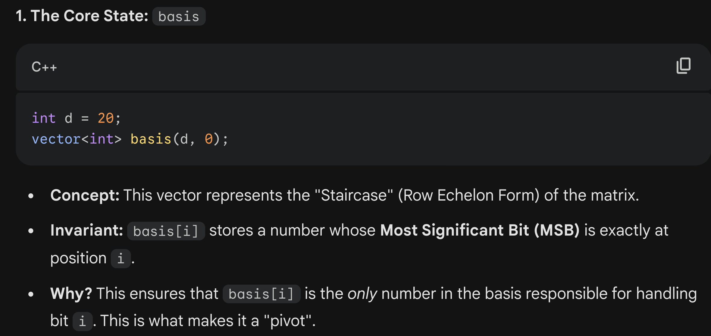
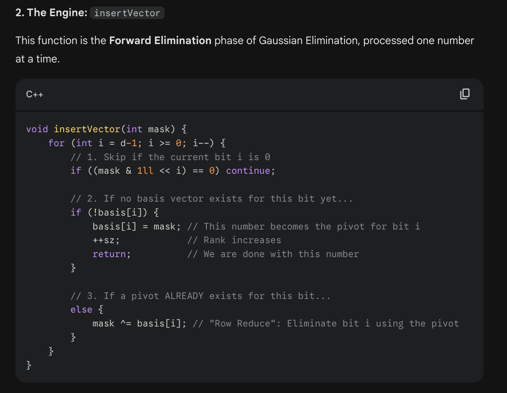
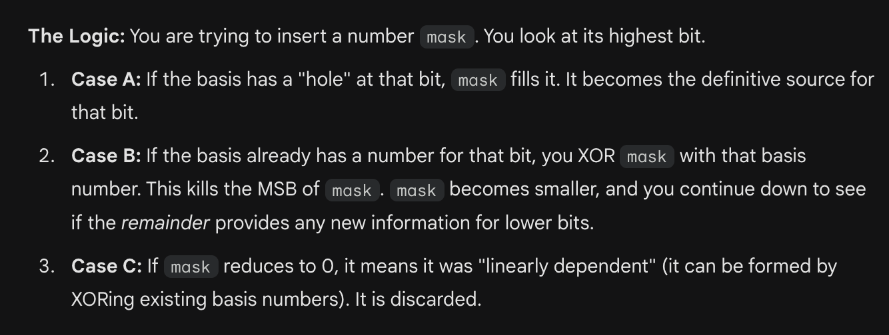
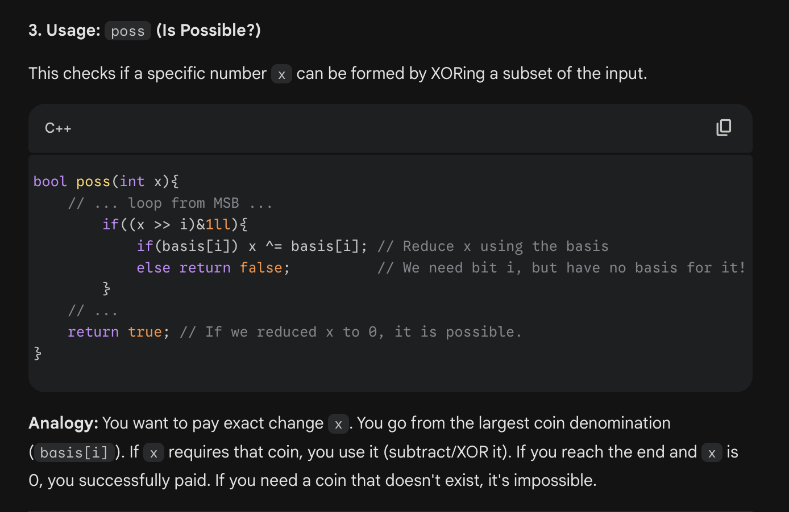
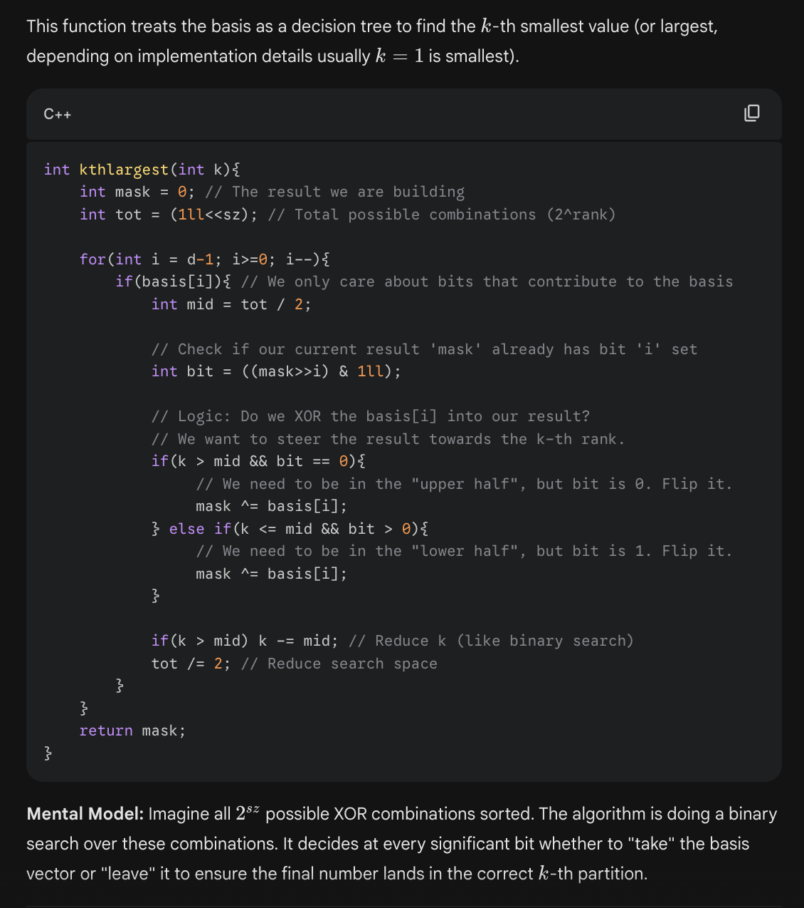
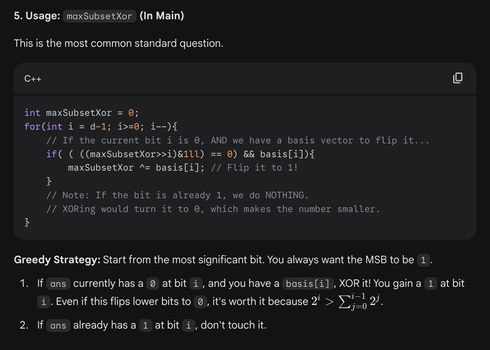
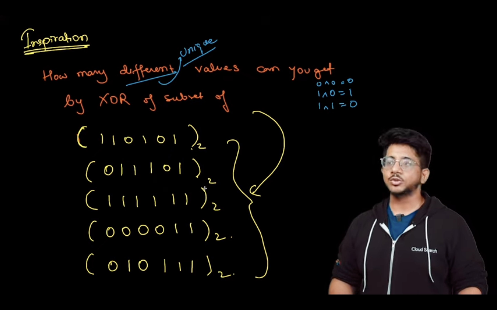
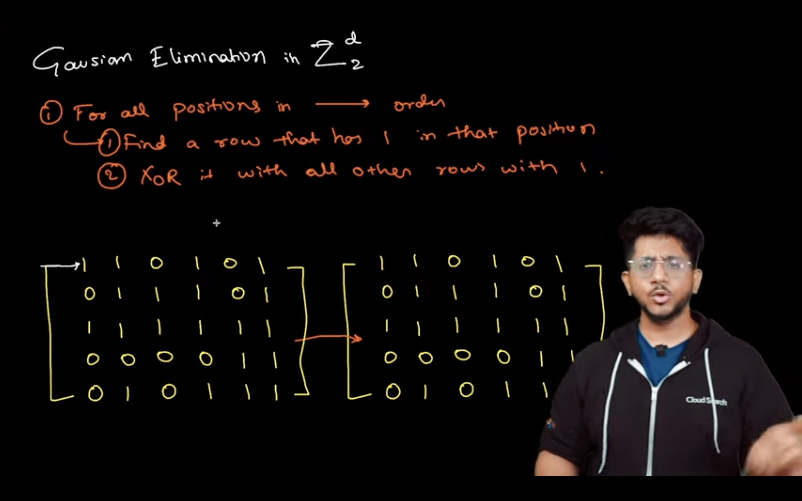

# XOR BASIS

 
     CODE:

  
     #include <bits/stdc++.h>
#define int long long
using namespace std;
int d = 20;
  
      *// the bit-width of the numbers*
  
     
vector<int> basis(d, 0);
  
      *// basis[i] keeps the mask of the vector whose f value is i*
  
     
int sz;
  
      *// Current size of the basis*
 
 
     *const*
  
      int mod = 1e9 + 7;

  
     **void insertVector(int mask) {
    for (int i = d-1; i >= 0; i--) {
        if ((mask & 1ll << i) == 0) continue;**
  
      ***// continue if i != f(mask)***
  
     

        **if (!basis[i]) {**
  
      ***// If there is no basis vector with the i'th bit set, then insert this vector into the basis***
  
     
            **basis[i] = mask;
            ++sz;
            return;
        }else{
            mask ^= basis[i];**
  
      ***// Otherwise subtract the basis vector from this vector***
  
     
        **}
    }
}**
  
     

int kthlargest(int k){
  
      *// the k'th hightest number from the Set S*
  
     
    int mask = 0;
    int tot = (1ll<<sz);
    for(int i = d-1; i>=0; i--){
        if(basis[i]){
            int mid = tot / 2;
            int bit = ((mask>>i) & 1ll);
            if(k > mid && bit == 0){
                mask ^= basis[i];
            } else if(k <= mid && bit > 0){
                mask ^= basis[i];
            }

            if(k > mid){
                k -= mid;
            }
            tot /= 2;
        }
    }
    return mask;
}

bool poss(int x){ // or “is linearly dependent?”
    for(int i = d-1; i>=0; i--){
        if((x >> i)&1ll){
            if(basis[i]){
                x ^= basis[i];
            } else{
                return false;
            }
        }
    }
    return true;
}

int32_t main() {
    int n; cin >> n;
    vector<int> a(n); 
    for(int i = 0; i<n; i++) {
        cin >> a[i];

  
             **insertVector(a[i]);**
  
     
    }

  
         **int distincts = (1ll << sz);**
  
      ***// the number of distinct integers that can be represented using xor over any subset of the set of the given elements.***
  
     

    **int maxSubsetXor = 0;**
  
      ***// maximum possible xor of the elements of some subset of*** 
  
     𝑆
  
     
    **for(int i = d-1; i>=0; i--){
        if( ( ((maxSubsetXor>>i)&1ll) == 0) && basis[i]){
            maxSubsetXor ^= basis[i];
        }
    }**
  
     
    return 0;
}

 
 
     THEORY:
 

 
     [https://codeforces.com/blog/entry/68953](https://codeforces.com/blog/entry/68953)
 

