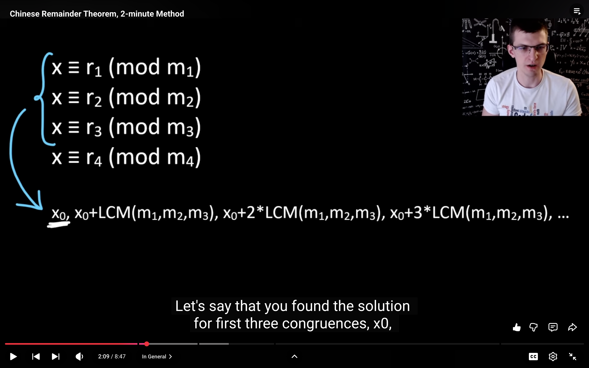
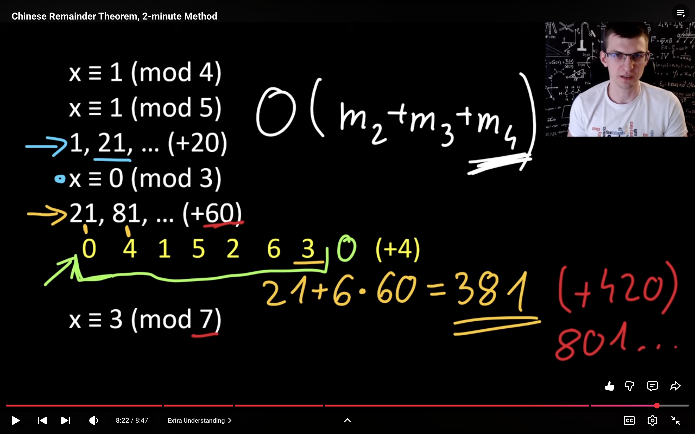
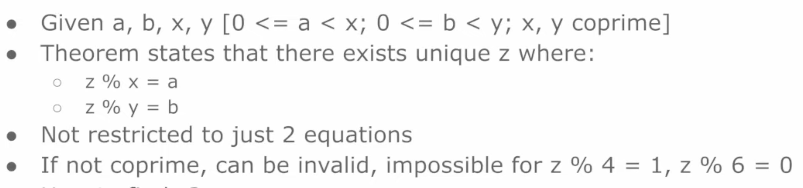
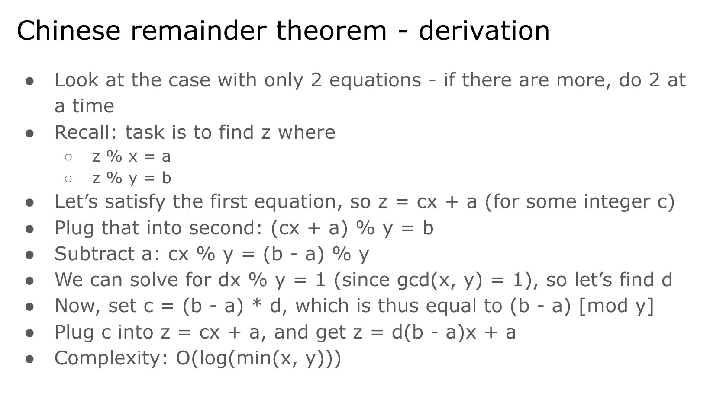

# CRT

## $O(m_1 + m_2 + m_3 + \dots)$ Approach

<https://www.youtube.com/watch?v=EHDEvFuYPRQ&list=PLl0KD3g-oDOEbtmoKT5UWZ-0_JbyLnHPZ&index=16>

---

## $O(\log(\min(m_1, m_2)) + \log(\min(m_2, m_3)) + \dots)$ Approach

It uses the **Extended Euclidean Algorithm**.  
Here, $d = \text{modInverse}(x) \pmod y$.

