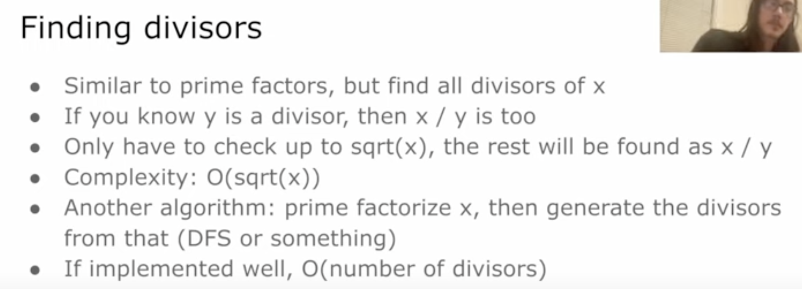
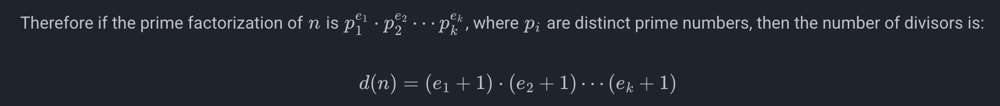
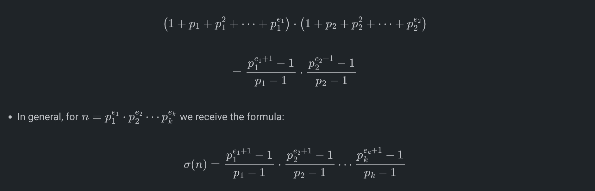
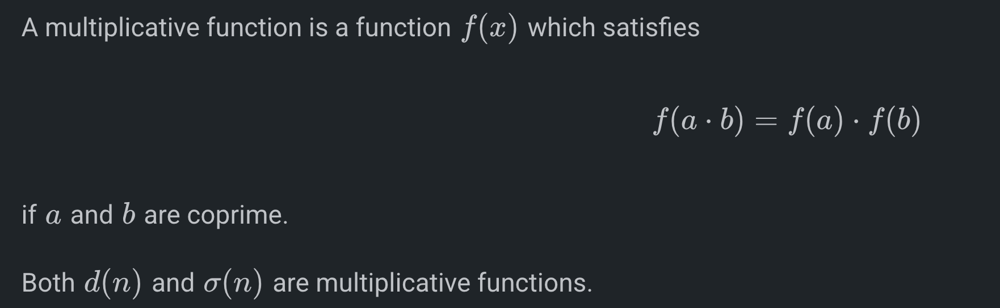

# Divisors

 
     For finding divisors from 1 to N : normally would take O(nrootn) but there is a way to do O(n logn) by going the other way around(calculating the factors)

 
*vi* divs[N+1];

    for(int i = 1; i<=N; i++){
        for(int j = i; j<=N; j+= i){
            divs[j].pb(i);
        }
    }

# Calculating all Divisors of a number through its prime factorisation, which in-turn can be calculated using sieve quickly.

*const* int N = 1e7 + 5;
int spf[N];

void sieve() {
    for (int i = 1; i < N; i++) spf[i] = i;
    
    for (int i = 2; i * i < N; i++) {
        if (spf[i] == i) { *// i is prime*
            for (int j = i * i; j < N; j += i) {
                if (spf[j] == j) {
                    spf[j] = i;
                }
            }
        }
    }
}

vector<int> get_divisors(int n) {
    vector<pair<int, int>> prime_factors;
    
    while (n > 1) {
        int p = spf[n];
        int count = 0;
        while (n % p == 0) { 
            n /= p;
            count++;
        }
        prime_factors.push_back({p, count});
    }

    vector<int> divisors;
    
    auto dfs = `[&](auto self, int idx, int current_divisor)` -> void {
        if (idx == prime_factors.size()) {
            divisors.push_back(current_divisor);
            return;
        }
        int p = prime_factors[idx].first;
        int max_pow = prime_factors[idx].second;
        long long p_pow = 1; 
        for (int i = 0; i <= max_pow; i++) {
            self(self, idx + 1, current_divisor * p_pow);
            p_pow *= p;
        }
    };
    dfs(dfs, 0, 1);
    *// Optional: Sort if required (DFS does not guarantee order)*
    sort(divisors.begin(), divisors.end());
    return divisors;
}

# Print All Divisors
vector<int> findDivisors(int n) {
    vector<int> divisors; 

    int sqrtN = sqrt(n); 
    for (int i = 1; i <= sqrtN; ++i) { 
        if (n % i == 0) { 
            divisors.push_back(i); 
            if (i != n / i) {
                divisors.push_back(n / i); 
            }
        }
    }
    sort(divisors.begin(), divisors.end());
    return divisors; 
}

# Num of Divisors

long long numberOfDivisors(long long num) {
    long long total = 1;
    for (int i = 2; (long long)i * i <= num; i++) {
        if (num % i == 0) {
            int e = 0;
            do {
                e++;
                num /= i;
            } while (num % i == 0);
            total *= e + 1;
        }
    }
    if (num > 1) {
        total *= 2;
    }
    return total;
}

# Sum of Divisors

long long SumOfDivisors(long long num) {
    long long total = 1;

    for (int i = 2; (long long)i * i <= num; i++) {
        if (num % i == 0) {
            int e = 0;
            do {
                e++;
                num /= i;
            } while (num % i == 0);

            long long sum = 0, pow = 1;
            do {
                sum += pow;
                pow *= i;
            } while (e-- > 0);
            total *= sum;
        }
    }
    if (num > 1) {
        total *= (1 + num);
    }
    return total;
}

