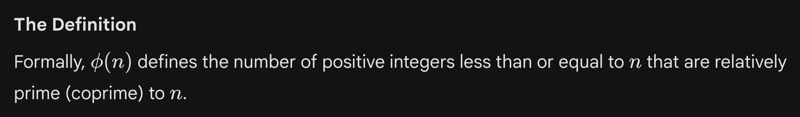
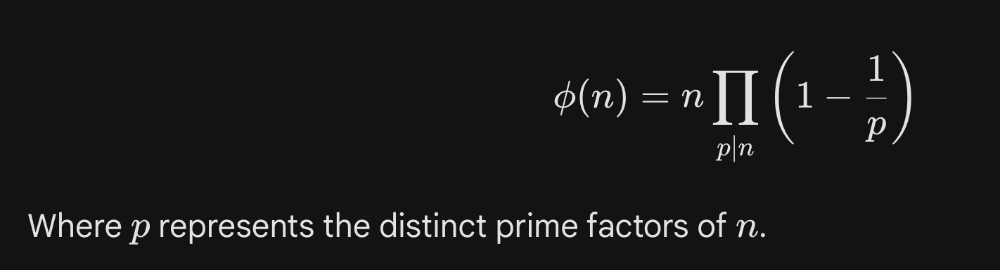
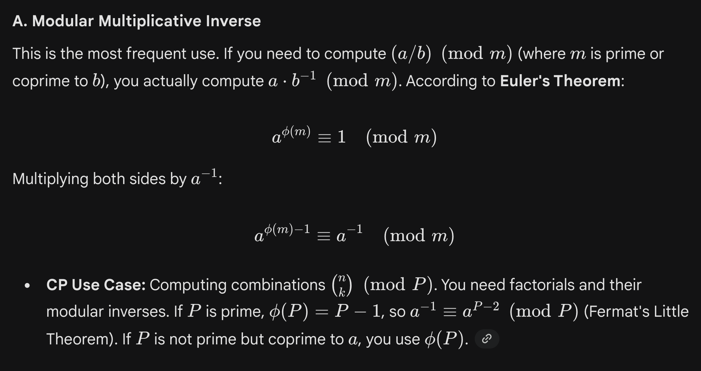
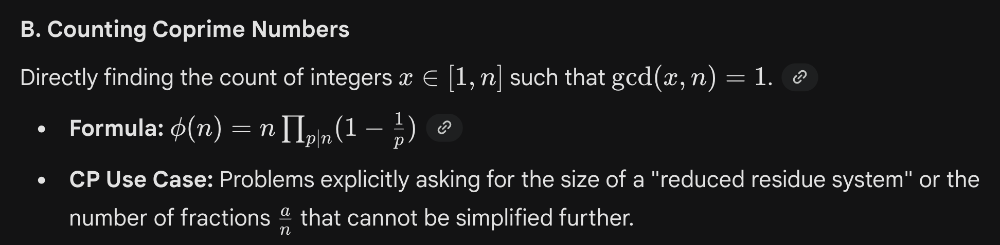
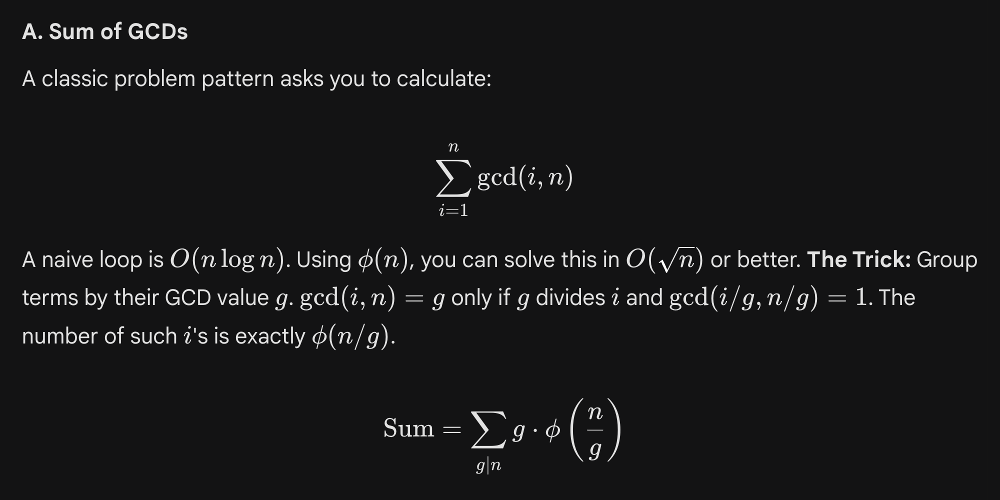

# Euler Totient Fn

[https://cp-algorithms.com/algebra/phi-function.html](https://cp-algorithms.com/algebra/phi-function.html)

 
     APPLICATIONS:
 

 
     THE APPLICATION USED IN NECKLACE BS LEMMA PROBLEM:
 

