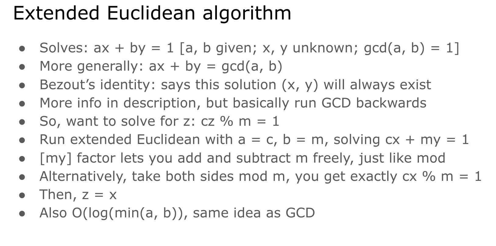

# Extended Euclid Algo

# To get modinverse (x^-1 under mod m) 
# when, m is not prime, but still (x, m) is co-prime. 

 
     [https://brilliant.org/wiki/extended-euclidean-algorithm/](https://brilliant.org/wiki/extended-euclidean-algorithm/)
 

# I don’t know how to do this though