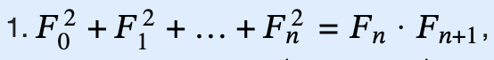

# Fibonacci

# 
# Fibonacci binpow:
struct matrix {
    long long mat[2][2];
    matrix friend operator *(const matrix &a, const matrix &b){
        matrix c;
        for (int i = 0; i < 2; i++) {
          for (int j = 0; j < 2; j++) {
              c.mat[i][j] = 0;
              for (int k = 0; k < 2; k++) {
                  c.mat[i][j] += a.mat[i][k] * b.mat[k][j];
              }
          }
        }
        return c;
    }
};

matrix matpow(matrix base, long long n) {
    matrix ans{ {
      {1, 0},
      {0, 1}
    } };
    while (n) {
        if(n&1)
            ans = ans*base;
        base = base*base;
        n >>= 1;
    }
    return ans;
}

long long fib(int n) {
    matrix base{ {
      {1, 1},
      {1, 0}
    } };
    return matpow(base, n).mat[1][0];
}

 
     **Normal Fibonacci serires:**

 	if (n == 0) {
	    cout<<"The Fibonacci Series up to "<<n<<"th term:"<<endl;
		cout << 0;
	}
	else {
		int secondLast = 0;*//for (i-2)th term*
		int last = 1;*//for (i-1)th term*
		cout<<"The Fibonacci Series up to "<<n<<"th term:"<<endl;
		cout << secondLast << " " << last << " ";
		int cur; *//for ith term*
		for (int i = 2; i <= n; i++) {
			cur = last + secondLast;
			secondLast = last;
			last = cur;
			cout << cur << " ";
		}

