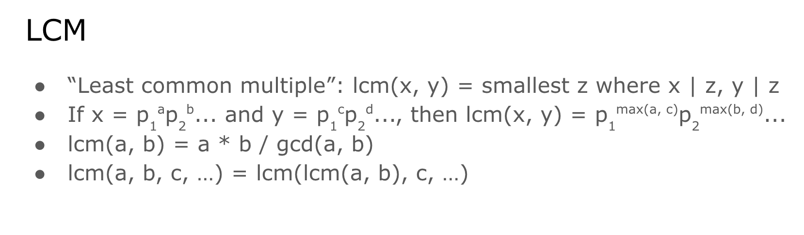
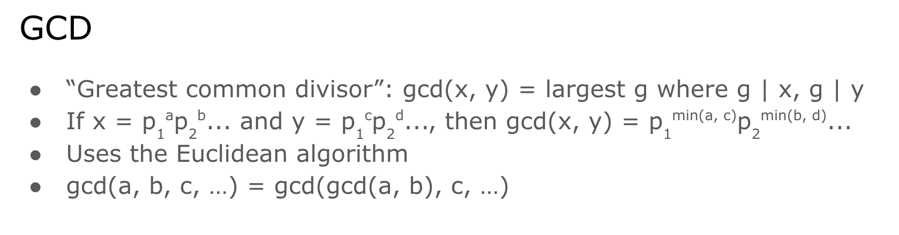

# GCD, LCM : KEEP

 
     int gcd(int a, int b)
{
    if (b == 0)
        return a;
    else
        return gcd(b, a % b);
}
// iterative version:
int gcd (int a, int b) {
    while (b) {
        a %= b;
        swap(a, b);
    }
    return a;
}

 
 
     int lcm(int a, int b)
{
    return ((a / gcd(a, b)) * b);
}

 
 
     # **LCM of multiple values**

  
        long long lcm_multiple(const std::vector<int>& numbers) {
       if (numbers.empty()) return 1; 
  
     *// LCM of an empty set is 1*
  
     
       return std::accumulate(numbers.begin() + 1, numbers.end(), (long long)numbers[0], std::lcm<long long, long long>);
   }

 

