# Mobius Inversion / PIE DP

> **(Combinatorics + Number Theory)**

## Equivalent DP Trick

> **Note:** Try all the 3 problems in the Blog, couldn’t do any of them on my own, which is sooo bad.

**Somehow, for all three problems, we did it over gcd!**

<https://codeforces.com/blog/entry/83757>

Most of the problems presented in this article will probably have a solution using Möbius inversion or some combinatorial approach (usually the inclusion-exclusion principle). It can probably be proven that this trick is equivalent to the inclusion-exclusion principle, but I still believe that it is worth knowing, since it is very intuitive and simple.

*It is based on, roughly speaking, overcounting and compensating for it.*

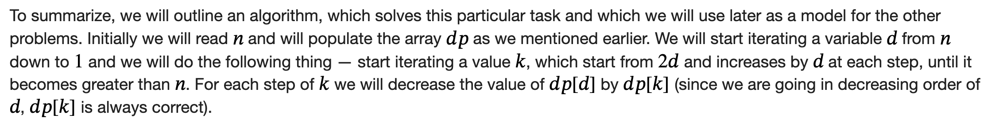

## Gemini Summary on PIE DP Trick

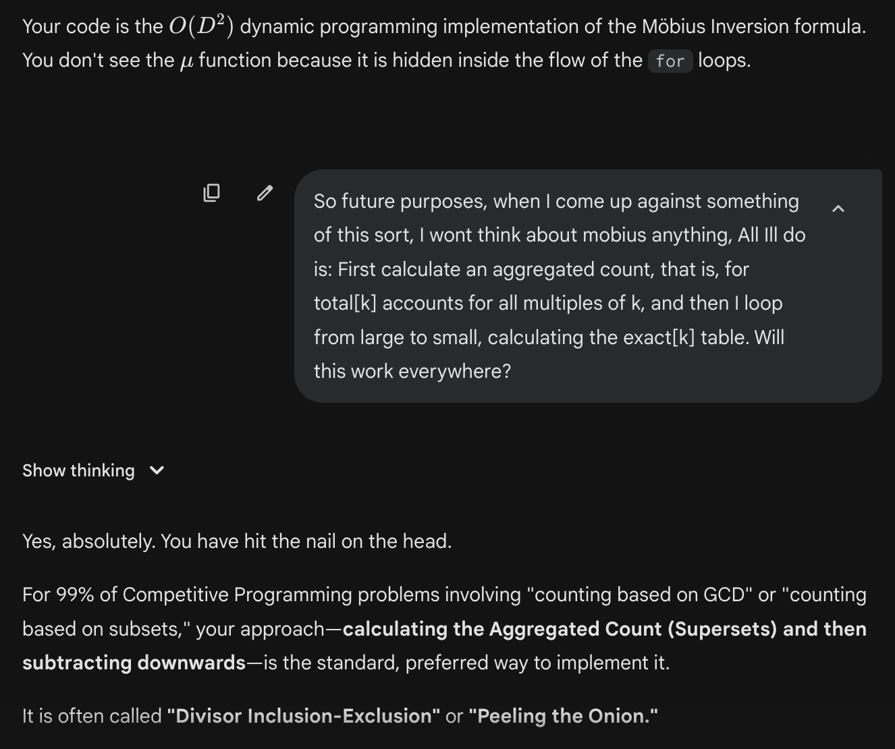

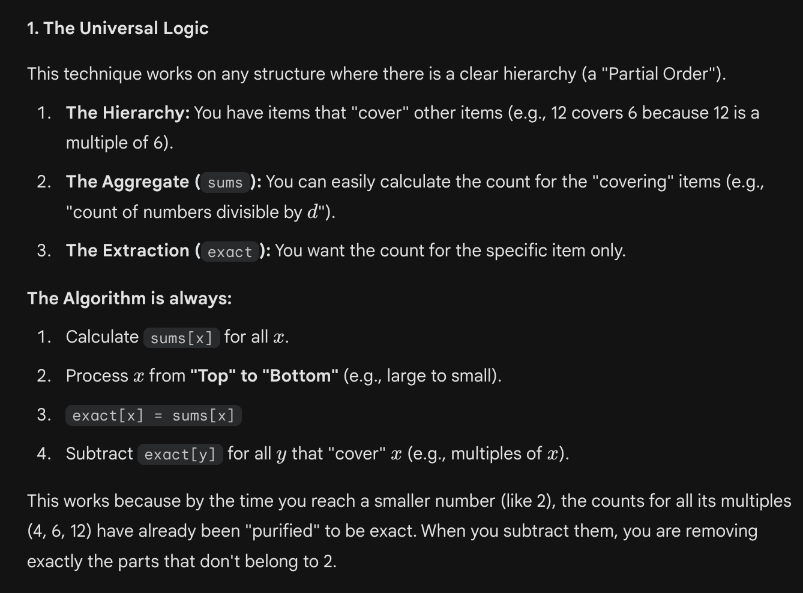

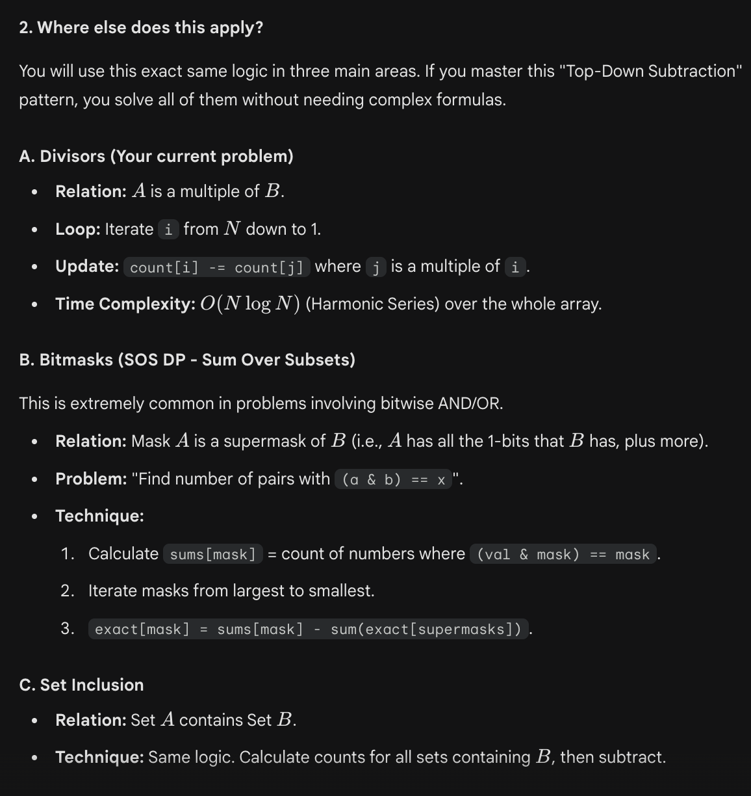

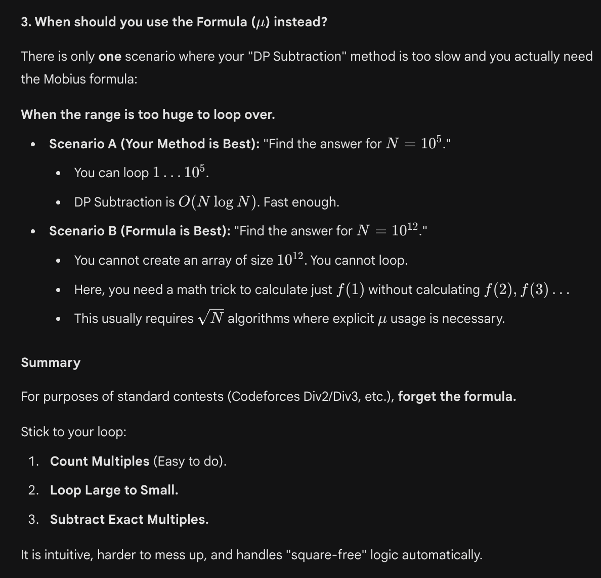

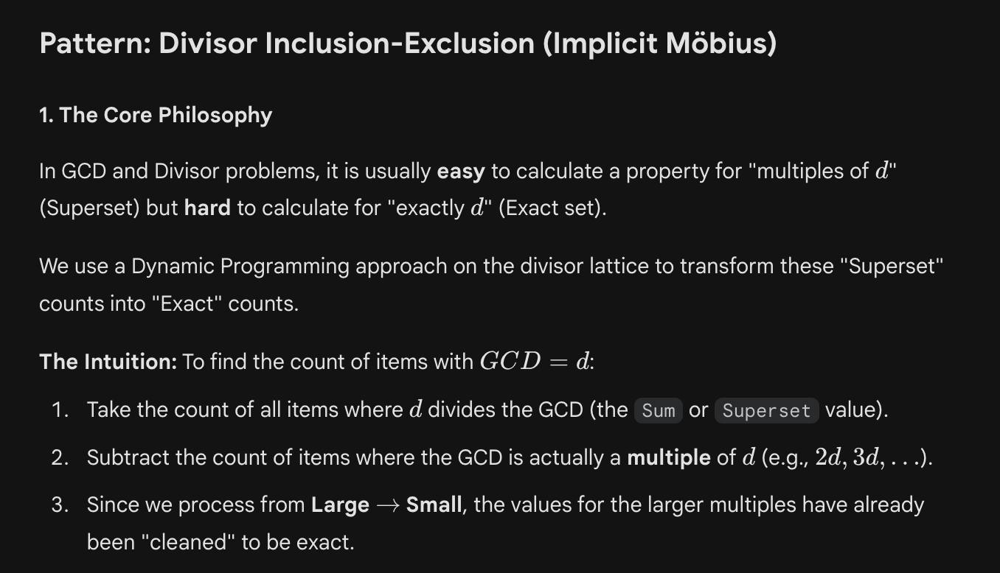

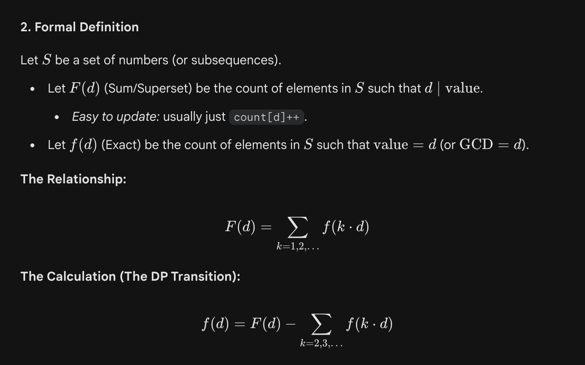

## How Colin sees it

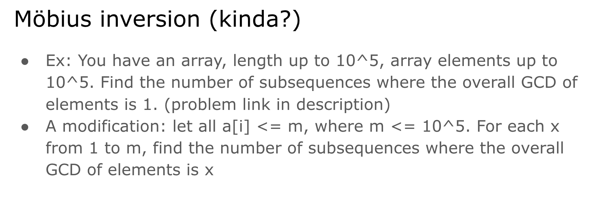

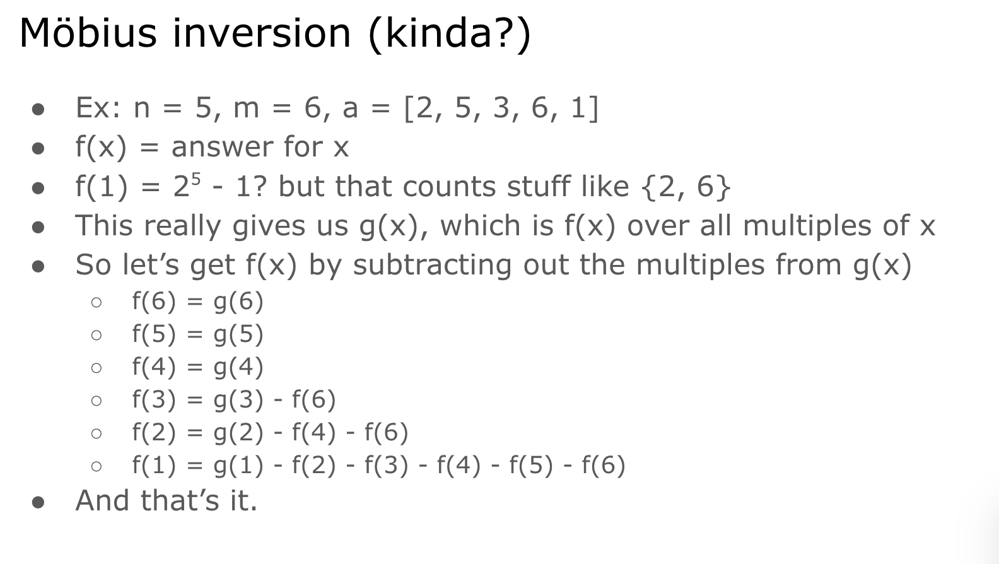

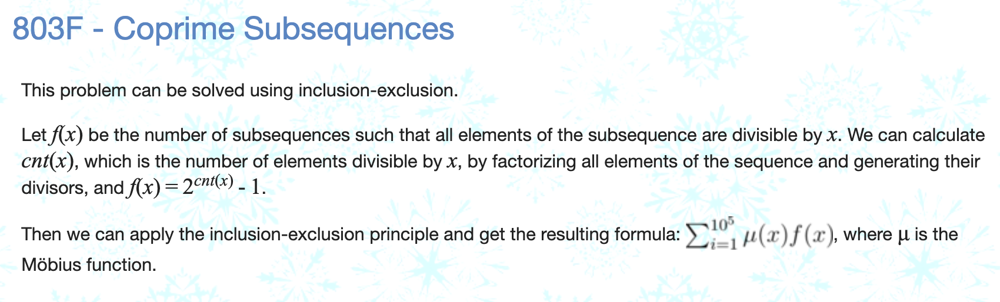

## Pure Mobius maybe

**I think pure Mobius is faster `O(n)` whereas the PIE DP is slower `O(3^n)` or `O(n log n)`, but the PIE DP also calculates more stuff.**

## Other resources (Blog, Video & Kactl)

<https://codeforces.com/blog/entry/53925>

<https://www.youtube.com/watch?v=51RQaeEiVvQ>

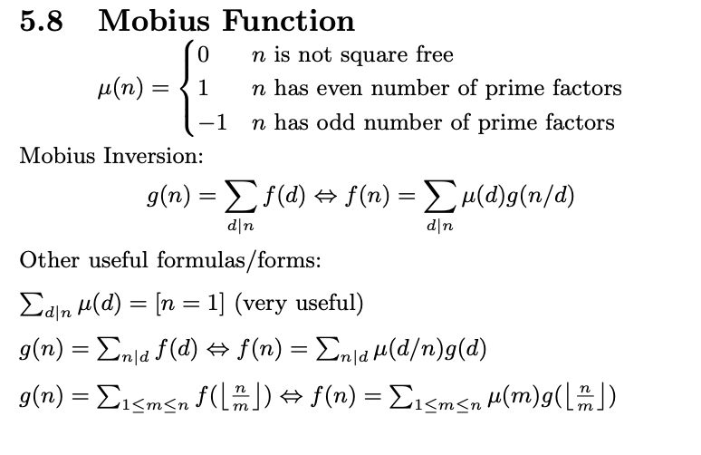

## Too proud of my solution to this problem

> (Uses PIE DP + 3^n bitmask traversal trick + only need unique prime factors)

<https://codeforces.com/problemset/problem/2037/G>

**Nice practice problem:**

<https://codeforces.com/problemset/problem/1559/E>
