# BURNSIDE LEMMA:

# Counting Colorings with Symmetries

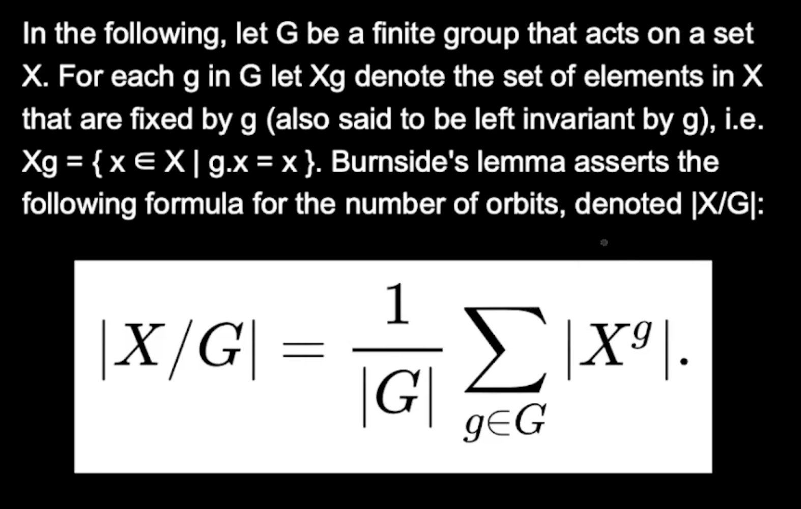

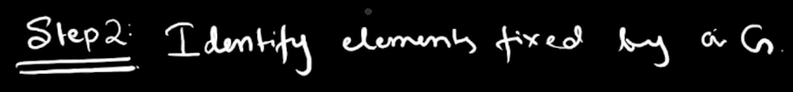

[https://cses.fi/problemset/task/2210/](https://cses.fi/problemset/task/2210/)
For 3D cases: [https://www.youtube.com/watch?v=2hRG6VAAj0Q](https://www.youtube.com/watch?v=2hRG6VAAj0Q)
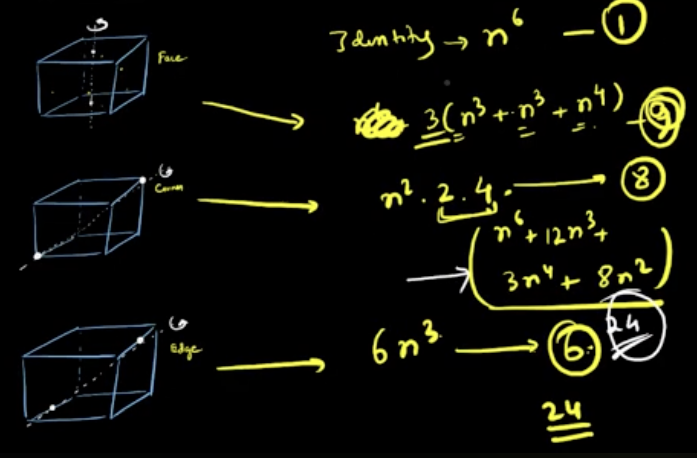

 
     Necklace Problem: ( n beads / n vertice regular polygon, n rotational symmetries, no reflection symmetry )
m colours

  
     [https://cses.fi/problemset/task/2209/](https://cses.fi/problemset/task/2209/)
 
 
     [https://www.youtube.com/watch?v=CddrfnIH8-Y](https://www.youtube.com/watch?v=CddrfnIH8-Y)
 
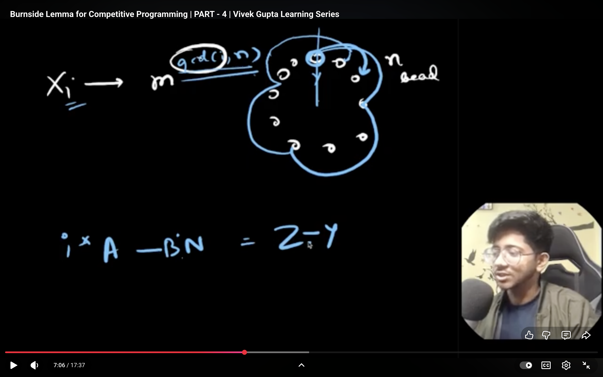
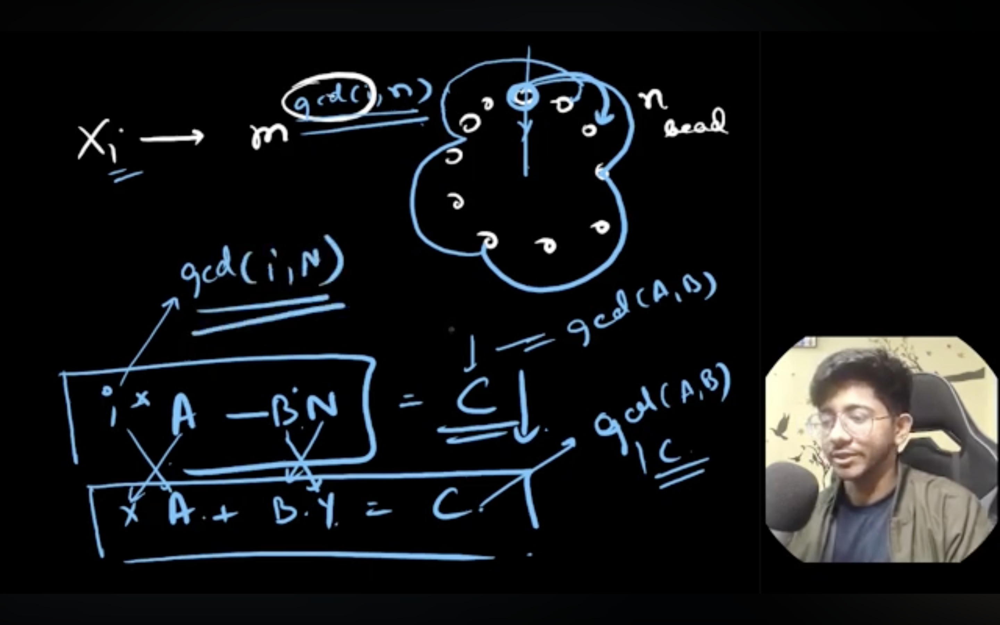
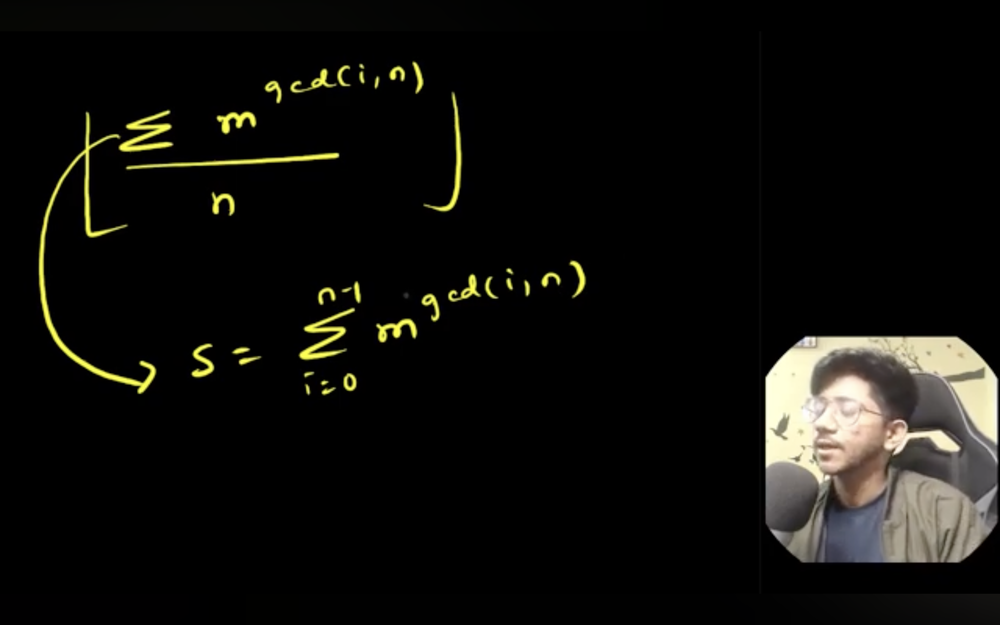
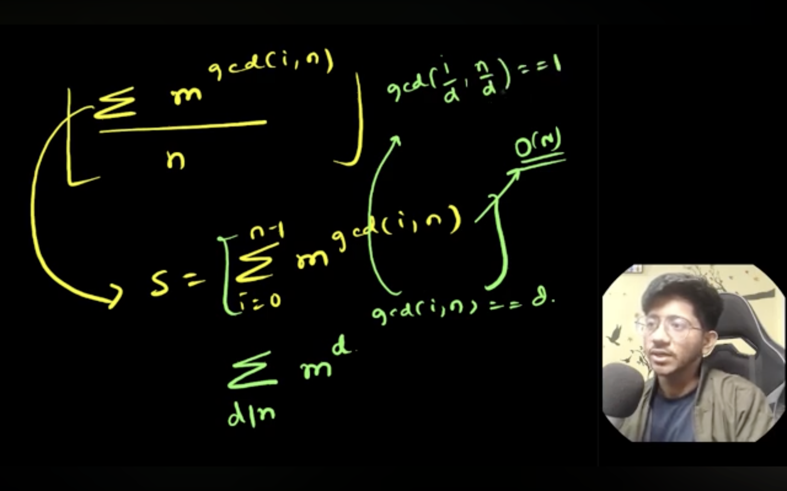
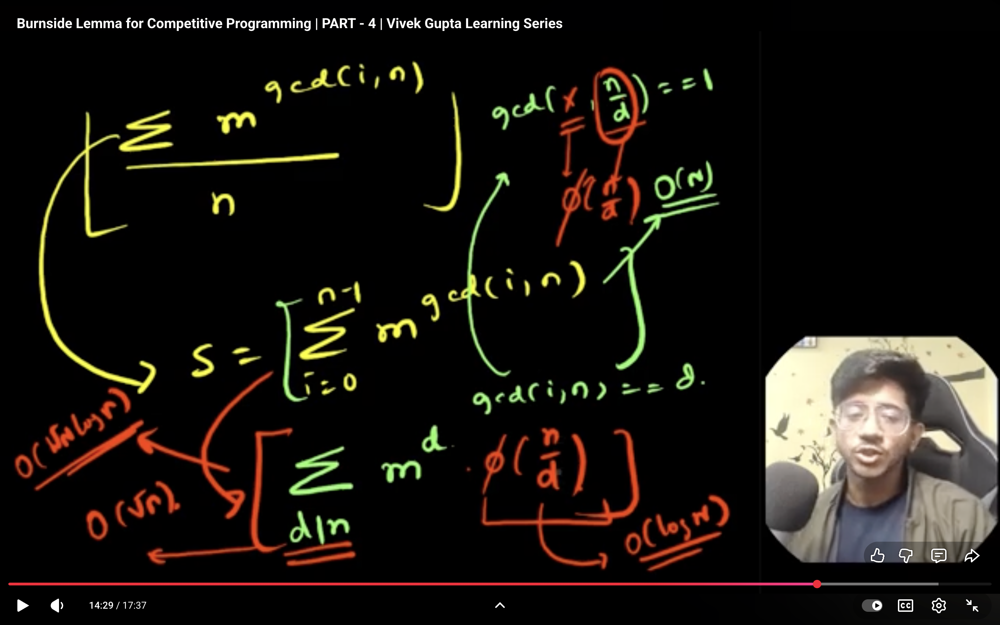

 
     Part 5: 

  
     [https://www.youtube.com/watch?v=vclpMhUaST0](https://www.youtube.com/watch?v=vclpMhUaST0)
  
     
(Advanced)

  
     **BLOG Learnings**

  
     [https://codeforces.com/blog/entry/62401](https://codeforces.com/blog/entry/62401)
  
     
Problem:

  
     [https://codeforces.com/contest/1065/problem/E](https://codeforces.com/contest/1065/problem/E)
  
     
Issue: The symmetries are not under Closure

 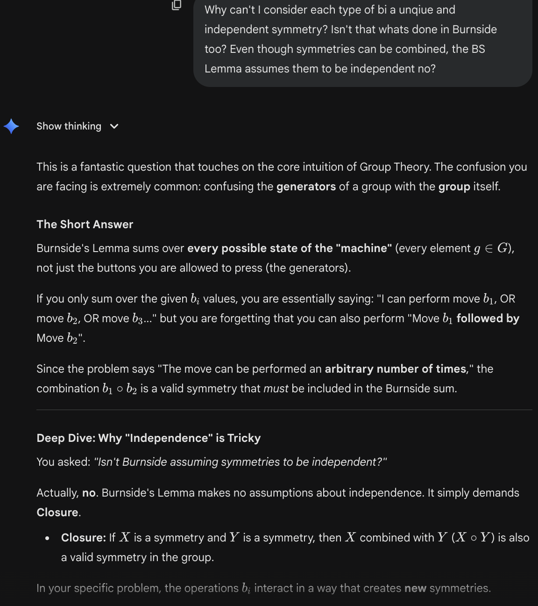
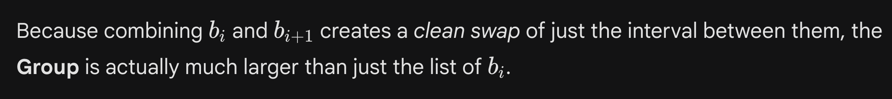

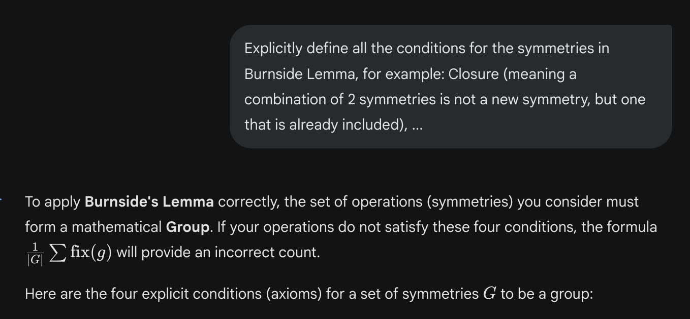
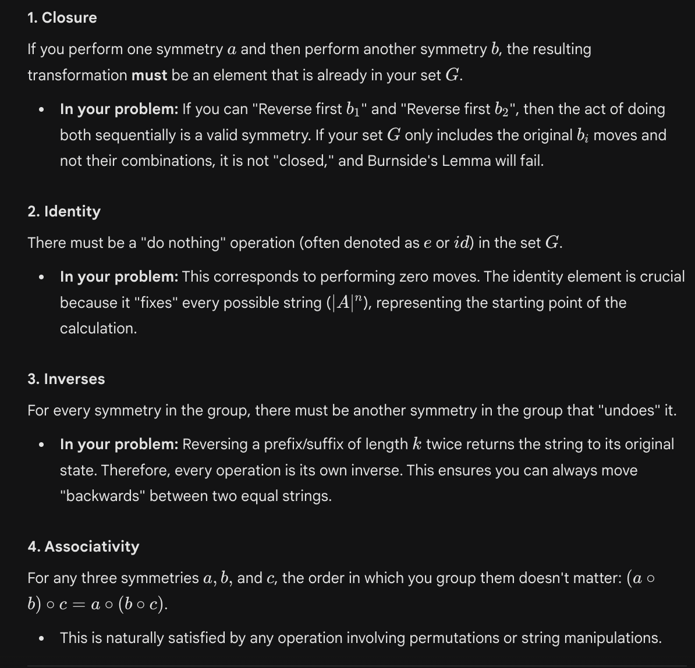
 
     I still dont understand this part: (making it fast)
 
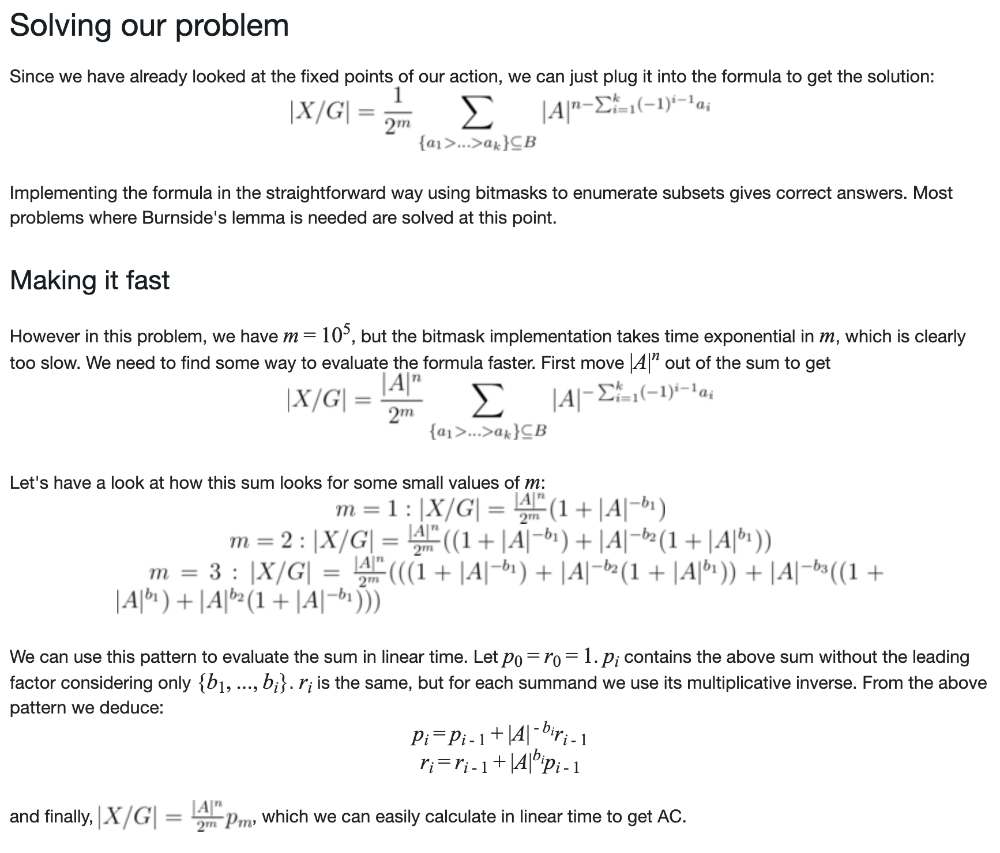
